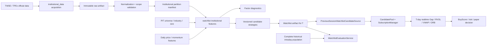

# 三大法人盤前 Candidate Prior — Code/Design Review 與 Implementation Plan

## 0. 文件狀態

- Review 結論：**APPROVED WITH CONDITIONS；四項 review conditions 已納入**
- Implementation 狀態：**PR-001～PR-004 REVIEWED；PR-005 IMPLEMENTED，等待 review gate**
- 上線邊界：Research／Shadow／Paper Simulation only
- Real Money：**PROHIBITED**
- 本文件不授權自動下單，也不把三大法人資料視為進場訊號。

三大法人資料適合加入目前專案，但正確角色是：

> 使用前一交易日已公布且可稽核的法人資料，排序出目標交易日值得監控的股票；開盤後仍由 Gap、RVOL、VWAP、ORB、流動性、風險與資料健康度決定是否形成 entry opportunity。

本次 review 認可使用者提案的主要方向；以下四個 blocker 必須在策略實作前解決：

1. 不可另建一套 watchlist 平台，必須擴充既有 previous-day watchlist 設計，並修正 runtime 來源/evidence 遺失問題。
2. 法人股數 numerator 與成交量／ADV denominator 的交易範圍尚未證明一致；不相容時 feature 必須 fail closed。
3. 目前缺 date-effective security type、industry、market cap 與 delisting universe，無法直接宣稱普通股母體、產業中性或規模中性研究成立。
4. Live shortlist 只觀察入選股票，無法形成全市場 setup denominator；正式增量效益必須以完整歷史母體或預先凍結的 matched controls 評估。

---

## 1. Code/Design Review Findings

### [BLOCKER] B1 — 若照提案另建法人 candidate pipeline，會重複基礎設施並遺失來源證據

現況：

- `Candidate` 已支援多來源與 matched rules：`candidate/models.py:15-53`。
- `CandidateDiscovery` 已有 rank、priority、TTL 與 immutable evidence：`candidate/sources.py:14-49`。
- 既有 `architecture/previous_day_premarket_watchlist_implementation_plan.md` 已規劃 `watchlist/` bounded context、P/T contract、artifact、repository、API 與 `PreviousSessionWatchlistCandidateSource`。
- 但目前 `dashboard/momentum.py:501-548` 會把 dashboard candidates 全部轉成 `CandidateSource.AUTO`，並把 BuyScore 當成 subscription priority；上游法人來源、artifact digest 與 factor ranks 會在這裡遺失。
- `CandidatePoolEntry` 只保留合併後 sources/ranks/priority，不保留每個 contribution 的 evidence：`candidate/pool.py:29-57`、`candidate/pool.py:246-323`。

決策：

- 法人 acquisition/normalization 使用新的 `institutional_data/` bounded context。
- Candidate generation、artifact、API 與 pool projection 必須擴充既有規劃的 `watchlist/`，不可建立 `institutional_watchlist/` 第二套平台。
- Candidate source 沿用 `PREVIOUS_SESSION_WATCHLIST`；法人種類由 strategy ID、artifact family 與 evidence 表達，不新增 `CandidateSource.INSTITUTIONAL`。
- Dashboard 保留獨立 watchlist detail read model；pool 只承擔 admission/scheduling，不把完整研究證據壓成一個 priority。
- 法人 discovery 走獨立 `PreviousSessionWatchlistCandidateSource`，不得經過會折疊成 `AUTO` 的 `_dashboard_candidate_discoveries()`。

### [BLOCKER] B2 — `net_buy_ratio` / `flow_adv20_ratio` 的分母交易範圍不相容

2026-08-19 的 TWSE T86 官方頁說明，最終資料包含一般、零股、盤後定價與鉅額交易，排除拍賣／標購，且以原始成交資料統計。TWSE Data E-Shop 又區分 18:00 不含鉅額與 20:00 含鉅額兩個商品。現有 Shioaji／derived OHLCV 的 `volume_contract` 尚未證明與任一 T86 scope 完全一致。

如果直接計算：

```text
foreign_net_shares / daily_volume
foreign_net_shares / ADV20
```

數字雖可產生，但分子與分母可能不是同一成交集合，不能作 formal feature。

決策：

- 每個 partition 必須保存 `trade_scope_id`、scope note、source product、retrieval time、raw digest 與 correction policy。
- 初版 canonical live/research scope 建議固定為 **final-with-block / after-20:00**；18:00 no-block 與 20:00 with-block 不可混接同一時間序列。
- 每個 ratio feature 都要經 `ScopeCompatibilityDecision`；不相容時 status=`SCOPE_INCOMPATIBLE`、value=`None`，不得只加 warning。
- 第一輪 diagnostics 可先使用 exact component shares、per-symbol persistence 與 component self-normalized ratio；cross-sectional rank 另需 PR-003 PIT gate，成交量／ADV variant 則需 denominator reconciliation 通過後才啟用。

### [BLOCKER] B3 — PIT universe、產業與市值資料尚不存在

現況：

- `InstrumentReference` 只有 current-session exchange、reference/limit prices、交易單位與 update date：`market_data/events.py:88-120`。
- `InstrumentReferenceStore` 每日清空且只支援當日 eligible admission：`market_data/instrument_reference.py:12-47`。
- Provider historical dataset 明確標示 `CURRENT_SNAPSHOT`、不含下市股票、`research_eligible=False`：`backtest/dataset.py:647-703`。

因此目前不能保證：

- 排除 ETF、ETN、權證、特別股等非普通股；
- 歷史 T 日的上市／上櫃／下市母體正確；
- industry-neutral 或 market-cap-neutral ranks 使用的是當時可知分類與市值；
- OOS 結果沒有 survivorship bias。

決策：

- 新增獨立 `PR-003 PIT Equity Universe Foundation`，負責 PIT equity master、listing/delisting、security type、industry classification 與 market-cap snapshot contracts；不得只把它留成文件 prerequisite。
- Gate 固定為 `PIT_UNIVERSE_MISSING`：單一股票 raw shares、positive/consecutive days、self-normalized flow、distribution/null-rate 與 time-series diagnostics 可執行，但 report 必須標 `research_eligible=false`。
- `PIT_UNIVERSE_MISSING` 時，cross-sectional percentile/decile、Top 10%、watchlist compression、industry/size-neutral rank、matched control 與 formal research 全部 blocked；不得用目前仍存在的股票回填歷史母體。
- 目標日 runtime 仍需再走 current-session `InstrumentReferenceStore.eligible()`，不可用前日 universe eligibility 取代訂閱 admission。

### [BLOCKER] B4 — Shortlist-only shadow results 不能證明策略有增量效益

目前即時 runtime 只訂閱 CandidatePool 內股票；若法人名單先篩掉 95% 母體，就無法知道被排除股票當天是否也形成 Gap/RVOL/VWAP/ORB setup。用 shortlisted live hit rate 與全市場敘述相比，會有 selection-on-observed-population bias。

決策：

- Formal Validation 使用完整歷史 intraday universe，或在生成 artifact 前凍結 deterministic matched-control cohort。
- 新增獨立 `WatchlistEvaluationService`，join immutable T-1 artifact、T 日 intraday setup/outcome 與成本；不修改 `StrategyContext`、不把 Premarket rank 注入 entry rule。
- 必須同時比較 price-only、institutional-only、combined 三個 arms，回答「法人資料是否帶來 incremental lift」，不是只證明高分組報酬為正。

### [IMPORTANT] I1 — 固定 30–80 檔不是安全的 subscription policy

- Provider 上限為 100 symbols（每檔 Tick + BidAsk 共占 2 subscriptions）：`market_data/provider.py:508-510`、`market_data/provider.py:656-662`。
- Dashboard runtime 目前使用 account limit 200、paired mode、`reserved_headroom=0`：`dashboard/momentum.py:456-467`。
- `SubscriptionCapacityConfig` 已可把 headroom 換算為 max symbols：`config/momentum.py:164-192`。

決策：產出 ranked candidates，不保證全部訂閱；實際數量由 reviewed `reserved_headroom`、protected positions/episodes、scanner/manual sources 與 `SubscriptionManager` 決定。未凍結 headroom 前不得開啟法人 live admission。

### [IMPORTANT] I2 — 單一 DatasetManifest 不足以描述法人研究 lineage

`DatasetManifest` 可描述一個價格資料集及其 capabilities/lineage：`backtest/dataset.py:138-205`；目前 backtest preflight 也只從單一 dataset capability set 驗證：`backtest/application.py:695-719`。法人研究實際由下列 inputs 組成：

- intraday/daily price bars；
- TWSE/TPEx institutional partitions；
- PIT equity universe/classification/size；
- trading calendar；
- corporate actions/reference data；
- strategy/config definitions。

決策分兩階段：探索性 MVP 先使用精簡 `ResearchRunManifest v0`，但 price、institutional、universe 都必須同時保存 ID 與 digest，strategy 同時保存 version 與 definition digest；ID 用來定位 artifact，digest 用來證明實際 bytes 未漂移。進入 Formal Validation 前再升級為 `CompositeResearchInputManifest`，增加每個 component 的 coverage 與 eligibility。不得把所有 capability 字串直接塞進價格 dataset 來偽造 lineage。

### [IMPORTANT] I3 — 80/90 percentile 與加權 PremarketScore 尚未經 OOS 驗證

提案內的 threshold/weight 可作 hypothesis grid，不能直接作產品預設。先輸出 continuous rank、decile 與非機率式 priority tier；weight/threshold 只能由 train/validation period 選定並形成 immutable strategy definition，holdout 不可回填。UI 不得把 `82` 呈現成 82% 勝率。

### [IMPORTANT] I4 — 必須凍結 active-session publication cutoff

同一 P 日資料可能晚到、重抓或更正。若 T 日盤中讓新 artifact 替換 active cohort，研究與 runtime 都無法重現。

決策：預設提議 `publication_cutoff=08:30 Asia/Taipei`，須由 owner review 後進 config。只有 cutoff 前完成、通過 manifest gate 且 target session=T 的 artifact 可進 active pool；cutoff 後資料只能建立 audit/research revision，不得改寫當日 active cohort。

### Review 中確認的正確設計

- `Candidate prior != Entry trigger` 的定位正確。
- 法人類型分開保存，優於只存三大法人合計。
- 先做 factor level/persistence/acceleration/surprise diagnostics，再做策略組合，順序正確。
- 分市場 completeness、`usable_from_session`、industry/size-neutral robustness 與 entry timing sensitivity 都應保留。
- `BuyScoreEngine` 僅接受 realtime `StockData` 並輸出 realtime rule breakdown：`scoring/engine.py:13-53`；不應加入法人規則。

---

## 2. 目標、非目標與不變量

### 2.1 目標

1. 每個交易日 P 收盤後取得 TWSE、TPEx 三大法人逐股資料並保存 immutable raw/normalized artifacts。
2. 使用 `usable_from_session <= T` 的資料，生成 target session=T 的法人盤前 candidate prior。
3. 保留外資（不含外資自營商）、外資自營商、投信、自營商自行買賣、自營商避險與自營商合計。
4. 以可重播 artifact 投影進 CandidatePool，開盤後沿用既有 realtime scoring/risk path。
5. 建立可審查的 factor diagnostics 與 incremental OOS evaluation。

### 2.2 非目標

- 不以法人買超直接送出 BUY/SELL。
- 不修改 BuyScore 計算公式。
- 不在 Dashboard request path 抓官方頁或即時計算全市場 ranks。
- 不把固定 30–80 檔當 provider SLA。
- 不使用當日收盤後才公布的 T 日法人資料生成 T 日盤前名單。
- 不宣稱法人資料可預測報酬，直到 Formal Validation 通過。
- 不啟用 real-money execution。

### 2.3 必守不變量

```text
target_session = T
as_of_session = previous_trading_session(T) = P
institutional.session_date <= P
institutional.usable_from_session <= T
artifact.published_at <= publication_cutoff(T)  # live admission only
artifact target/as-of/calendar/universe/config digests immutable
Premarket rank never enters BuyScoreEngine as an entry rule
late revision never mutates T-day active cohort
```

---

## 3. 目標架構



### 3.1 Bounded contexts

`institutional_data/` 負責「官方資料是什麼、何時可用、交易範圍是否一致」：

```text
institutional_data/
  domain.py
  sources/
    base.py
    twse.py
    tpex.py
  normalization.py
  validation.py
  artifacts.py
  repository.py
  application.py
```

`watchlist/` 負責「哪些 symbols 在 T 日值得監控」；沿用 previous-day watchlist plan，新增：

```text
watchlist/
  institutional_features.py
  institutional_strategies.py
  evaluation.py
```

不可將官方 HTTP parser 放入 `watchlist/`，也不可讓 `institutional_data/` 直接控制 subscription 或 BuyScore。

### 3.2 Dependency gate

目前 `watchlist/` 尚未落地。法人工作依賴既有 previous-day plan 的下列能力：

1. versioned trading calendar 與 P/T resolution；
2. date-effective equity universe/reference data；
3. immutable daily derivation與 corporate-action policy；
4. watchlist artifact/repository/application；
5. `PREVIOUS_SESSION_WATCHLIST` candidate source、API 與 read model。

若要讓兩項工作平行開發，PR 只可共用已先合併的 contracts，不可各自建立同名 calendar/universe/artifact abstractions。

---

## 4. Institutional Data Contract

### 4.1 `InstitutionalFlowDaily`

建議 domain contract：

```python
@dataclass(frozen=True)
class InstitutionalFlowDaily:
    partition_id: str
    market: InstitutionalMarket
    symbol: str
    session_date: date

    foreign_ex_dealer_buy_shares: int
    foreign_ex_dealer_sell_shares: int
    foreign_ex_dealer_net_shares: int

    foreign_dealer_buy_shares: int | None
    foreign_dealer_sell_shares: int | None
    foreign_dealer_net_shares: int | None

    investment_trust_buy_shares: int
    investment_trust_sell_shares: int
    investment_trust_net_shares: int

    dealer_proprietary_buy_shares: int | None
    dealer_proprietary_sell_shares: int | None
    dealer_proprietary_net_shares: int | None

    dealer_hedge_buy_shares: int | None
    dealer_hedge_sell_shares: int | None
    dealer_hedge_net_shares: int | None

    dealer_total_buy_shares: int
    dealer_total_sell_shares: int
    dealer_total_net_shares: int
    published_total_net_shares: int

    trade_scope_id: str
    correction_policy: CorrectionPolicy
    raw_artifact_id: str
    raw_sha256: str
    retrieved_at: datetime
    first_observed_at: datetime
    usable_from_session: date
```

Rules：

- 所有 share counts 使用 `int`；ratio/rank 用 `Decimal`，不得用 binary float 參與 digest 或 threshold comparison。
- `net == buy - sell` 必須逐 component 驗證。
- `dealer_total == proprietary + hedge` 只在 proprietary 與 hedge 兩組都已知時執行；不一致為 `FAIL`。
- 來源無法分拆時 component 欄位不得填 0 冒充已知：個別 component check 為 `UNKNOWN_COMPONENT`，依賴拆分值的 dealer reconciliation 為 `NOT_APPLICABLE`，兩者都不構成 formula failure 或 partition quarantine。
- Validation status 固定為 `PASS | FAIL | NOT_APPLICABLE | UNKNOWN_COMPONENT`；只有 `FAIL` 產生 blocking issue。
- TPEx published total 必須驗證：

```text
foreign_ex_dealer_net + investment_trust_net + dealer_total_net
```

外資自營商已包含於 dealer，不得再加一次。

- `published_total_net_shares` 與 recomputed total 不一致時，row/partition fail closed，保留 raw evidence。
- Symbol normalization 與 market mapping 必須由 PIT security master 驗證；endpoint 出現 ETF 不代表它屬於 equity research universe。
- Row digest 不存成可與內容漂移的冗餘欄位；由 canonical `institutional_flow_rows_v1` JSON bytes 計算 `flow_rows_sha256`。Source schema/parser version 在 PR-002 partition/source artifact 加入，不塞進每一筆 row。

### 4.2 `InstitutionalPartitionManifest`

每個 `(market, session_date, source_product, trade_scope_id)` 一份 manifest。PR-001 的 `institutional_partition_manifest_v1` 先固定最小可驗證集合：

- `partition_id`、`schema_version`、`market`、`session_date`、`source_product`；
- `retrieved_at`、`first_observed_at`、`usable_from_session`；
- response scope note、`trade_scope_id`、correction policy；
- raw artifact ID/digest、normalized rows digest；
- source row count、normalized row count；
- status：`RAW_CAPTURED | NORMALIZED | VALIDATED | QUARANTINED`。

PR-002/004 在來源與研究 schema 穩定後，再以新 schema version 增加 source URL/license/parser、duplicate/invalid/unknown counts、expected universe/coverage、issues/exclusions、research eligibility 與 capability tokens；不得悄悄改寫 v1 bytes。

Manifest status 以 market 分開判定。TWSE valid、TPEx failed 時，TWSE-only strategy 可執行；要求雙市場的 strategy 必須 fail closed，不能默默縮成 TWSE universe。

### 4.3 Availability contract

`published_at` 只有官方可證明時才存；歷史頁面沒有真實 publication timestamp 時不得用檔案 mtime 或抓取時間假造。策略只使用可稽核的：

```text
usable_from_session = first trading session after the source's reviewed availability cutoff
```

同一 session 若 scope/version 變更，建立新 partition/revision，不覆寫舊資料。

### 4.4 Trade scope IDs

至少凍結：

- `TWSE_T86_FINAL_WITH_BLOCK_V1`
- `TWSE_T86_1800_NO_BLOCK_V1`
- `TPEX_DAILY_ORIGINAL_TRADES_V1`
- denominator side另有 `SHIOAJI_DAILY_VOLUME_<reviewed_scope_version>`。

Scope ID 由包含/排除的交易類別、odd-lot、after-hours、block、auction/tender 與 correction policy 決定，不可只用 provider 名稱。

---

## 5. Acquisition、Normalization 與 Data Quality

### 5.1 Canonical sources

- TWSE 公開 T86：[三大法人買賣超日報](https://wwwc.twse.com.tw/zh/trading/foreign/t86.html)
- TWSE 目前 final report endpoint：[T86 report](https://www.twse.com.tw/fund/T86?response=html)
- TWSE Data E-Shop：[三大法人買賣超日報商品說明](https://eshop.twse.com.tw/zh/product/detail/c4c87ac184e44896a05fcab5a9d544ec)
- TPEx：[三大法人買賣明細](https://www.tpex.org.tw/zh-tw/mainboard/trading/major-institutional/detail/day.html)
- TPEx OpenAPI 只作 latest cross-check，不作 canonical historical store：[OpenAPI](https://www.tpex.org.tw/openapi/)

Source adapter 必須以 captured official fixtures 鎖定 schema。Production raw bytes/metadata 存 immutable artifact store，不把每日完整資料 commit 進 Git；tests 只留最小合法、schema drift、公式錯誤、空表與 ETF fixtures。

### 5.2 Ingestion sequence

```text
resolve source session P
  -> fetch response + headers + URL/query
  -> seal raw bytes and metadata digest
  -> parse without mutating raw artifact
  -> normalize numeric fields and symbols
  -> validate formulas/schema/duplicates
  -> reconcile expected PIT universe by market
  -> assign trade scope and availability contract
  -> transactionally publish partition + rows
  -> emit capability only if VALIDATED
```

### 5.3 Fail-closed validations

- HTTP success但內容為錯誤頁、captcha、空表或非目標日期；
- report date 與 requested session mismatch；
- required headers missing/duplicated/renamed；
- duplicate `(market, symbol, session_date)`；
- non-integer share values或不可解析括號負數；
- component `buy - sell != net`；
- TPEx total double-count 或 published total mismatch；
- unknown market/symbol 超過 reviewed tolerance；
- row count/coverage 遠離 versioned expectation；
- response scope note 與 requested `trade_scope_id` 不一致；
- raw/normalized digest replay non-deterministic。

Validation failure 只能 quarantine；不得沿用前一日 partition 產生今日名單。

### 5.4 Reconciliation report

每日輸出 per-market report：

- expected/observed/eligible/excluded symbols；
- missing/extra/duplicate rows；
- component formula failures；
- scope/correction policy；
- raw/normalized digests；
- usable target session；
- capability status與阻擋哪些 strategy。

---

## 6. Feature Engineering 與 Diagnostics

### 6.1 先診斷、後組合

完整研究路線可評估下列 factor families：

1. **Level**：1D/3D/5D/10D component net shares 或 self-normalized flow。
2. **Persistence**：lookback 內 net-buy days、consecutive days、positive-day ratio。
3. **Acceleration**：short-window flow rank 減 long-window flow rank。
4. **Surprise**：當日 flow 減 trailing median/MAD；MAD=0 有明確 null contract。
5. **Consensus**：foreign ex-dealer 與 investment trust 同向，不把 dealer hedge 當同質長線訊號。
6. **Flow + momentum**：法人 rank 與 previous-day price/momentum candidate 的交集/聯集。

自營商避險必須單獨保存與分析；除非 diagnostics 證明，不與 foreign/trust 使用相同權重或持續性解釋。

第一個 research implementation 分兩層：

- PIT universe 未完成前，只做 per-symbol foreign/trust raw shares、positive days、consecutive days、self-normalized flow 與資料 distribution/null-rate；
- PR-003 PIT exit gate 通過後，才啟用 foreign/trust 5D cross-sectional rank、percentile/decile、foreign + trust consensus 與 watchlist compression。

Acceleration、Surprise、dealer-derived factors 與複雜 normalization 延後到上述 baseline 可重播、可解釋且完成第一輪 diagnostics 之後。

### 6.2 初版 feature eligibility

- exact component net/buy/sell shares；
- rolling sum、positive days、consecutive days；
- `component_net / (component_buy + component_sell)`，分母 0 時 value=`None`；
- cross-sectional percentile/decile：PR-003 PIT universe valid 後才可用；
- within-bucket rank：PIT industry/size digest 存在且 date-effective 時才可用。

### 6.3 Scope-gated features

| Feature | 初版狀態 | Gate |
|---|---|---|
| component raw shares | 可用 | source formula/partition valid |
| self-normalized flow | 可用 | buy+sell denominator > 0 |
| cross-sectional percentile/decile/Top 10% | blocked until PIT data | per-market coverage + PIT universe valid |
| watchlist compression/matched control | blocked until PIT data | same PIT eligible universe digest |
| industry/size-neutral rank | blocked until PIT data | effective classification/size digest |
| net / daily volume | blocked | numerator/denominator scope compatible |
| net / ADV20 | blocked | scope compatible + 20 complete sessions |
| market-cap normalized flow | blocked until PIT data | effective shares/market cap contract |

### 6.4 Diagnostics outputs

對每個 market/component/lookback 输出：

- coverage/null/outlier/distribution；
- daily Spearman Rank IC、mean IC、ICIR；
- decile forward outcome與 top-bottom spread；
- 1/2/3/5 session decay；
- turnover與candidate stability；
- year/quarter/market regime/liquidity/industry/size cohorts；
- raw vs neutralized comparison；
- entry observation timing sensitivity：open、09:01、09:05、first-5m VWAP；
- block-trade scope sensitivity，不混資料只比較獨立 cohorts。

Diagnostics report 必須保存 input bundle digest、code/config version、multiple-testing inventory 與 exploratory/formal 標籤。

---

## 7. Candidate Strategy Definitions

初版 strategy IDs：

```text
candidate.institutional_momentum_confirmation_v0
candidate.institutional_foreign_trust_consensus_5d_v0
candidate.institutional_foreign_rank_5d_v0
candidate.institutional_trust_persistence_5d_v0
```

共同屬性：

- role：`CANDIDATE`（現有 `StrategyRole` 已支援）
- session phase：`PRE_MARKET`
- lifecycle：先 `DRAFT`，callable/binding/tests 完整後才可 `EXPERIMENTAL`
- execution binding：`watchlist.institutional_strategies.<name>`
- source：`PREVIOUS_SESSION_WATCHLIST`
- side：`None`；現有 catalog 已允許 CANDIDATE role 不帶 ENTRY/EXIT side，不塞入 backtest entry strategy set。
- definition digest 包含 market requirements、scope IDs、lookbacks、universe、neutralization、rank、threshold、tie-break與null policy。

Strategy catalog 目前使用 explicit `_BUILTIN_BINDINGS`，且 ACTIVE/EXPERIMENTAL 定義若 binding 未部署會拒絕：`strategy_catalog/service.py:30-45`、`strategy_catalog/service.py:278-285`。因此 registry definition 與 callable 必須在同一 release 被驗證；純定義先留 DRAFT。

### 7.1 `institutional_momentum_confirmation_v0`

- 第一個 combined candidate hypothesis；回答既有 price momentum 是否得到法人籌碼支持。
- Join institutional rank 與 existing previous-day price/momentum strategy outputs。
- 不重算第二套 SMA/RSI/volume formulas；沿用 `watchlist/features.py` 的共用 feature snapshot。
- 必須保留 arms：price-only、flow-only、combined，才可量測 incremental lift。

### 7.2 `institutional_foreign_trust_consensus_5d_v0`

- 第二優先 hypothesis；Foreign ex-dealer 與 trust 5D ranks 都為正向且通過版本化 threshold。
- 兩 component 任一缺值不得以 0 補值。
- Consensus 與單 factor 必須分開評估 incremental lift。

### 7.3 `institutional_foreign_rank_5d_v0`

- 第三優先 hypothesis；單純外資 rank 容易受到大型股、權值股與 ETF flow confounding，必須配合 PIT universe/size cohorts 解讀。
- Factor：foreign ex-dealer 5D continuous percentile。
- Universe：PIT ordinary equity、market-specific valid coverage。
- 第一版 candidate threshold 不固定 80；以 diagnostics/validation grid 選定後凍結。
- Tie-break：percentile desc、liquidity rank desc、symbol asc。

### 7.4 `institutional_trust_persistence_5d_v0`

- Trust net-buy days/consecutive days + continuous magnitude rank。
- Persistence threshold 由 train/validation 選定。
- 不把連續買超解讀為必然趨勢；T 日仍待 realtime confirmation。

### 7.5 Premarket priority 表達

在 calibration 前不發布勝率式 score。Artifact 使用：

- `factor_percentiles`；
- `matched_strategy_ids`；
- `priority_tier`（例如 A/B/C，定義版本化）；
- `overall_rank`；
- `selection_reason_codes`。

若後續仍要使用 0–100 `premarket_score`，名稱與 UI 必須明示 `non_probability_score`，weight/scale 進 definition digest，且只能在 OOS calibration 後啟用。

---

## 8. Watchlist Artifact 與 CandidatePool Integration

### 8.1 擴充既有 artifact，不新增第二套

沿用 `WatchlistArtifactManifest` 與 `candidate_watchlist_entries`，增加：

- `artifact_family="INSTITUTIONAL_PREMARKET"`；
- `composite_input_manifest_id/digest`；
- per-market institutional partition IDs/digests/status；
- scope IDs與scope compatibility decisions；
- factor set ID/digest；
- strategy definition IDs/digests；
- PIT universe/classification/size digests；
- `published_at`、`publication_cutoff`、`live_admission_eligible`；
- exclusion/confounding summary；
- research eligibility。

Entry payload 增加 component factors、percentiles、matched strategies、priority tier、rank、evidence digests；不可寫入 T 日 realtime price、setup 或 future outcome。

### 8.2 Candidate projection

`PreviousSessionWatchlistCandidateSource.discover()` 對每個 entry 產生：

```text
source = PREVIOUS_SESSION_WATCHLIST
rank_types = matched strategy IDs
best_rank = artifact overall_rank
priority = bounded subscription priority mapping
discovered_at = artifact published_at
expires_at = T session close / explicit runtime expiry
evidence = artifact_id/digest + strategy/factor ranks + target/as-of
```

只有 target=T、status=VALIDATED、cutoff 前發布、current-session instrument eligible 的 entry 可進 live admission。Late/audit artifact 只可在 detail API 顯示。

### 8.3 Evidence projection

不要把所有 evidence 複製到 `CandidatePoolEntry`。採兩層 read model：

1. Pool entry：sources、rank types、best rank、priority、TTL，服務 admission。
2. Watchlist detail：artifact/strategy/factor/scope/version evidence，服務 UI、audit、evaluation。

Pool decision 只需保存 contribution reference（artifact ID + entry digest），由 detail repository resolve。若修改 `CandidatePoolEntry`，新增 bounded `contribution_refs`，不得嵌入無上限 JSON。

### 8.4 Capacity/headroom gate

- feature flag：`institutional_watchlist_enabled=false` 預設。
- `max_institutional_candidates` 是 admission budget，不是策略輸出截斷；artifact 保存完整 ranked list。
- protected position/active episode/manual source 優先。
- institutional budget 由 `SubscriptionManager` 的 total capacity/headroom 共同決定。
- 建議先以 shadow API-only 顯示，不訂閱；headroom review 通過後才開 live candidate admission。
- `dashboard/momentum.py` 的 hard-coded `reserved_headroom=0` 必須在 rollout 前移至 reviewed config。

---

## 9. Research and Evaluation Design

### 9.1 Primary hypothesis

> 在同一個 PIT eligible universe、相同 T 日 intraday setup 定義與相同成本模型下，加入 T-1 三大法人 candidate prior，能否相較 price-only candidate prior 提升 setup precision 與 net expectancy？

### 9.2 Arms

每個 target session 生成固定 cohorts：

1. `eligible_universe`：全 PIT eligible ordinary equities。
2. `price_only`：既有 previous-day momentum/watchlist baseline。
3. `institutional_only`：指定法人 strategy。
4. `combined`：price + institutional。
5. `matched_control`：按 market、industry、size、liquidity、prior momentum 配對，但未達法人 selection。

每個 cohort 必須在 T 開盤前由 artifact/digest 凍結。不得用 T 日 setup/outcome 回補名單。

### 9.3 Outcomes

分兩層，避免把 candidate quality 與 entry strategy 搞混：

**Candidate/Setup layer**

- T 日形成 Gap/RVOL/VWAP reclaim/ORB setup 的比例；
- first valid setup time；
- setup coverage、precision、candidate count、turnover；
- `watchlist_compression_ratio = 1 - selected_symbols / eligible_symbols`；
- `setup_coverage = successful_setups_in_watchlist / successful_setups_in_eligible_universe`；
- `daily_monitoring_load = selected_symbols`，並報告相較 eligible universe 減少的 attention load；
- no-trade sessions 與被風險／資料健康 gate 正確擋下的 sessions；「沒有交易」可形成產品/風險成功，不視為策略故障；
- 因 capacity 被 admission 排除的比例。

**Execution layer**

- 使用同一既有 entry/exit rules 後的 gross/net expectancy；
- hit rate、profit factor、MAE/MFE、drawdown contribution；
- turnover、slippage/fees/tax後結果；
- open/09:01/09:05/first-5m VWAP sensitivity。

### 9.4 Statistical protocol

- Train / validation / untouched holdout 依時間切割，禁止 random row split。
- Threshold/weight/lookback 只在 train/validation 選擇；holdout 只執行一次已凍結 definition。
- 使用 session/block bootstrap 或 HAC-aware interval，避免同日股票樣本被當成獨立。
- 報告 Rank IC、ICIR、decile monotonicity、spread、decay，也報 confidence intervals 和 sample size。
- 多 variants 必須列 multiple-testing inventory；探索性結果不得升級成 formal evidence。
- Formal pass gate 需在看 holdout 前凍結：primary metric、minimum sessions/setups、confidence rule、liquidity/market guardrails 與最大容許 turnover。

推薦 primary gate：`combined - price_only` 的 net expectancy difference 在預先定義的 session-block confidence interval 下限 > 0，且 TWSE/TPEx、主要 liquidity cohorts 與 drawdown guardrail 無預先定義的重大退化。實際 confidence level、樣本數與 guardrail 數值由 research owner 在跑 holdout 前批准。

### 9.5 Research manifests 分階段

第一輪 exploratory diagnostics 使用 `ResearchRunManifest v0`：

- `price_dataset: {id, digest}`；
- `institutional_dataset: {id, digest}`；
- `universe: {id, digest}`；
- `strategy: {version, definition_digest}`。

ID 用來定位 input，digest 用來證明 input bytes／definition 未漂移；缺任一 required digest 時不得宣稱可重播。此 manifest 只提供最小重播 identity，不宣稱 formal research eligibility。

進入 Formal Validation 前再升級為 `CompositeResearchInputManifest`，至少包含：

- price dataset ID/digest/capabilities；
- institutional partition set ID/digest/market coverage/scope；
- PIT universe/classification/size snapshot IDs/digests；
- calendar/corporate-action/reference digests；
- setup/outcome definition IDs；
- cost model ID/digest/effective dates；
- strategy/config/code versions；
- coverage matrix、issues、overall `research_eligible`。

Overall eligibility 是所有 required components 的交集；任何 formal-required component 不 eligible，run 必須降級 exploratory 或 fail closed。

---

## 10. Persistence 與 Migration

### 10.1 Migration ordering

原始 plan 在既有 `001`–`003` 後，為 previous-day watchlist 預留：

```text
backtest/migrations/004_previous_day_watchlists.sql
```

並曾預期法人資料接續：

```text
backtest/migrations/005_institutional_premarket_candidate.sql
```

PR-006 repository discovery 確認 `004`、Candidate Watchlist domain 與
`WatchlistRepository` 都尚未實作，因此不得建立 `005` 或以 DB schema 反向
虛構該 dependency。已依原 plan 的 migration decision 要求，改為獨立 namespace：

```text
institutional_prior/migrations/001_candidate_prior.sql
```

這一份可攜 SQL 同時供 PostgreSQL/SQLite 使用，避免兩份 schema 漂移；完整
decision record 見
`architecture/contracts/institutional_candidate_persistence_v0.md`。若未來
previous-day watchlist 實作，仍由其 own domain 決定 `004` 與
`WatchlistRepository`，不得讓 PR-006 先替它定義。

### 10.2 Tables

下列是完整 roadmap 的候選 durable tables，不等於 PR-006 全部授權範圍：

`institutional_flow_partitions`

- partition ID、market/session/source product/scope/schema；
- retrieval/first-observed/usable-from timestamps/sessions；
- raw/normalized digests、row counts、coverage/status/issues；
- universe/license/correction metadata；
- unique key：`(market, session_date, source_product, trade_scope_id, raw_sha256)`。

`institutional_flow_rows`

- partition ID、symbol、all component buy/sell/net values；
- published/recomputed totals、row digest；
- PK：`(partition_id, symbol)`。

`institutional_factor_runs`

- factor run ID、composite input digest、factor spec/config/code digest；
- status、coverage/issues、created/completed timestamps；
- immutable report artifact ID/digest。

`institutional_factor_rows`

- factor run ID、target/as-of、market/symbol；
- factor payload/ranks/null/status/reason、row digest；
- PK：`(factor_run_id, symbol)`。

`watchlist_evaluation_runs` / `watchlist_evaluation_results`

- artifact/composite input/strategy/outcome/cost definition digests；
- split/cohort/metrics/confidence intervals/issues/status；
- outcome rows可分區，report 保持 immutable。

PR-006 實際只 freeze Candidate Prior v0，使用
`institutional_candidate_prior_artifacts/entries` 保存 canonical bytes 與 ordered
row projection。Flow/factor/evaluation tables 要等各自 persistence contract 核准，
而不存在的 `candidate_watchlist_artifacts/entries` 不再視為既有依賴。

### 10.3 Repository ports

- PR-006 新增 bounded `CandidatePriorRepository`：只保存/讀回 frozen Candidate Prior artifact 與 entries。
- 未來另行核准 `InstitutionalFlowRepository`：partition/row/reconciliation/factor metadata。
- 未來若新增 `WatchlistRepository` 或 `WatchlistEvaluationRepository`，維持 bounded methods；不要繼續擴張 `_JsonBacktestRepository` 為所有 domain 的萬用 port。
- PostgreSQL/SQLite adapters 共用 portable migration 與 SQL repository logic，domain port 保持獨立。
- transaction publish、idempotency key與digest conflict 都需 fail closed；相同 key 不同 bytes=`NON_DETERMINISTIC_REPLAY`。

---

## 11. API、Dashboard 與 Operational UX

### 11.1 Watchlist API

沿用既有 previous-day plan：

- `GET /api/dashboard/watchlists/latest?family=INSTITUTIONAL_PREMARKET`
- `GET /api/dashboard/watchlists/{target_session}?family=INSTITUTIONAL_PREMARKET`
- `GET /api/dashboard/watchlists/{target_session}/{symbol}?family=INSTITUTIONAL_PREMARKET`

回應包含 target/as-of、published/cutoff、market coverage、scope、artifact/input/strategy digests、research/live eligibility、entries、matched strategies、factor percentiles、exclusion/issues。

Ops-only readiness：

- `GET /api/dashboard/institutional/partitions/{session_date}`
- `GET /api/dashboard/institutional/health`

這兩個 endpoint 顯示 per-market acquisition/validation，不產生 candidate、不觸發 fetch。

### 11.2 Dashboard

在 candidates workspace 加「盤前觀察池／三大法人」filter 或獨立 panel，顯示：

- 目標日、資料日、發布時間與 cutoff；
- TWSE/TPEx 各自 ready/degraded/blocked；
- overall rank、priority tier、外資/投信/自營商 ranks；
- matched strategies、artifact digest short ID；
- `候選 ≠ 買進` 固定提示；
- `SCOPE_INCOMPATIBLE`、`CONFOUNDING_LIMITED`、late/audit badges；
- 當前是否 admitted/subscribed，以及被 capacity 排除的原因。

不得把 Premarket rank 與 BuyScore 相加後只顯示單一總分。

### 11.3 Operational commands

新增 scripts：

```text
scripts/collect_institutional_flow.py
scripts/validate_institutional_partition.py
scripts/run_institutional_factor_diagnostics.py
scripts/evaluate_institutional_watchlist.py
```

擴充既有規劃的 `scripts/generate_previous_day_watchlist.py`，接受 institutional strategy set/composite input manifest；不另建會繞過 watchlist application 的 production generator。

CLI 必須顯式輸入/resolve source session、target session、source scope 與 idempotency key，並輸出 artifact IDs/digests/status。Production job 不可只用 `today()` 猜日期。

---

## 12. Exact File Map

### 新增

```text
config/institutional.py
institutional_data/__init__.py
institutional_data/domain.py
institutional_data/serialization.py
institutional_data/sources/__init__.py
institutional_data/sources/base.py
institutional_data/sources/twse.py
institutional_data/sources/tpex.py
institutional_data/normalization.py
institutional_data/validation.py
institutional_data/artifacts.py
institutional_data/repository.py
institutional_data/application.py
watchlist/institutional_features.py
watchlist/institutional_strategies.py
watchlist/evaluation.py
backtest/migrations/005_institutional_premarket_candidate.sql
scripts/collect_institutional_flow.py
scripts/validate_institutional_partition.py
scripts/run_institutional_factor_diagnostics.py
scripts/evaluate_institutional_watchlist.py
```

Tests/fixtures：

```text
tests/fixtures/institutional/twse_t86_valid.html
tests/fixtures/institutional/twse_t86_schema_drift.html
tests/fixtures/institutional/tpex_valid.json
tests/fixtures/institutional/tpex_total_mismatch.json
tests/fixtures/institutional/twse_flow_rows_valid.json
tests/fixtures/institutional/tpex_flow_rows_valid.json
tests/fixtures/institutional/twse_partition_manifest_valid.json
tests/fixtures/institutional/tpex_partition_manifest_valid.json
tests/test_institutional_domain.py
tests/test_institutional_serialization.py
tests/test_institutional_twse_source.py
tests/test_institutional_tpex_source.py
tests/test_institutional_normalization.py
tests/test_institutional_validation.py
tests/test_institutional_repository.py
tests/test_institutional_application.py
tests/test_institutional_features.py
tests/test_institutional_strategies.py
tests/test_institutional_watchlist_integration.py
tests/test_institutional_evaluation.py
tests/test_institutional_api.py
tests/test_institutional_dashboard_ui.py
```

### 修改

- `pyproject.toml`：PR-001 先加 `institutional_data*`；`watchlist*` 與 migration packaging 在各自實作 PR 才加入。
- `config/watchlist.py`：target/as-of、publication cutoff、artifact/admission flags（依 previous-day plan 建立）。
- `candidate/models.py`：只依 previous-day plan 加 `PREVIOUS_SESSION_WATCHLIST`。
- `candidate/pool.py`：僅在需要時加 bounded contribution reference；不嵌入無上限 evidence。
- `watchlist/domain.py`、`artifacts.py`、`application.py`、`repository.py`、`candidate_source.py`：擴充 institutional family/input manifests。
- `strategy_catalog/domain.py`、`service.py`：candidate definitions/capabilities/bindings；只在 callable 已部署時加 executable binding。
- `backtest/repository.py`、`sqlite_repository.py`、`postgres_repository.py`：schema adapters/parity，不把 institutional port 混成 backtest monolith。
- `dashboard/server.py`、`dashboard/service.py`：read-only watchlist/health APIs。
- `dashboard/momentum.py`：讓 previous-session source 走獨立 adapter；移除 institutional path 對 AUTO 的折疊；capacity config外移。
- `dashboard/static/js/workspaces/candidates.js`、`dashboard/static/css/dashboard.css`：panel/filter/status badges。
- `scripts/generate_previous_day_watchlist.py`：加入 strategy family/input bundle選擇。

不修改：

- `scoring/engine.py` 與 realtime score rules；
- `backtest/strategies.py::StrategyContext`；
- order/risk/live broker execution semantics；
- local paper simulation 僅持倉/掛單的 subscription 行為。

---

## 13. Configuration

`config/institutional.py` 至少包含：

```text
schema/config version
enabled markets
canonical source products and trade scope IDs
source availability/cutoff rules
request timeout/retry/backoff/rate limits
coverage/schema/formula validation policy
raw artifact retention and license class
feature scope compatibility registry
factor specs and null policy
```

`config/watchlist.py` 至少包含：

```text
publication_cutoff
institutional_watchlist_enabled = false
institutional_live_admission_enabled = false
max_institutional_candidates
reserved_headroom
source priority mapping
artifact TTL/expiry
required market/capability policy per strategy
```

不要把上述設定堆進 `config/settings.py`。所有 strategy-affecting config 需 version/digest；secret、session cookie、API token 不得進 artifact或 Git。

---

## 14. Test Matrix

### 14.1 Domain/property tests

- share integers、Decimal ratios、timezone-aware timestamps；
- net公式與 dealer total 公式；
- TPEx 外資自營商不重複加總；
- canonical serialization/digest deterministic；
- unknown/null/zero denominator rules；
- market/session/source/scope identity。

### 14.2 Source contract tests

- valid TWSE/TPEx official fixtures；
- renamed/missing/reordered columns；
- wrong session/error page/captcha/empty response；
- thousands separators、括號負數、dash/null；
- 18:00 no-block response不可冒充 20:00 final-with-block；
- raw capture在 parser failure 後仍可稽核。

### 14.3 Data quality tests

- duplicate rows、unexpected ETF、unknown symbols；
- per-market incomplete coverage；
- TWSE valid/TPEx invalid 的 strategy-specific capability behavior；
- late revision/admission cutoff；
- same key same bytes idempotent；same key different bytes fail。

### 14.4 PIT/leakage tests

- P 之後可得的資料注入後，T artifact digest不變；
- delisted/newly listed/security-type transitions依 effective date；
- industry/size snapshot不可使用未來 revision；
- historical `published_at` 不可由 file mtime 生成；
- T 日法人 flow絕不進入 T 日盤前 artifact。

### 14.5 Feature/strategy tests

- rolling windows在缺 session 時 fail/null，不以 rows 代替交易日；
- self-normalized零分母；
- scope incompatible ratio不可產值；
- rank/tie-break deterministic；
- raw/industry/size-neutral ranks fixtures；
- threshold boundary與holdout config freeze；
- dealer hedge不被誤併 trust/foreign consensus。

### 14.6 Integration tests

- validated partition → factor set → immutable watchlist artifact；
- artifact → `PREVIOUS_SESSION_WATCHLIST` discovery → CandidatePool；
- source/strategy/artifact refs不被轉成 AUTO或遺失；
- target mismatch、late artifact、current-session instrument ineligible 均不 admission；
- protected sources/headroom/capacity eviction；
- local paper simulation subscription semantics不變；
- Premarket rank不改 BuyScore details/total。

### 14.7 Evaluation tests

- treatment/control在 T 前凍結；
- complete denominator 或 matched-control manifest required；
- price-only/flow-only/combined arms相同 setup/outcome/cost definitions；
- time split與holdout不可回填；
- session-clustered metrics fixture；
- same input/config rerun report digest identical。

### 14.8 Packaging/UI/API tests

- built wheel包含 `institutional_data*`、`watchlist*` 與 migration SQL；
- API只讀、無 artifact時明確 not-ready；
- UI顯示 target/as-of/scope/coverage/eligibility；
- `候選 ≠ 買進`、late/confounding/scope badges存在；
- UI不把 non-probability score顯示為勝率。

---

## 15. Implementation PR Sequence

長期的 data、research、runtime 與 Formal Validation gates 保留，但交付必須切成小 PR；不得把完整平台當成一次 implementation。

### PR-001 — Institutional Data Contract

檔案：

- `institutional_data/domain.py`
- `institutional_data/serialization.py`
- `institutional_data/validation.py`
- `institutional_data/__init__.py`
- normalized JSON fixtures與focused tests
- `pyproject.toml` 僅加入必要的 `institutional_data*` package discovery

工作：`InstitutionalFlowDaily`、`InstitutionalPartitionManifest`、trade-scope compatibility contract、canonical JSON、SHA256、formula/partition validation。

明確不做：migration、repository、official source adapter、strategy、API、Dashboard、CandidatePool、live ingestion。

Exit gate：valid/invalid fixtures deterministic round-trip；formula/scope/duplicate/identity failures fail closed；optional component 缺值明確回報 `UNKNOWN_COMPONENT`／`NOT_APPLICABLE` 且不 quarantine；built package可import；沒有 network/persistence/runtime side effect。

### PR-002 — Official Source Adapter Implementation

檔案：TWSE/TPEx source adapters、raw capture/normalization application、captured official fixtures/tests。

工作：抓取或重播 official response，產生 immutable raw JSON 與 PR-001 normalized JSON artifact；不接 database、strategy 或 CandidatePool。

Exit gate：reviewed TWSE/TPEx samples可重播；錯日、schema drift、空表、scope mismatch與公式錯誤會 quarantine；raw bytes 必須先於 parser 封存，parse fail 後仍可讀取；同一 `(market, session_date, source_product, trade_scope_id)` 的相同 bytes 必須 idempotent，不同 bytes 必須建立 immutable `revision++`，不得覆寫舊 artifact。

### PR-003 — PIT Equity Universe Foundation

檔案：擴充既有 previous-day watchlist 的 `EquityUniversePort`／reference-data snapshot、PIT acquisition/import adapter、canonical artifacts/manifests與fixtures/tests；不可建立 institutional-only universe subsystem。

每筆 date-effective contract 至少包含：

- `symbol`、`market`、`security_type`；
- `listed_from`、`listed_until`；
- `industry_as_of`、`market_cap_as_of`；
- `effective_from`、`effective_to`；
- `source_digest`，以及 snapshot ID/content digest/coverage。

工作：支援 as-of session 查詢、上市／下市歷史、security-type eligibility、日期有效的產業與市值分類；保留 `CURRENT_SNAPSHOT` 但固定為 `research_eligible=false`。來源、license、correction、coverage 與 immutable revision policy 必須可稽核。

Exit gate：包含下市股票、security-type 變更、產業變更與市值 cohort 變更的 fixtures 可依歷史 session 重播；同 bytes 產生相同 digest；缺 coverage/digest 或僅有 current snapshot 時回傳 `PIT_UNIVERSE_MISSING`，禁止 cross-sectional diagnostics、matched controls 與 formal research。

### PR-004 — Institutional Factor Diagnostics

檔案：research-only feature/diagnostics modules、`ResearchRunManifest v0`、reports/tests。

執行層級必須寫死：

- 無 PIT 時只允許 per-symbol raw shares、positive/consecutive days、self-normalized flow、distribution/null-rate 與 time-series diagnostics；
- cross-sectional 5D rank、percentile/decile/Top 10%、foreign + trust consensus compression、industry/size-neutral rank 與 matched controls 都要求 PR-003 date-effective universe ID/digest，否則回傳 `PIT_UNIVERSE_MISSING`；
- formal research 另要求完整 `CompositeResearchInputManifest` 與預註冊 gate。

Acceleration、Surprise、dealer-derived factors與複雜 normalization 延後。此 PR 不註冊 executable strategy、不接 runtime。

Exit gate：`ResearchRunManifest v0` 的 price/institutional/universe 各保存 ID+digest，strategy 保存 version+definition digest；同 inputs 重跑結果一致；PIT missing poison test 阻擋所有 cross-sectional output；report清楚標示 exploratory、PIT/confounding與scope eligibility。

### PR-005 — Premarket Candidate Prior Research

實際 repository discovery 顯示 previous-day watchlist 的 P/T artifact 與
`PreviousSessionWatchlistCandidateSource` 尚未實作，因此本 PR 不虛構該
runtime dependency，也不提前進入 PR-007 admission。

工作：第一個 combined hypothesis 為
`candidate.institutional_momentum_confirmation_v0`，第二個為
`candidate.institutional_foreign_trust_consensus_5d_v0`；輸入為 digest-pinned
price-momentum membership、由 PR-004 驗證後投影且不含 future outcomes/IC 的
target-session factor prior、PIT universe 與 calendar，產生
research-only immutable Candidate Prior artifact 與 matched-only read
projection。完整 PIT universe、price-only、institutional-only、combined
cohorts 都保留在 artifact，供 PR-008 比較。

Exit gate：Candidate Prior 不進 BuyScore；T/future、PIT、session、definition
與 digest poison 全部 fail closed；projection 固定
`strategy_ready=false`、`production_ready=false`、
`live_admission_ready=false`、`execution_allowed=false`，不開 API、CandidatePool 或 live subscription
admission。

### PR-006 — Schema Freeze and Durable Persistence

完成 PR-002/003/004/005 schema checkpoint 後新增 repository ports 與
PostgreSQL/SQLite parity。實際 repository discovery 確認原先預留的 previous-day
`004`、Candidate Watchlist domain 與 `WatchlistRepository` 仍未實作；PR-006 不以
DB schema 反向虛構該 domain，改由獨立 forward-only
`institutional_prior/migrations/001_candidate_prior.sql` 保存 frozen Candidate
Prior v0。migration decision 與欄位契約記錄於
`architecture/contracts/institutional_candidate_persistence_v0.md`。

Exit gate：JSON contract與durable rows byte/semantic parity；idempotency與digest conflict fail closed；migration forward-only。

### PR-007 — CandidatePool Shadow Admission

工作：獨立 previous-session adapter、current-session eligibility、reviewed headroom、pool/admission metrics。只 data/shadow，不送單。

Exit gate：來源不被折疊成AUTO；source/evidence可追；capacity/protected-symbol invariants通過；BuyScore/order semantics不變。

實作狀態：以 `candidate/previous_session.py` 將 durable Candidate Prior 投影為
`PREVIOUS_SESSION_WATCHLIST` discoveries，並以 bounded artifact ID + entry digest
保留 contribution reference；`candidate/shadow_admission.py` 只產生 residual
capacity/budget decision 與 metrics，不呼叫 `SubscriptionManager` 或 provider。
契約見 `architecture/contracts/institutional_candidate_shadow_admission_v0.md`。

### PR-008 — Formal Evaluation and Paper Simulation

工作：升級 `CompositeResearchInputManifest`，使用完整母體或matched controls、three-arm comparison、costs/OOS/robustness。

Exit gate：預註冊 gate報告完成；不通過則保持 exploratory，不能因單一漂亮 cohort 升級。

實作狀態：已建立 `institutional_research.evaluation` 的
`CompositeResearchInputManifestV1`、五 cohort observation contract、相同
setup/outcome/cost 定義下的 deterministic evaluator、session-clustered confidence
interval、TWSE/TPEx/liquidity guardrails 與 preregistered holdout verdict。所有 report
固定 `subscription_allowed=false`、`execution_allowed=false`；契約見
`architecture/contracts/institutional_formal_evaluation_v0.md`。目前尚未產生真實
historical holdout evidence，因此 PR-008 evidence exit gate 仍待 research owner
凍結 thresholds、建立合格 population 並執行 untouched holdout。

### PR-009 — Production Strategy Review Gate

只表示是否允許長期 paper/shadow operation；**不包含 real-money authorization**。任何 real-money 需求需另開 threat/risk/compliance/execution review，且本計畫仍維持 prohibited。

---

## 16. Rollout、Observability 與 Rollback

### 16.1 Feature flags

```text
institutional_ingestion_enabled
institutional_diagnostics_enabled
institutional_watchlist_generation_enabled
institutional_dashboard_enabled
institutional_live_admission_enabled
```

依序開啟，不用單一總開關越過前置 gates。

### 16.2 Metrics

- source fetch success/latency/schema drift；
- partition status、row count、coverage、unknown/duplicate/formula failures；
- usable/published/cutoff lag；
- factor null/scope-incompatible/confounding-limited rate；
- artifact generation/replay/digest conflict；
- candidates generated/admitted/rejected by reason/source overlap；
- subscription capacity/headroom/evictions/ack failures；
- setup precision、incremental expectancy、turnover與regime drift。

### 16.3 Kill conditions

- official schema/scope drift；
- wrong-session or future-data detection；
- published/recomputed total mismatch；
- required market capability missing；
- artifact after cutoff或target mismatch；
- PIT universe digest missing；
- capacity/headroom breach；
- replay digest non-determinism；
- sustained factor distribution/coverage drift beyond reviewed thresholds。

### 16.4 Rollback

- 關閉 `institutional_live_admission_enabled`，CandidatePool停止接收新法人 contributions；既有 position/active episode保持保護語意。
- 關閉 dashboard/generation不刪除 raw、partition、artifact或evaluation evidence。
- DB migrations forward-only；停用 reader/writer，不 destructive down migration。
- 已發布 artifact immutable，標 `REVOKED_FOR_LIVE_ADMISSION` 但不覆寫/刪除。
- 回到 price/scanner/manual candidate sources，BuyScore/risk/order paths無須回滾。

---

## 17. Definition of Done

Data：

- TWSE/TPEx raw bytes、scope、availability、license與digests可稽核。
- component formulas、TPEx double-count、per-market coverage全部 fail closed。
- PIT universe/classification/size與composite input lineage可重播。

Strategy：

- Premarket prior與entry trigger在code/API/UI分離。
- thresholds/weights由版本化 train/validation流程選定，holdout未回填。
- dealer hedge與foreign/trust分開。

Runtime：

- 使用 `PREVIOUS_SESSION_WATCHLIST`，不偽裝 AUTO。
- late/target mismatch/ineligible symbol不 admission。
- reviewed headroom存在，100-symbol provider limit與protected sources不被破壞。
- BuyScore、risk、local paper subscription semantics保持不變。

Research：

- complete denominator或matched-control population有manifest。
- price-only/flow-only/combined使用同一 setup/outcome/cost contract。
- Formal report包含OOS、confidence intervals、regime/market/liquidity cohorts與negative/null結果。

Engineering：

- PostgreSQL/SQLite schema parity、idempotency、digest deterministic。
- wheel包含新packages/migration。
- unit/integration/leakage/API/UI/capacity/evaluation tests通過。
- feature flags預設安全，kill/rollback演練完成。
- Real Money 仍為 PROHIBITED。

---

## 18. Implementation 前需核准的決策

| 決策 | 建議預設 | 未決影響 |
|---|---|---|
| TWSE canonical scope | 20:00 final-with-block | 不凍結則跨日比率不可比 |
| TPEx canonical product/schema | 官方逐股日資料 + captured schema version | parser/coverage contract無法凍結 |
| Source license/retention | 先確認內部research/dashboard使用條款 | 可能限制保存與對外展示 |
| Publication cutoff | T 08:30 Asia/Taipei | late artifact是否可live admission不明 |
| PIT security/industry/size provider | date-effective、含下市/變更歷史 | neutralization與formal OOS blocked |
| Subscription headroom | 由現有scanner/manual/position usage evidence決定，不採0 | 80檔名單可能吃滿capacity |
| Initial factor set | raw/self-normalized/persistence ranks | volume/ADV ratios仍blocked |
| Primary validation gate | combined-price-only net expectancy CI lower bound > 0 + guardrails | 不預註冊會產生post-hoc selection |

PR-001 與 PR-002 已完成 implementation 與 review gate；`InstitutionalPartitionManifest v1` 與 source coverage matrix 已凍結。PR-003 已通過 review，並提供 shared `EquityUniversePort`、date-effective snapshot/manifest、canonical import 與 `PIT_UNIVERSE_MISSING` poison gates。PR-004 已通過 conditional review，report 現在明確固定為 `EXPLORATORY`、`strategy_ready=false` 與 `production_ready=false`。PR-005 已完成兩個 Candidate Prior hypotheses、完整 PIT denominator、immutable lineage/digests、evaluation cohorts 與 matched-only non-live projection，等待本輪 review gate；未新增 migration、database repository、executable trading strategy、watchlist runtime、backtest execution、API、Dashboard、CandidatePool、BuyScore、subscription 或 order integration。
