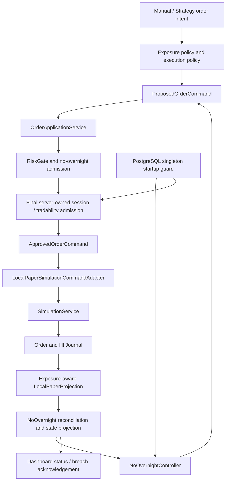

# Central No-Overnight Risk Controller Implementation Plan

## 1. 決策與目標

採用 **B：中央收盤風控狀態機**，但 domain、application ports、Journal schema 與 recovery contract 必須可以在未來由獨立 watchdog（C）承載，不重寫 order、position、market-data 或 reconciliation pipeline。

本計畫的工程宣稱是：

> No-Overnight Policy 保證系統不會「有意」把受政策管理的 intraday exposure 帶到隔日；若收盤時仍無法證明已平倉，系統必須留下持久化的 critical breach，並封鎖後續新進場。

本計畫不宣稱真實市場一定能成交，也不宣稱整個 brokerage account 的股票數量必須為零。

### 1.1 管理範圍

受 No-Overnight Policy 管理：

- `AUTO_INTRADAY`
- `MANUAL_INTRADAY`

不受本政策自動平倉：

- `AUTO_SWING`
- `MANUAL_LONG`
- `UNCLASSIFIED_LEGACY`

若同一個 symbol 同時存在長期與當沖 exposure，只能平掉被 policy 管理的 intraday slice；不得用 symbol-level 全部賣出達成假平倉。

### 1.2 第一版執行邊界

- 僅實作 `LOCAL_PAPER_SIMULATION`。
- 不新增 Shioaji order、CA、broker callback 或 real-money execution。
- 不實作獨立 process、HA、renewable/fenced execution lease 或 broker failover。
- B 的 `ENFORCING` 仍必須有 PostgreSQL-backed singleton startup guard，確保同一 account/policy family 只有一個 controller 可以執行；此 guard 不提供 C 的 lease expiry、fencing token 或 HA handoff。
- 不建立第三套 market-data、order 或 Portfolio pipeline。
- 不產生 synthetic fill。
- 不凍結尚無 evidence 支持的收盤時間參數。
- 不以本計畫授權 Portfolio Phase 1、Small Capital Live 或 unattended production。

## 2. 現況與必要修正

目前執行路徑是：

```text
Dashboard / Strategy
  -> LocalPaperCommandService
  -> OrderApplicationService
  -> RiskGate
  -> LocalPaperSimulationCommandAdapter
  -> SimulationService
  -> terminal order/fill Journal
  -> LocalPaperProjection/checkpoint
```

可直接重用：

- `OrderApplicationService` 的 journal-before-side-effect 邊界。
- `RiskGate` 的 entry 與 risk-reducing SELL 分流。
- `LocalPaperCommandService` 的 idempotent submit、cancel、bounded retry、terminal outcome 與 checkpoint。
- PostgreSQL Journal 的 append-only records 與 monotonic projection checkpoints。
- `RuntimeComposition` 的單一 construction/recovery/close root。
- deterministic `Clock`、`ReviewedEquityCalendar`、partial-fill 與 restart test infrastructure。

必須先修正：

1. `OrderCommand` 沒有 holding horizon、exposure identity、position action 或 operational exit reason。
2. `SimulationService` 與 `LocalPaperProjection` 都以 symbol 聚合 position，同 symbol 無法安全保存 long 與 intraday slice。
3. `RiskSnapshot` 的 position/pending quantity 是 symbol aggregate，不能證明 SELL 只減少 managed exposure。
4. 現有 13:25 flatten 位於 `ContinuousPaperStrategyController`，只管理自己的 automated position，不是中央政策。
5. strategy stop／kill switch 會停止產生 intent，但 no-overnight cancellation、flatten、reconciliation 不得被一起停止。
6. in-memory Journal 無法支持 restart-safe breach；ENFORCING 不可 silent fallback 到 memory。
7. 現有 `local-paper-runtime-v1` Journal session沒有 immutable account/policy-family identity，政策升版或重啟可能無法證明仍在管理同一組 exposure/breach。
8. `dashboard.server` 的 singleton 只在單一 process內成立，無法防止多 worker或重複 process。
9. `LocalPaperCommandService._risk_snapshot()` 固定 `market_open=True`、`instrument_tradable=True`，且 `OrderApplicationService` 在 handler前沒有最後一次 server-owned admission。

## 3. Target Architecture



約束：

- `NoOvernightController` 只能建立 operational intent，再走同一條 Proposed → Risk → Approved → Adapter path。
- Controller 不得直接改 position、製造 fill 或呼叫 `SimulationService._fill()`。
- 未來 C 只搬移 Controller host 與 scheduler ownership；command service、Journal、projection、market data、broker adapter 均維持單一權威。
- `ENFORCING` 若失去 singleton guard health，最後 admission必須 fail closed，不得呼叫 handler。

## 4. Domain Contracts

### 4.1 Exposure identity

新增 `trading/exposure.py`：

```text
AccountScopeIdentity
  account_scope_id
  execution_mode
  ledger_id
  identity_schema_version

PolicyFamilyIdentity
  policy_family_id
  account_scope_id
  policy_kind = NO_OVERNIGHT
  identity_schema_version

HoldingHorizon
  INTRADAY
  SWING
  LONG_TERM
  UNCLASSIFIED_LEGACY

PositionAction
  OPEN_LONG
  CLOSE_LONG

ExecutionReasonCategory
  STRATEGY
  OPERATIONAL_RISK

ExposureIdentity
  exposure_id
  account_scope_id
  policy_family_id
  owner_origin
  owner_id
  holding_horizon
  entry_session_date
  entry_policy_version
  entry_policy_digest
```

規則：

- `AUTO_INTRADAY` = `STRATEGY_AUTOMATED + INTRADAY`。
- `MANUAL_INTRADAY` = `MANUAL_WEB + INTRADAY`。
- `account_scope_id` 是一個 ledger/account projection 的 immutable、非敏感穩定 ID；`policy_family_id` 是跨 policy version/digest 沿用的 immutable policy lineage ID。兩者必須由 reviewed config顯式提供，不可從 PID、hostname、DSN、session date、random UUID或啟動時間生成。
- `policy_revision_id = digest(policy_family_id + policy_version + canonical policy config)`；升版只建立新 revision，不改 `policy_family_id`。
- `no_overnight_managed` 必須由 immutable entry policy 推導，不讓 UI 任意傳 boolean。
- 每個 BUY entry 建立或明確延續一個 `exposure_id`；所有 fill、retry、SELL 都保留該 identity。
- `CLOSE_LONG` 必須指定 `target_exposure_id`，不得只指定 symbol。
- 同 symbol 可有多個 exposure；quantity、average cost、realized PnL 先在 exposure level 計算，再產生 symbol aggregate view。
- policy config 更新不得把既有 managed exposure 排除；舊版本 exposure 仍由同一 policy family 管到歸零。
- transition、result、breach、ack、order/fill與 projection checkpoint都必須攜帶或由 session metadata不可歧義地解析出 `account_scope_id + policy_family_id`。
- `ENFORCING` recovery必須從code-owned固定identity anchor開始，掃描其predecessor/current session chain內所有 open managed exposure/breach。若 config、Journal session metadata、checkpoint或現有 exposure的 scope/family不一致，RuntimeComposition拒絕啟動；不得建立新 scope來繞過舊 latch，也不得自動 rebind。
- 更換 `account_scope_id` 或 `policy_family_id` 是另案 migration：必須先證明舊 scope已flat、無 pending/unresolved/open breach，再建立下一個code-owned schema session（例如v3）與reviewed migration event；不能只換config或改session ID。

### 4.2 Legacy records

- 不覆寫既有 `order_command.v1`／`local_paper_fill.v1` Journal。
- 新增code-owned固定名稱、不可由config改寫的immutable `local-paper-runtime-v2` identity-anchor Journal session，metadata至少保存 `account_scope_id`、`policy_family_id`、execution mode、ledger identity、identity schema version與predecessor v1 session ID/digest；不得修改既有 `local-paper-runtime-v1` metadata。固定anchor確保任意更換scope/family只會造成metadata conflict，而不是建立一條逃離舊latch的新session。
- v2 reader 將缺少 horizon/exposure 的舊 record 映射成 deterministic legacy exposure ID，horizon 固定為 `UNCLASSIFIED_LEGACY`。
- 不從 `MANUAL_WEB`、symbol、策略名稱或 UI 文案猜測 legacy position 是 intraday。
- 建立 `local_paper.v2` projection/checkpoint；首次重建必須與 v1 的 cash、aggregate quantity、average cost及 realized PnL 對得上，否則 fail closed。
- v1 → v2 import以 append-only `local_paper_v1_imported.v1` manifest記錄來源 session、terminal sequence、digest與 target scope/family；同一 manifest只能成功一次，source digest改變即 `RECOVERY_REQUIRED`。
- `UNCLASSIFIED_LEGACY` 不會被自動賣出；同 symbol 若存在 legacy exposure，新的 managed entry 預設 blocked，直到舊 exposure 被人工關閉或另案完成有稽核的分類流程。

### 4.3 Order and fill schemas

新產生的 command／order／fill至少保存：

- `exposure_id`
- `account_scope_id`
- `policy_family_id`
- `holding_horizon`
- `position_action`
- `target_exposure_id`
- `execution_reason_category`
- `execution_reason_code`
- `policy_version`
- `policy_digest`
- 原有 strategy/run/decision/intent lineage

收盤風控 exit 使用：

```text
execution_reason_category = OPERATIONAL_RISK
execution_reason_code = NO_OVERNIGHT_POLICY
position_action = CLOSE_LONG
```

停利、停損與 thesis exit 仍屬 `STRATEGY`，不得混入 No-Overnight Alpha／績效歸因。

### 4.4 Versioned Journal kinds

建議新增／升版：

- `order_command.v2`
- `local_paper_fill.v2`
- `local_paper_order_state.v2`
- `local_paper_v1_imported.v1`
- `no_overnight_final_admission.v1`
- `no_overnight_transition.v1`
- `no_overnight_reconciliation.v1`
- `no_overnight_result.v1`
- `no_overnight_breach_resolved.v1`
- `no_overnight_breach_acknowledged.v1`
- `no_overnight_controller_guard.v1`

Projection names：

- `local_paper.v2`
- `no_overnight.v1`

Generic Journal tables 已可容納這些事件，B v1 不需要新增 mutable state table。若後續需要營運查詢效能，只能新增可重建 index/materialized projection，不可形成第二個事實來源。

### 4.5 Identity closure matrix

| Artifact | Required immutable identity |
|---|---|
| `NoOvernightPolicyConfig` | `account_scope_id`, `policy_family_id`, `policy_version`, canonical `policy_digest` |
| fixed v2 Journal identity anchor | `account_scope_id`, `policy_family_id`, ledger/execution identity, predecessor session/digest |
| `ExposureIdentity` | `account_scope_id`, `policy_family_id`, `exposure_id`, entry policy version/digest |
| command/order/fill/state fact | `account_scope_id`, `policy_family_id`, `exposure_id`, target identity and semantic action key where applicable |
| transition/reconciliation/result | `account_scope_id`, `policy_family_id`, `session_date`, monotonic state/revision, policy revision |
| breach | `account_scope_id`, `policy_family_id`, originating `session_date`, `breach_id`, `breach_revision`, evidence fence/digest |
| resolution/ack | same breach identity and latest revision, exact reconciliation digest, ordered Journal sequence |
| checkpoint | fixed projection/session identity, state-key digest, covered Journal sequence, payload digest |

Reader不得用「目前config」補上舊event缺少的scope/family。v2 event缺欄位、unknown identity或matrix任一欄位不一致皆為schema/recovery error；只有明確的v1 import reader可以產生`UNCLASSIFIED_LEGACY`。

## 5. Policy Configuration

新增 `config/no_overnight.py`，定義：

```text
NoOvernightMode
  DISABLED
  OBSERVE_ONLY
  ENFORCING

NoOvernightPolicyConfig
  account_scope_id
  policy_family_id
  policy_version
  timezone
  no_new_entry_at
  cancel_entry_at
  flatten_at
  aggressive_exit_at
  final_reconciliation_at
  max_exit_attempts
  retry_cooldown_seconds
  executable_book_policy_id
  controller_hosting_mode = SINGLE_HOST_SINGLE_WORKER
  controller_guard_kind = POSTGRES_ADVISORY_LOCK
```

驗證：

```text
market open
  < no_new_entry_at
  < cancel_entry_at
  < flatten_at
  < aggressive_exit_at
  < final_reconciliation_at
  < reviewed session close
```

規則：

- `DISABLED` 為預設。
- `OBSERVE_ONLY` 只計算 transition、would-block、would-cancel、would-exit 與 reconciliation，不建立 command。
- `ENFORCING` 必須顯式提供完整時間與 policy identity，不使用隱藏預設或 magic number。
- `ENFORCING` 必須使用 PostgreSQL Journal、成功 migration/health check、可信 checkpoint、reviewed session-window calendar、immutable scope/family metadata及有效 singleton guard；缺一項即拒絕啟動，且不得提供任何 exposure-increasing order API。
- `dashboard.__main__` 的 ENFORCING啟動契約固定為一個 Uvicorn worker；外部 launcher必須提供 reviewed single-host/single-worker deployment manifest。PostgreSQL guard仍要防止誤啟第二個 worker/process/host。
- 每個 trading session建立 immutable No-Overnight Journal session metadata，至少包含 `account_scope_id`、`policy_family_id`、policy version/digest、calendar schema/digest、timezone、hosting mode與guard key version；任何 mismatch皆 fail closed。
- 時間與 book-age policy 需由後續 full-session Paper/Shadow evidence review 凍結；本 PR 不宣稱範例時間是正式參數。
- config canonical JSON、validation algorithm version 與 digest 必須進入 session result。

## 6. State Machine

```text
NORMAL
  -> NO_NEW_ENTRY
  -> CANCEL_ENTRY
  -> FLATTENING
  -> AGGRESSIVE_EXIT
  -> FINAL_RECONCILIATION
       -> CONFIRMED_FLAT
       -> OVERNIGHT_BREACH
```

狀態以 immutable `account_scope_id + session_date + policy_family_id` 為 identity，transition 只能單調前進。Process 晚啟動時直接恢復到依 server clock/calendar 應在的最高狀態，不補做已經不合法的市場操作。

| State | Entry admission | Controller action | Exit condition |
|---|---|---|---|
| `NORMAL` | 依原 RiskGate | 只投影與監控 | 到 `T_no_new_entry` |
| `NO_NEW_ENTRY` | block managed intraday entry/increase；SELL allowed | 記錄 blocked evidence | 到 `T_cancel_entry` |
| `CANCEL_ENTRY` | 同上 | 取消 managed active BUY remainder；partial fill 成為 managed exposure | active managed BUY remainder 為 0，或到下一時點 |
| `FLATTENING` | 同上 | 對每個 managed available quantity 建立正常 risk-reducing SELL | managed qty 歸零或到 aggressive 時點 |
| `AGGRESSIVE_EXIT` | 同上 | cancel-confirm-refresh-reprice-submit；bounded retry | managed qty 歸零或到 final 時點 |
| `FINAL_RECONCILIATION` | all exposure-increasing BUY blocked | 停止猜測；取得 authoritative projection、terminal order 與 reconciliation evidence | flat predicate 成立或到 session close |
| `CONFIRMED_FLAT` | managed intraday entry保持關閉至下一 reviewed session | 只監控 late facts | late/recovered fill 可使結果失效並建立 breach |
| `OVERNIGHT_BREACH` | account-wide exposure-increasing BUY blocked | reconciliation、cancel、風險降低與人工處理仍 allowed | exposure 已解決且 operator ack 後，下一 session 才可重新 admission |

### 6.1 Boundary race rule

Risk admission 必須同時檢查：

- monotonic No-Overnight state/revision；以及
- server-owned `requested_at` 是否已達 cutoff。

因此即使 transition worker 與 HTTP/strategy BUY 同時抵達，`requested_at >= no_new_entry_at` 的 managed entry 仍必須 deterministic BLOCKED。Client timestamp 不具 admission authority。

此外，在 `OrderApplicationService` 已完成初次 RiskGate decision與Journal append後、真正呼叫 handler前，必須透過 `FinalExecutionAdmissionReader` 重新讀取：

- server clock與依 reviewed session-window calendar計算的 session date/phase；
- calendar schema/digest與coverage狀態；
- server-owned instrument tradability；
- No-Overnight state/revision與open breach latch；
- singleton guard ownership/health；
- executable BidAsk policy仍成立。

這次 final admission 必須另寫 `no_overnight_final_admission.v1`。只要 planned/approved時與pre-handler時的 phase、tradability、state revision或guard health已失效，就回傳 stable BLOCKED/RECOVERY_REQUIRED reason；只允許Journal evidence，不得呼叫 adapter/`SimulationService`、建立模擬 order或改 position。特別是「收盤前完成規劃、收盤後才執行」的handler call count必須為0。

現有 `LocalPaperCommandService._risk_snapshot()` 的 `market_open=True`、`instrument_tradable=True` 必須在 PR-NO-003移除。`ReviewedEquityCalendar` 目前只證明trading day，必須新增versioned session open/close window與per-instrument tradability port；無coverage、phase不允許或tradability unknown一律fail closed。Cancel/query/reconciliation依各自adapter capability處理，不以偽造`market_open=True`繞過。

### 6.2 Aggressive exit algorithm

每個 `exposure_id` 同一時間最多一筆 active exit：

```text
read managed remaining quantity
  -> if active SELL exists: wait
  -> if cancellable stale SELL exists: journal cancel intent
  -> wait for terminal cancel/reconciliation evidence
  -> refresh managed quantity and fresh executable book
  -> create new proposed CLOSE_LONG command
  -> RiskGate admission
  -> submit with deterministic idempotency key
  -> wait for fill/partial/reject/cancel/unknown
  -> retry only known terminal remainder and within max attempts/deadline
```

禁止：

- timeout 後直接再送一張，不先確認前一張終態。
- 對 `SUBMIT_UNKNOWN`／`RECOVERY_REQUIRED` 建 successor。
- 用 Tick 取代 BidAsk 形成 executable price。
- 無限重試或超過 session/adapter 可接受時段仍假裝 flatten。

semantic idempotency identity：

```text
account scope id + policy family id + session date
  + exposure id + deterministic exit chain id + action + attempt
```

`exit_chain_id` 由 `account_scope_id + policy_family_id + session_date + exposure_id + CLOSE_LONG` deterministic建立；同 exposure/session只有一條 policy exit chain。Cancel action另外包含 immutable target order ID。`planner_input_digest`、quantity、book snapshot、state revision與reconciliation digest只放在 evidence payload，不得加入semantic action key。兩個controller即使讀到不同snapshot，只要是同一 chain/attempt就必須碰到同一Journal idempotency identity，第二個不得抵達handler。

不以 PID、random UUID、mutable input digest或 wall-clock polling 次數作為唯一語意。

### 6.3 B single-controller startup guard

B 不建立 C 的 renewable lease/fencing protocol，但 `ENFORCING` 必須實作 `NoOvernightControllerGuard`：

1. 用 dedicated PostgreSQL connection對 `account_scope_id + policy_family_id + guard-key-version` 取得 non-blocking advisory lock。
2. guard必須在 controller construction/action planning前成功；第二個 composition無法取得時直接拒絕 ENFORCING startup。
3. guard connection由RuntimeComposition持有至command producers/controller全部停止；不得從一般transaction pool短借後歸還。
4. 每次 `run_once()` 與 pre-handler final admission都檢查guard health。lock connection遺失時立即停止controller mutation、封鎖所有 exposure-increasing BUY並進入 `RECOVERY_REQUIRED`；只允許query/reconciliation與明確人工risk-reducing處理。
5. stable Journal action identity仍是第二道防線；guard不能取代idempotency或journal-before-side-effect。
6. PostgreSQL UAT建立兩個獨立RuntimeComposition共用同一Journal/scope/family：只允許一個取得guard，而且所有相同/不同snapshot競爭的handler side effect總數最多1。

此 guard沒有expiry、renewal、fencing token、host handoff或HA宣稱；這些仍屬未來C。B的部署證明固定為reviewed single-host/single-worker manifest加上PostgreSQL guard，任一項無法驗證即不得ENFORCING。

## 7. Final Reconciliation Contract

`CONFIRMED_FLAT` 必須同時成立：

```text
managed_position_qty == 0
AND pending_entry_qty == 0
AND pending_exit_qty == 0
AND unresolved_execution_count == 0
AND reconciliation == MATCH
AND snapshot_after_last_execution_fact == true
```

並依本 session的managed exposure history選擇一種明確proof mode：

```text
NEVER_EXPOSED
  max_managed_position_qty_during_session == 0
  -> 不要求存在SELL或fill；strict predicate成立即可CONFIRMED_FLAT

FILL_DERIVED_CLOSE
  max_managed_position_qty_during_session > 0
  -> 每一筆managed quantity減量都必須等於non-duplicate authoritative
     CLOSE_LONG fill allocation；不得由cancel、reject、submitted狀態、人工projection
     調整或synthetic fill減量
  -> 所有exit order chain已terminal/resolved，且strict predicate成立
```

`EXIT_SUBMITTED`、`PARTIALLY_FILLED`、`CANCELLED`或`REJECTED`本身都不是flat證明；但已Journal化的partial fill仍是合法減量fact，前提是原order最終terminal、餘量已處理、整條chain無pending/unresolved，且最後managed quantity確實歸零。空倉session不得因沒有SELL `FILLED`而被誤判breach。

`NoOvernightResult` 至少包含：

```text
account_scope_id
session_date
policy_family_id
policy_version/digest
state
flat_proof_mode
max_managed_position_qty_during_session
managed_position_qty_by_exposure
pending_entry_qty_by_exposure
pending_exit_qty_by_exposure
unresolved_execution_ids
reconciliation_status/digest
last_fill_journal_sequence
last_execution_fact_journal_sequence
snapshot_covers_through_journal_sequence
snapshot_journal_sequence
snapshot_source_as_of
snapshot_received_at
transition timestamps
result_at
```

`last_execution_fact_journal_sequence` 必須涵蓋會改變pending/unresolved/position evidence的所有fact：submit accepted/unknown、fill/partial fill、cancel intent/result、reject、expire、terminal state、`RECOVERY_REQUIRED`及recovery resolution。`snapshot_after_last_execution_fact` 必須證明 `snapshot_covers_through_journal_sequence >= last_execution_fact_journal_sequence`，不只比較兩個可能clock-skew的wall-clock timestamp。

任何 execution fact sequence晚於既有result的snapshot fence，都會使該result變成`SUPERSEDED`並強制重新reconcile；若已過session close且strict predicate無法再次成立，建立或升版`OVERNIGHT_BREACH`。

### 7.1 Local Paper reconciliation

B v1 比對：

- fill-derived `local_paper.v2` exposure projection；
- `SimulationService` exposure state；
- Journal-derived latest order states；
- active/unresolved local simulator orders。

任何 quantity、ownership、order state、cash/PnL projection digest mismatch 都是 `RECONCILIATION_REQUIRED`；到 session close 仍未解除即為 `OVERNIGHT_BREACH`。

### 7.2 同 symbol 的 long + intraday 範例

```text
2330 MANUAL_LONG       1,000 shares
2330 AUTO_INTRADAY     1,000 shares
```

Controller 只送出 target=`AUTO_INTRADAY exposure_id` 的 1,000 股 SELL。成功後：

```text
managed intraday qty = 0
excluded long qty = 1,000
aggregate symbol qty = 1,000
reconciliation = MATCH
```

這是 `CONFIRMED_FLAT`。要求 aggregate symbol quantity 為 0 反而是錯誤。

## 8. Durable Breach Latch

建立 breach 的條件：

- session close 時 flat predicate 任一項不成立；
- `CONFIRMED_FLAT` 後出現 late/recovered managed fill；
- restart replay 發現先前 flat result 與 Journal/execution facts 不一致；
- managed/excluded allocation或 reconciliation 無法證明。

Breach properties：

- append-only Journal event，搭配 `no_overnight.v1` checkpoint。
- severity=`CRITICAL`。
- process/machine restart 後仍為 open latch。
- open latch block 所有 exposure-increasing BUY，不只 managed intraday BUY。
- SELL、cancel、query、recovery、reconciliation 不得被 latch 阻擋。
- operator acknowledgement 與 exposure resolution 是兩件事。
- acknowledgement 不刪 breach、不改歷史 result、不自行 reopen admission。
- 每次新breach evidence或late execution fact都建立monotonic `breach_revision`，保存 `evidence_through_journal_sequence`與當下`reconciliation_digest`；revision更新會使先前resolution/ack失效。
- Resolution只能在latest revision重新滿足strict predicate後寫入 `no_overnight_breach_resolved.v1`，內容包含`breach_revision`、`reconciliation_digest`、snapshot fence與resolution Journal sequence。
- Acknowledge request必須提供latest `breach_revision + reconciliation_digest` 作optimistic concurrency check；只有該revision已resolution後才接受，ack Journal sequence必須晚於resolution sequence。未resolution的「我已看到」不算release acknowledgement。
- late/recovered execution fact、reconciliation digest改變或revision增加後，舊ack不得沿用；必須重新resolution及ack。
- 只有latest revision具有效resolution與其後ack，且下一reviewed session已開始，才可解除admission latch。

## 9. Runtime and Future Watchdog Ports

新增或擴充 `runtime/ports.py`：

- `ManagedExposureReader`
- `ManagedOrderReader`
- `NoOvernightCommandPort`
- `NoOvernightReconciliationPort`
- `NoOvernightStateRepository`（由 Journal/projector adapter 實作）
- `FinalExecutionAdmissionReader`（server clock + reviewed session window + instrument tradability + policy/latch revision + guard health）
- `NoOvernightControllerGuard`（B使用dedicated PostgreSQL advisory-lock adapter；memory adapter只能測試DISABLED/OBSERVE_ONLY）
- `NoOvernightAlertSink`（第一版 structured log/dashboard；不自動接外部訊息）

新增 `runtime/no_overnight.py`：

- deterministic `run_once(now)`；
- optional single-process polling host；
- transition/action planner；
- 不持有 SDK、不直接持有 provider、不直接 mutation position。

`RuntimeComposition` wiring order：

```text
Journal health/migrations
  -> immutable account_scope_id/policy_family_id metadata and mismatch scan
  -> acquire ENFORCING singleton guard
  -> local_paper.v2 recovery
  -> no_overnight.v1 recovery and latch
  -> SimulationService restore
  -> LocalPaperCommandService
  -> NoOvernightController
  -> strategy controllers and Dashboard routes
```

Shutdown order：

```text
stop accepting new managed entry
  -> stop strategy producers
  -> stop no-overnight polling host
  -> checkpoint no-overnight state and append guard release evidence
  -> disable command handler admission
  -> close simulation workers
  -> close Journal
  -> release/close singleton guard connection
  -> close provider
```

停止 process 不等於 flat。Shutdown 時若仍有 managed exposure，必須保存 `HOST_STOPPED_WITH_MANAGED_EXPOSURE` evidence；B 無法處理主機持續死亡的缺口，這正是未來 C 的升級理由。

## 10. API and Dashboard

### 10.1 Manual order contract

BUY 必須明確選擇 horizon；SELL 必須選擇 exposure：

```text
POST /api/simulation/orders
  BUY:  holding_horizon required
  SELL: target_exposure_id required
```

Rollout 初期在 `DISABLED`／`OBSERVE_ONLY` 下，缺少欄位的 legacy request 可映射成 `UNCLASSIFIED_LEGACY`。`ENFORCING` 下缺少 horizon 必須回 422，不得建立新的 unclassified 或 managed entry；Gate G3 後 Dashboard 必須一律送出明確 horizon。

### 10.2 Policy status routes

```text
GET  /api/simulation/no-overnight
POST /api/simulation/no-overnight/breaches/{breach_id}/acknowledge
```

- GET 只讀 projection，不觸發 provider/broker/account query。
- acknowledgement 使用既有 loopback、same-origin、CSRF、actor 與 idempotency boundary。
- acknowledgement body必須帶latest `breach_revision`與`reconciliation_digest`；revision未resolved、digest mismatch或已被late fact supersede一律回409且零latch mutation。
- 不提供「清除 breach」API。
- 不提供從 Web 修改/freeze 時間 policy 的 API。

### 10.3 UI

新增獨立「收盤風控」卡片，顯示：

- mode、policy version/digest；
- current state、下一 transition；
- managed exposure、pending entry/exit、unresolved count；
- last reconciliation、snapshot sequence/as-of；
- `CONFIRMED_FLAT` 或 `OVERNIGHT_BREACH`；
- breach reason、resolved/acknowledged 狀態。
- breach revision、resolution digest與「僅可在latest revision resolved後ack」狀態；UI不得讓舊頁面ack解除新版breach。

持倉 drawer 以 exposure/horizon 標示 `自動當沖`、`手動當沖`、`自動波段`、`手動長期`、`舊資料未分類`。同 symbol 不可只顯示一個模糊 owner。

## 11. Dependency-Ordered Implementation Slices

### PR-NO-001 — Exposure identity and projection v2

工作：

1. 新增 immutable `AccountScopeIdentity`、`PolicyFamilyIdentity`及 exposure/horizon/action/reason contracts。
2. 建立code-owned fixed `local-paper-runtime-v2` identity anchor、immutable session metadata與一次性v1 import manifest；不修改v1 session/records，且config更換scope/family只能產生conflict、不能旁路舊latch。
3. 升版 command/order/fill Journal schemas與strict readers；所有v2 facts攜帶scope/family/exposure identity。
4. 將 simulator internal position改為exposure-keyed，保留symbol aggregate query compatibility。
5. SELL availability與fill allocation改成target exposure。
6. 建立 `local_paper.v2` reducer、legacy mapping、v1/v2 parity migration。
7. 凍結semantic action identity/exit-chain builder，明確排除mutable input digest。
8. 更新 manual/strategy command builders，先不啟動no-overnight behavior。

Gate G1：

- 同 symbol long + intraday 可共存，SELL intraday 不減少 long quantity。
- quantity/cash/PnL 守恆；partial fill/retry/restart digest一致。
- legacy record 不被自動分類或自動賣出。
- 現有 Local Paper 行為在 aggregate view 的 golden tests 不漂移。
- scope/family policy升版與restart保持同一identity；metadata/checkpoint/exposure mismatch全部fail closed。
- v1 import idempotent且source digest改變會停止；不得以新scope/family繞過舊exposure或breach。

### PR-NO-002 — Pure state machine and OBSERVE_ONLY projection

工作：

1. 新增typed config、以immutable scope/family/session為key的pure transition planner、conditional flat proof mode與event readers。
2. 新增 `no_overnight.v1` Journal projection/checkpoint。
3. Projection追蹤`last_execution_fact_journal_sequence`、snapshot coverage fence與late-fact result supersession。
4. `RuntimeComposition` 建立controller，預設DISABLED。
5. 實作OBSERVE_ONLY；只記would-block/cancel/exit/reconcile。
6. 新增status API/UI card，明確顯示尚未enforcing。

Gate G2：

- deterministic clock 同一輸入產生相同 transitions/actions/digest。
- late start、休市日、calendar out-of-range、timezone與restart均 fail closed。
- OBSERVE_ONLY 的 handler call count 永遠為 0。
- NEVER_EXPOSED空倉session可flat；FILL_DERIVED_CLOSE的每一筆減量都可追溯到authoritative fill。
- cancel/reject/unknown/recovery晚於snapshot時，舊result必須SUPERSEDED。

### PR-NO-003 — Central admission and pending-entry cancellation

工作：

1. 將 no-overnight admission revision接到 `OrderApplicationService/RiskGate`。
2. 新增 stable Risk reasons：cutoff、open breach、recovery required、unclassified conflict。
3. managed BUY cutoff 使用 server requested_at + state revision雙重判斷。
4. 新增 `FinalExecutionAdmissionReader`，在handler前重讀reviewed session window、instrument tradability、policy/latch revision、BidAsk與guard health；寫 final-admission event後才可side effect。
5. 移除 `LocalPaperCommandService._risk_snapshot()` 的 `market_open=True`／`instrument_tradable=True` hardcode，並讓final-admission block不建立模擬rejected order。
6. 實作dedicated PostgreSQL `NoOvernightControllerGuard`；ENFORCING要求single-worker deployment manifest與guard acquisition。
7. `CANCEL_ENTRY` 只取消 managed BUY remainder。
8. partial BUY fill立刻成為待 flatten exposure。
9. strategy stop／kill不得停止中央controller。

Gate G3：

- cutoff 與 concurrent BUY race 中，cutoff 後 entry side effect 為 0。
- long/swing order 不被普通 cutoff 誤擋；open breach 則 block 所有新 exposure increase。
- partial BUY remainder取消後，只以已成交 quantity 建立 flatten requirement。
- 收盤前plan/初審、收盤後pre-handler與tradability由true轉false的測試，adapter/simulator handler call與order/position side effect均為0；只有Journal blocked evidence。
- 兩個獨立composition共用同一PostgreSQL Journal/scope/family時只有一個guard owner；相同attempt即使input digest不同，handler side effect總數最多1。
- guard connection遺失會阻止後續handler並封鎖exposure increase；memory backend不得取得ENFORCING guard。

### PR-NO-004 — Flatten, aggressive exit and final reconciliation

工作：

1. 實作 exposure-level FLATTENING。
2. 實作 cancel-confirm-refresh-reprice-submit bounded successor。
3. 延用 canonical BidAsk/executable-book policy；不使用 Tick 猜價。
4. 實作Local Paper reconciliation、conditional flat proof mode、last-execution-fact fence與strict `NoOvernightResult`。
5. 在 central controller ENFORCING 前，移除或 delegate `ContinuousPaperStrategyController` 的 13:25 strategy-local flatten，避免雙重 SELL。

Gate G4：

- `EXIT_SUBMITTED`、`PARTIALLY_FILLED`、`CANCELLED`、`REJECTED` 都不會被判為 flat。
- NEVER_EXPOSED session在strict zero/pending/unresolved/MATCH/fence成立時可直接`CONFIRMED_FLAT`，不要求SELL。
- FILL_DERIVED_CLOSE session只有所有managed減量皆fill-derived、exit chains terminal/resolved，且managed qty 0 + pending 0 + unresolved 0 + MATCH + post-execution-fact snapshot成立時才能`CONFIRMED_FLAT`。
- duplicate run/callback、timeout、late callback、stale book及cancel race不會重複賣出。
- long + intraday 同 symbol 的端到端測試保留 long exposure。

### PR-NO-005 — Durable breach, restart and admission latch

工作：

1. ENFORCING startup要求 PostgreSQL、migration health與trusted checkpoints。
2. 實作 open breach latch、restart replay、late-fill supersession。
3. 實作monotonic breach revision、late-fact supersession、resolution event，以及綁定latest `breach_revision + reconciliation_digest`且晚於resolution的acknowledgement。
4. 新增 PostgreSQL restart/concurrency UAT與critical structured alerts。
5. 補齊 Dashboard breach UX與操作 runbook。

Gate G5：

- process/machine-equivalent restart後 breach identity、reason、quantity、Journal sequence不變。
- ack 未 resolution、resolution 未 ack、reconciliation mismatch 都不能 reopen BUY。
- stale revision/digest ack回409；late fill或digest改變使舊resolution/ack失效，必須對latest revision重新處理。
- memory backend 無法啟動 ENFORCING。
- PostgreSQL unavailable 時不 fallback 到 memory mutation。

### PR-NO-006 — Evidence campaign and controlled rollout

工作：

1. 先 DISABLED baseline，再 OBSERVE_ONLY full-session evidence。
2. 依 observed entry opportunity、cancel latency、partial-fill、exit fill/retry latency與book availability review時間參數。
3. Freeze policy config/digest後執行 supervised Local Paper ENFORCING UAT。
4. Freeze並review single-host/single-worker deployment manifest、scope/family identity及PostgreSQL guard evidence。
5. 交付session reports、breach drills、restart/duplicate-process drills及false-positive review。
6. 通過獨立review才允許unattended Local Paper；不得自動銜接broker/live。

Gate G6：

- 所有 transition都有完整 input/result evidence。
- synthetic fill count=0、duplicate exit side effect=0、wrong-horizon liquidation=0。
- supervised UAT、unattended Local Paper readiness、broker/live readiness分開評級。

## 12. File Change Map

預計新增：

```text
config/no_overnight.py
trading/exposure.py
trading/no_overnight.py
runtime/no_overnight.py
runtime/no_overnight_guard.py
tests/test_exposure_projection.py
tests/test_no_overnight_domain.py
tests/test_no_overnight_controller.py
tests/test_no_overnight_final_admission.py
tests/test_no_overnight_guard.py
tests/test_no_overnight_recovery.py
tests/test_no_overnight_api.py
tests/test_no_overnight_ui.py
tests/test_no_overnight_postgres.py
architecture/no_overnight_risk_controller_implementation_plan.md
```

預計修改：

```text
trading/risk.py
trading/application.py
trading/local_paper.py
trading/journal.py                 # only if typed helper/export is needed
trading/postgres_journal.py        # expose/build dedicated guard adapter without reusing transaction connection
market_data/equity_calendar.py     # add reviewed session-window contract; do not hardcode tradability
simulation/models.py
simulation/service.py
simulation/application.py
simulation/strategy_flow.py
simulation/continuous_strategy.py
runtime/ports.py
runtime/composition.py
runtime/trading_persistence.py
dashboard/server.py
dashboard/__main__.py
dashboard/static/index.html
dashboard/static/css/dashboard.css
dashboard/static/js/workspaces/simulation.js
tests/test_risk_gate.py
tests/test_order_application.py
tests/test_local_paper_projection.py
tests/test_recoverable_simulation_orders.py
tests/test_continuous_paper_strategy.py
tests/test_runtime_composition.py
tests/test_dashboard_simulation_api.py
tests/test_phase5_paper_sell_postgres_uat.py
.env.example
README.md
```

B v1 原則上不需新增 SQL table migration；若實作時發現 generic Journal/checkpoint不足，必須先停在 review gate 說明原因，不可臨時加入第二個 mutable source of truth。

## 13. Test Matrix

### Domain/property

- 所有合法／非法 state transition。
- state per session單調，不因 clock倒退而回復舊狀態。
- exposure quantity conservation。
- 同 exposure最多一筆 active exit。
- managed/excluded classification matrix。
- flat predicate每個條件的單獨 negative test。
- policy/config canonical digest與unknown-field rejection。
- `account_scope_id`／`policy_family_id`在policy version rotation、restart與replay保持穩定。
- scope/family/session metadata、exposure、checkpoint任一mismatch都fail closed，且無implicit rebind。
- NEVER_EXPOSED與FILL_DERIVED_CLOSE proof mode各自的positive/negative properties。
- `last_execution_fact_journal_sequence`涵蓋cancel/reject/unknown/recovery，舊snapshot不得越過sequence fence。

### Order/Risk

- cutoff 前後與exact-boundary BUY。
- managed/unmanaged entry差異。
- open breach block all new exposure increase。
- risk-reducing SELL保留ownership、quantity、fresh book、idempotency、Journal checks。
- stale/missing BidAsk、market closed、instrument untradable、transport kill。
- plan/初審在session open、pre-handler已close；handler/adapter/simulator order/position side effect必須為0。
- reviewed calendar out-of-coverage、tradability unknown/flip與singleton guard lost的final-admission fail-closed。
- `SUBMIT_UNKNOWN` 不重送。

### Fill/projection

- immediate、delayed、partial、多次 partial fill。
- cancel remainder後只 flatten filled quantity。
- same symbol long + intraday。
- wrong exposure SELL被拒絕。
- v1 replay → v2 parity與legacy unclassified。
- immutable v2 Journal session metadata與v1 import manifest idempotency/source digest conflict。
- duplicate/reordered/late terminal event。

### Controller/concurrency

- entry request與cutoff transition race。
- cancel與late partial fill race。
- 兩個 `run_once()` 同時執行。
- 兩個controller看到不同planner input digest但同exit chain/attempt，只能有一個semantic command/handler side effect。
- 兩個獨立RuntimeComposition共用同一PostgreSQL Journal/scope/family，第二個無法取得singleton guard。
- guard connection遺失後所有controller mutation與exposure-increasing BUY fail closed。
- worker restart於每個 state。
- start after final reconciliation/session close。
- strategy stop/kill與central controller isolation。
- old strategy flatten不會與central flatten並行。

### Persistence/recovery

- missing/corrupt/stale checkpoint。
- Journal append成功但handler outcome未知。
- flat result後late fill轉 durable breach。
- breach revision/resolution/ack所有排列；ack必須綁latest revision+digest且Journal sequence晚於resolution。
- stale ack、resolution後late fill、digest改變與new revision全部不得reopen admission。
- PostgreSQL process restart、concurrent append/idempotency conflict。
- ENFORCING + memory/postgres outage fail-closed。

### API/UI

- BUY horizon與SELL target exposure validation。
- unknown/extra fields 422。
- CSRF、loopback、origin、idempotency。
- GET無side effect且不呼叫 provider。
- same-symbol multi-exposure rendering與Traditional Chinese labels。
- breach不可由前端按鈕直接清除。
- stale `breach_revision`／`reconciliation_digest` acknowledge回409且零latch mutation。
- responsive/accessibility與JS module syntax。

## 14. Observability and Evidence

Journal／structured metrics至少包含：

- state transition與transition lag；
- account scope、policy family/revision、Journal session metadata digest（不得含credential/PII）；
- singleton guard key version、owner status、acquire/loss reason與deployment manifest digest；
- initial/final admission phase、calendar/tradability/guard evidence與stable block reason；
- managed position/pending/unresolved quantities；
- cancel/exit attempts與terminal disposition；
- time-to-first-exit、time-to-flat；
- reconciliation status/digest；
- confirmed-flat與breach counts；
- late facts after flat；
- flat proof mode、last execution fact sequence與snapshot coverage sequence；
- breach revision、resolution sequence/digest與ack sequence/digest；
- admission blocks by stable reason code；
- wrong-horizon liquidation count（必須為 0）；
- duplicate exit side effects（必須為 0）。

Log/Journal 不保存 credential、完整 account/person identity 或 SDK object。Dashboard 文案可翻譯，但 wire reason code、event kind與digest語意不可隨文案改變。

## 15. Rollout and Rollback

Rollout：

1. Freeze immutable account scope/policy family，建立linked v2 Journal session與projection v2，behavior不變。
2. `OBSERVE_ONLY` 與 Dashboard可視化。
3. 經evidence review後freeze reviewed session-window/time policy與final-admission contract。
4. 驗證single-host/single-worker manifest、PostgreSQL singleton guard與duplicate-composition UAT。
5. supervised `ENFORCING` Local Paper。
6. restart/breach/late-fact/stale-ack/guard-loss drills。
7. 另一次approval才考慮unattended Local Paper。

Rollback：

- 可以 `ENFORCING -> OBSERVE_ONLY/DISABLED` 停止自動 action，但不得清除 open breach或自動 reopen BUY。
- Event schemas與Journal records採forward-compatible readers，不回寫或刪除。
- Central ENFORCING與legacy 13:25 flatten必須互斥；只有 managed exposure已flat且controller無active action時才能切回legacy。
- Reconciliation不可信時只能退回query/recovery模式，不能回退成memory mutation。
- Scope/family identity、v2 Journal metadata、breach revision與ack evidence不可rollback/delete；若identity mismatch只能停止ENFORCING並走reviewed migration。

## 16. Future B + C Upgrade Gate

只有以下條件另案完成後，才把同一 Controller搬到獨立 watchdog：

- `FreshnessPolicyV1`與broker/account evidence已freeze；
- account-bound Portfolio/reconciliation contract已實作並通過；
- broker mode具有durable PostgreSQL、submission ambiguity、callback dedupe、execution lease與rate-limit contracts；
- Small Capital Live另行明確授權；
- 主程式死亡、網路分割、lease handoff與雙主防護測試通過。

C 只新增：

- independent scheduler/host；
- execution lease；
- broker reconciliation adapter；
- external critical alert sink；
- process/host failure drills。

C 必須以具有expiry、renewal與fencing token的lease取代B的startup singleton guard，但沿用相同`account_scope_id`、`policy_family_id`、semantic action key與final-admission ports。

C 不得新增第二條 OrderApplicationService、PortfolioProjection、market-data pipeline或broker transport。

## 17. Definition of Done

1. 只有 managed intraday exposure會被中央政策操作。
2. 同 symbol long + intraday 可安全共存，long quantity不被no-overnight SELL減少。
3. 所有 no-overnight SELL 經同一 Proposed → Risk → Approved → Adapter pipeline。
4. 沒有synthetic fill；position/PnL減量只能來自non-duplicate authoritative fill facts。
5. `account_scope_id`與`policy_family_id`跨policy升版/restart穩定，任何identity mismatch都阻止ENFORCING startup。
6. B以reviewed single-worker manifest加PostgreSQL singleton guard保證同scope/family只執行一個controller；stable action key不含mutable input digest。
7. Handler前final admission重新取得server-owned session phase/tradability/state/guard evidence；過期approval零adapter/simulator side effect。
8. `CONFIRMED_FLAT`完整滿足strict predicate；NEVER_EXPOSED不要求SELL，FILL_DERIVED_CLOSE的所有減量皆fill-derived且exit chain resolved。
9. Result保存last execution fact與snapshot coverage fence；任何late fact會supersede舊result。
10. 任何未解 exposure／pending／unknown／mismatch在close後成為durable `OVERNIGHT_BREACH`。
11. Breach跨restart保留；只有latest revision resolution後、綁定同revision/digest的後置ack才能在下一reviewed session解除latch。
12. cutoff race、partial fill、cancel/retry、late callback、restart、duplicate composition、guard loss與PostgreSQL outage/recovery皆有negative tests。
13. 時間policy保持config/digest化，只有evidence review後才能freeze/promote。
14. Dashboard清楚區分policy state、managed/excluded exposure與breach，不把order submitted顯示成flat。
15. 既有strategy exit attribution與no-overnight operational exit attribution完全分離。
16. B v1沒有broker order、real-money authority、獨立watchdog、renewable/fenced lease或第三套pipeline。

## 18. Implementation Authorization Boundary

本文件只是一份 implementation plan。開始 PR-NO-001 前仍需使用者明確授權，且應先處理目前 dirty shared worktree：建立隔離 branch/worktree，或由owner先commit/整理既有變更。不得直接把本功能疊在現有廣泛未提交修改上。
