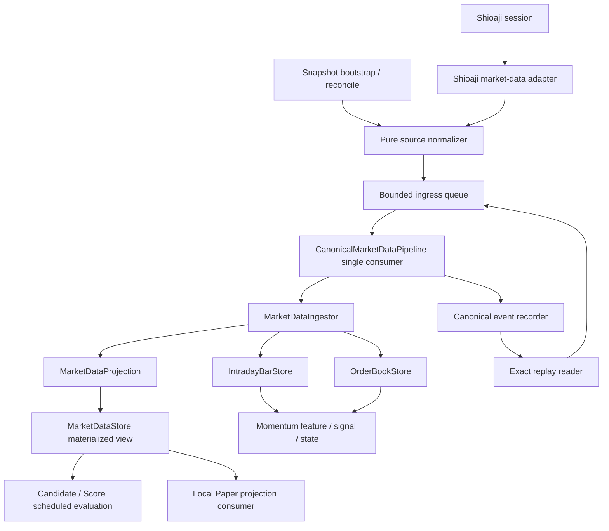

# P1 — Canonical Market Event Pipeline Implementation Plan（Contract-Freeze Revision）

> 狀態：`P1 Vertical Slice 1 — PASSED`；`P1.1a Durable Journal Baseline — PASSED`；
> `P1.1b Reference Contract — PASSED`；`Exact Projection Replay Engine —
> IMPLEMENTATION PASSED`；`Historical Qualification — ACTIVE (Case A + Case B
> required)`。
> 已實作能力仍為 flags-off，未接 production runtime、未切 consumer authority、未啟用
> 券商委託、未凍結 Freshness 門檻，也未啟用 real-money execution。
>
> 命名注意：此處 `P1-CMEP` 是專案優先級名稱，不等於 Portfolio 文件中的
> `Phase 1`。目前 `FreshnessPolicyV1` 尚未完成，相關 cutover gate 仍維持阻擋。

## 1. 結論

建議採用這個 milestone，但不要新建第三套 event model／queue／ingestor。
目前 repo 已有可直接提升為 backbone 的基礎：

- `market_data.events.EventEnvelope`、`TickEvent`、`BidAskEvent`
- `BoundedMarketEventQueue`
- `MarketDataIngestor`
- `IntradayBarStore`、`OrderBookStore`、`DataHealth`
- `ShioajiMomentumStream` 的 callback mapping、subscription ACK／rollback／reconnect
- `ReplayDatasetLoader`／`ReplayRunner`
- Momentum worker 的 single-consumer、overflow fail-closed、shutdown drain

真正缺少的是 process-wide ownership 與共同 projection：

1. 一個 Shioaji callback owner。
2. 一個有界 ingress queue 與 ordered consumer。
3. 一個 canonical market-event recorder。
4. 一個把 Event 投影成「目前市場狀態」的 `MarketDataProjection`。
5. 一個長生命週期、thread-safe 的 `MarketDataStore`。
6. Paper、Momentum、Scanner 共用同一 ingestion 與 subscription ownership。
7. Live event log 經同一 pipeline replay 後的 projection parity gate。

`MarketDataStore` 不刪除；它會從「呼叫者任意覆寫的快照 dict」升級為
canonical events 的 materialized view。Candidate／Score 仍只讀 `StockData`，
不處理 raw event，也不在 Shioaji callback thread 執行。

## 2. 現況判讀

| 能力 | 現況 | P1-CMEP 決策 |
|---|---|---|
| Lightweight callback | Momentum、Paper 已有 | 收斂成一個 adapter callback owner |
| Bounded queue | Momentum、Paper 各一套 | 共用一個 ingress queue |
| Canonical Tick/BidAsk | Momentum 已有；Paper 使用較小的 `RealtimeQuoteUpdate` | 沿用 canonical contracts，淘汰重複 quote DTO |
| Ordering／dedupe | Momentum ingestor 與 Paper 各自處理 | `MarketDataIngestor` 成為唯一權威 |
| Bar／Book projection | Momentum 已有 | 提升為 backbone projections |
| MarketDataStore | latest-write-wins、每次 scan 重建 | 改成長生命週期 materialized view |
| Recorder | 有 evidence capture／交易 Journal，沒有全量 canonical market recorder | 新增 recorder port + JSONL adapter |
| Replay | 可重播 fixture 並驗證 Bar／Book digest | 升級為 exact envelope round-trip 與多 projection parity |
| Subscription ownership | Momentum、Paper 各自管理 | 共用 interest coordinator |
| Scanner | snapshot `run_scan()`；Momentum 每 30 秒取得 snapshot-derived candidates | discovery 與 subscribed-symbol state 分離 |

### 2.1 現在的重複定義風險

目前至少有以下重複責任：

- `ShioajiProvider` 與 `ShioajiMomentumStream` 都註冊 Tick／BidAsk callback。
- `SimulationService` 與 Momentum runtime 都有 queue、worker、ordering、freshness、
  subscription 與 shutdown 行為。
- `RealtimeQuoteUpdate` 與 canonical `TickEvent`／`BidAskEvent` 表示同一來源的
  不同子集合。
- `StockData.timestamp`、Paper 的 last trade/book time、Momentum DataHealth 的
  `event_at/received_at` 並非同一套語意。
- Live Momentum 與 fixture Replay 會走 `MarketDataIngestor`，舊 Scanner 與 Paper
  則不會。

這些不是單純 code duplication；它們會讓同一筆行情產生不同 freshness、
volume、VWAP、ordering 與 subscription health 結論。

## 3. Scope 與不變條件

### 3.1 In scope

- Tick／BidAsk canonical envelope 與 shared ingress。
- Lifecycle／subscription control evidence 的同序處理。
- Single-producer-adapter ownership、bounded queue、single ordered consumer。
- Canonical recorder、session manifest、exact replay reader。
- MarketData materialized projection 與 Store compatibility view。
- Paper Trading 與 Momentum 的漸進遷移。
- Snapshot bootstrap／reconcile 與第一個 Scanner shadow migration。
- DataHealth、metrics、feature flags、rollback 與 parity gates。

### 3.2 Out of scope

- Shioaji order/deal callback、SSE order event、`update_status()` 或任何券商下單。
- CA activation、broker account／position／buying-power API。
- Real-money execution、Production trading 或 Portfolio Phase 1。
- Kafka、Redis、PostgreSQL event store、跨 process distributed pipeline。
- 全市場 Tick/BidAsk 訂閱。
- 在這個 milestone 內猜測或凍結 freshness milliseconds。
- 改寫 Candidate／Score 規則或 Momentum 策略公式。
- 直接把 Parquet 當 live authoritative append log。

### 3.3 必須維持的 invariants

1. Shioaji callback 只允許：擷取 receipt metadata、pure mapping、bounded enqueue、
   記錄 callback/overflow metrics。
2. Callback 不執行 Store projection、Candidate、Score、Momentum feature、Paper fill、
   JSON serialization 或磁碟 I/O。
3. 每個 process 只有一個 Tick/BidAsk callback owner。
4. 所有 downstream projection 與 consumer 看到同一個 dequeue order。
5. Queue overflow、recorder failure、session mismatch 與無法確認的 reconnect 必須
   fail closed；不得 silent drop 後繼續產生策略結果。
6. `event_at` 是來源 provenance／source ordering；在 source-clock contract 未證明前，
   不用它計算 transport SLA。
7. Candidate／Score 只讀 materialized state，不 replay events。
8. Recorder 在任何 strategy／fill consumer 前面。
9. Snapshot 只用於 bootstrap／reconcile／new-symbol hydration，不代替盤中 streaming。
10. Shutdown 順序固定為 stop producer → drain queue → finalize recorder/projections → close SDK。

## 4. 目標架構



### 4.1 Dependency direction

採用 ports/adapters 邊界：

- Domain contracts：`events.py`、projection read models，不 import Shioaji、FastAPI、
  file system 或 database。
- Application orchestration：pipeline、ingestor、subscription coordinator，只依賴 ports。
- Adapters：Shioaji mapping、JSONL recorder、snapshot source、legacy compatibility view。
- Composition：`runtime/composition.py` 是唯一 production wiring point。
- Consumers：Paper、Momentum、Scanner 依賴 Store／projection ports，不擁有 SDK callback。

## 5. 名詞與 ownership

| 名詞 | 唯一責任 |
|---|---|
| Source adapter | 把 SDK raw callback 映射為 canonical envelope；不做 business logic |
| Ingress queue | 有界保存已接受 callback 的順序；overflow fail closed |
| Recorder | 保存 dequeue order 與原始 canonical envelope；不計算策略 |
| Ingestor | session、identity、dedupe、watermark、validation、DataHealth 與 projection admission |
| Projection | 將 accepted event 決定性地套用到某個 read model |
| MarketDataStore | 回答「現在市場長什麼樣」；不是 event log |
| Consumer | 在 projection 成功後執行 Paper／Momentum／scheduled scan |
| Replay source | 讀取原始 envelope 並交給同一 ingress；不得改寫市場來源 identity |
| Subscription coordinator | 合併各 consumer 的 symbol interests，唯一呼叫 subscribe/unsubscribe |

## 6. Canonical contract 決策

### 6.1 不重新定義 `EventEnvelope`

第一階段沿用現有 `market-event-v1` Tick／BidAsk contract：

```python
@dataclass(frozen=True)
class EventEnvelope:
    event_id: str
    schema_version: str
    session_id: str
    session_date: date
    source: MarketEventSource
    source_mode: str
    stream_kind: MarketStreamKind
    symbol: str
    event_at: datetime
    received_at: datetime
    ingress_sequence: int
    source_identity: str
    payload: TickEvent | BidAskEvent
    raw_capture_id: str | None = None
```

使用者提案中的 `source_ts` 對應現有 `event_at`；`received_ts` 對應
`received_at`；`sequence` 對應 `ingress_sequence`。現有 contract 已更完整，
不應另建較小的 envelope。

#### C-EVT-001：`market-event-v1` frozen schema

P1 不另外新增 `event_type` 或 `payload_version`：現有 `stream_kind` 是 payload
discriminator，`schema_version="market-event-v1"` 同時版本化 envelope 與 Tick/BidAsk
payload。若未來 payload 需要獨立演進，必須進 `market-event-v2` 或新增明確的
`payload_schema_version`，不得讓 reader 猜測版本。

| 欄位 | v1 contract |
|---|---|
| `event_id` | 非空；來源 adapter 產生的 idempotency identity，目標是在同一 `session_id` 內唯一；duplicate 仍先 record，再由 Ingestor disposition |
| `schema_version` | v1 只能是 `market-event-v1`；unknown version fail closed，不以預設值補齊 |
| `session_id` / `session_date` | 非空且屬於同一 runtime market session；`event_at.date()` 必須等於 `session_date` |
| `source` | 市場來源 provenance；exact replay 保留原值，不改寫成 `REPLAY` |
| `source_mode` | SDK quote mode／adapter mode；不是 live/replay runner mode |
| `stream_kind` | 僅 `TICK` 或 `BIDASK`，且必須與 payload concrete type 一致 |
| `symbol` | canonical instrument symbol；必須與 payload 完全相同 |
| `event_at` | timezone-aware source event time；保留來源語意，不宣稱是 callback 順序 |
| `received_at` | timezone-aware callback receipt wall clock；audit 用，不用來修正 source order |
| `ingress_sequence` | 非負；一個 adapter session 共用的 admission sequence，規則見 `C-ORD-001` |
| `source_identity` | 非空、可稽核的 provider/source identity；serializer 不可重新生成 |
| `payload` | immutable `TickEvent` 或 `BidAskEvent`；重複欄位必須與 envelope value-for-value 等價 |
| `raw_capture_id` | optional raw evidence link；缺少時不得捏造 |

Payload invariants 直接沿用現有 dataclass contract：

- `TickEvent`：Decimal price／average/high/low、非負 lot volume、cumulative volume、
  aggressor/suspension/simulation/odd-lot evidence；不可因「只留最新價」丟掉中間 cumulative
  volume transition。
- `BidAskEvent`：最多五檔、price/volume tuple 長度一致、price positive、volume
  non-negative；Tick 與 BidAsk 不互相補 timestamp 或 sequence。
- Envelope 與 payload 的 `event_id/source/symbol/session_date/event time/received time/
  ingress sequence` 必須一致；不一致在 queue 前即視為 adapter mapping error，進 quarantine
  evidence，不進 canonical ingress。

Canonical JSON serialization 也屬於 freeze contract：field name 固定、Decimal 使用十進位
字串、datetime 使用含 UTC offset 的 ISO-8601、enum 使用明確 value、tuple 依序輸出、
unknown/missing required fields 拒絕。Phase 0 必須留下 v1 contract 文件與 Tick/BidAsk golden
JSON fixtures，reader/writer round-trip 不得更改任何 identity、時間或數值表示。

### 6.2 不可原地改變 schema 語意

- `market-event-v1` 保持既有 Tick／BidAsk fixture 相容。
- v1 field set 在 Phase 0 freeze 後不再 additive；新的 receipt-only evidence 放在
  `IngressReceiptMetadataV1`／recorder metadata，不偷加到市場事件 provenance。
- Snapshot payload、nullable source time 或重新切分 provider/origin/replay semantics，
  必須使用 `market-event-v2`，不得同名偷改 v1。
- Legacy fixture importer 可以產生 canonical events，但要標記 importer provenance；
  canonical log replay 不可把原始 `source` 改為 `REPLAY`。

### 6.3 時間與順序

| 欄位 | 語意 | 可否用於 freshness SLA |
|---|---|---|
| `event_at` | Shioaji／來源事件時間與 source ordering | 目前不可直接當 transport latency |
| `received_at` | 本機 wall-clock callback receipt，需 timezone-aware | 可作 audit／replay pacing；門檻待 calibration |
| ingress `received_monotonic_ns`（不屬於 envelope v1） | 同 process session 內的 cadence／queue latency | 可作 session-local measurement，不可跨 session 比絕對值 |
| `ingress_sequence` | 同一 adapter session 的全域遞增 tie-breaker | ordering authority之一 |
| recorder `record_index` | single consumer 的實際 dequeue order | exact replay order |

`StreamWatermark(event_at, ingress_sequence)` 保持 Tick 與 BidAsk 分流；
Snapshot reconcile 另用 snapshot capture window，不把無來源 timestamp 的 snapshot
硬塞成交易所 event time。

### 6.4 Lifecycle 不另開無序捷徑

目前 Momentum 將 lifecycle 與 market events 放在兩個 deque，consumer 優先處理
lifecycle。Shared backbone 應新增 internal `IngressMessage`：

```python
IngressMessage = MarketIngressMessage | LifecycleIngressMessage
```

兩者共用一個 global ingress sequence 與同一 bounded queue。Lifecycle 不必偽裝成
Tick／BidAsk `EventEnvelope`，但 recorder/session manifest 必須保存它，否則 reconnect、
subscription ACK 與 DataHealth replay 無法重現 live 順序。

## 7. Callback、normalization 與 queue

### 7.1 Normalizer 放置位置

Raw Shioaji object 不能進 queue，因為它可能 mutable、SDK-specific 或無法序列化。
因此有兩層不同意義的 normalization：

1. Callback thread：入口先擷取 receipt wall/monotonic time，再做 pure source mapping，raw SDK
   → immutable normalized draft；admission critical section 分配 sequence、finalize
   `EventEnvelope` 並 enqueue。
2. Consumer thread：canonical validation/projection，EventEnvelope → materialized state。

`MarketDataNormalizer` 若保留這個名字，應指第 1 層 pure mapper；第 2 層稱為
`MarketDataProjection`，避免一個名字同時負責 SDK mapping 與 business state。

### 7.2 Queue policy

- 固定 `capacity_total`，由 config 注入，不使用 unbounded queue。
- 保留 `control_reserve`（`1 <= control_reserve < capacity_total`）；market message 只能使用
  `capacity_total - control_reserve`，lifecycle 才能使用 reserve。仍是同一 FIFO／single
  consumer，不建立第二條無序 control pipeline。
- 已接受 messages 不得被覆蓋、丟最舊或按 symbol coalesce。

#### C-QUE-001：overflow/drop matrix

| Ingress class | Admission | Saturation policy | Session／consumer consequence |
|---|---|---|---|
| Tick | callback `put_nowait`，受 market capacity 限制 | `REJECT_NEW_AND_MARK_INCOMPLETE` | DataHealth `BLOCKED`、停止 producer、session `INCOMPLETE`；silent drop／`DROP_OLDEST`／coalesce 禁止 |
| BidAsk | callback `put_nowait`，受 market capacity 限制 | `REJECT_NEW_AND_MARK_INCOMPLETE` | 與 Tick 相同；不可只保留 latest book 後繼續宣稱 exact replay |
| Lifecycle／subscription／reconnect | 使用 control reserve；允許短且有上限的 enqueue wait，不做 disk/network I/O | `NEVER_SILENT_DROP`；timeout 即 terminal incident | 無法 admission 時 session `INCOMPLETE`；不得假裝 ACK/reconnect 已被處理 |
| Snapshot bootstrap/reconcile（Phase 4） | application producer bounded wait/retry；不在 SDK callback thread | timeout 後該 reconcile attempt `FAILED`，不覆蓋 Store | 保留既有 streaming state；依賴 reconcile 的 cutover 保持 blocked |
| Order／Deal event（future） | **不進 P1 market-data queue** | 必須先設計 durable／never-drop ingress 與 broker reconciliation | 另開 milestone/ADR；不得沿用 market-data drop policy偷渡 |

P1 對 Tick/BidAsk 選 fail-closed，而不是 reviewer 舉例的 `DROP_OLDEST`，原因是現有
Tick 帶 cumulative volume、BidAsk/Bar/Health 有獨立 watermark，而且本 milestone 要提供
canonical recorder 與 exact replay。若未來要提供可 coalesce 的 UI-only latest-quote channel，
它只能是 canonical projection **之後**的 derived notification，不是 canonical ingress。

Metrics invariants：

```text
callback_raw = callback_mapped + adapter_mapping_error
callback_mapped = enqueued_market + rejected_overflow
enqueued_all = dequeued + queue_depth
dequeued = recorded + recorder_failed
recorded_market = applied + duplicate + out_of_order + invalid + session_mismatch
```

- Queue overflow 第一次發生時，market admission 原子地轉成 `CLOSED`；後續 Tick/BidAsk
  callback 只增加 rejected-after-close metrics，不再嘗試排隊。Control reserve 暫時維持開啟，
  只用來接收 stop/disconnect/final lifecycle evidence；若 control admission 也失敗，整個 gate
  關閉。第一筆 incident 必須保存 source identity、ingress sequence、stream kind、received
  time、depth/capacity 與原因。
- 因被拒絕的 event 從未進入 queue，recorder 只能在 session summary 保存 incident evidence；
  該 session 必須標記 `INCOMPLETE`，不可拿 accepted prefix 冒充完整
  exact-replay evidence。
- Overflow 後仍 drain 已接受 prefix，完成 recorder 與 deterministic disposition；DataHealth
  已是 `BLOCKED`，不得再發出 Paper fill、Momentum signal 或 scheduled decision。是否保留
  forensic projection digest 由 replay gate 驗證，但不可當健康 market state 對外服務。
- Recorder 或 projection blocked 後，adapter 停止接受新 subscription interests；
  是否立即 unsubscribe 由 lifecycle policy 決定，不在 callback 內操作。

## 8. Canonical ingestion ordering

#### C-ORD-001：ordering domains

「同 symbol 保序」在 P1 不是把所有來源硬排成一條 exchange timeline，而是以下四個
可驗證 domain：

| Domain | Authority／contract |
|---|---|
| Callback admission order | 一個 adapter session 共用 atomic counter；`ingress_sequence` 分配與 FIFO append 在同一個短 critical section 完成 |
| Recorder/dequeue order | single consumer 依 queue FIFO 消費；pipeline ingress index 從 0 連續遞增。Durable journal 每列的 `record_index` 從 1 連續遞增，DISPOSITION 以 `ingress_record_index` 指回 INGRESS row；accepted messages 的 `ingress_sequence` 嚴格遞增（overflow rejection 可造成 sequence gap） |
| Market semantic order | 每個 `(session_id, symbol, stream_kind)` 獨立用 `StreamWatermark(event_at, ingress_sequence)`；相同 `event_at` 由 sequence tie-break，較小或相同 watermark 記錄後 reject |
| Lifecycle causal order | lifecycle 與 market message 共用 ingress sequence／queue；它表示本 process 的觀察順序，不宣稱是交易所跨 stream causal order |

Callback 可由 SDK 併發呼叫，所以不能先在 lock 外取 sequence、稍後才 enqueue。正確 admission
步驟是：callback 入口先擷取 receipt metadata，完成不含 sequence 的 pure draft mapping，
再在同一 `IngressAdmission` lock 內檢查 gate/capacity、分配 attempted sequence、完成
immutable envelope/payload、append 或記錄 rejection。Callback critical section 不得做
recorder、projection、network 或磁碟 I/O。

明確不提供的 ordering 保證：

- Tick 與 BidAsk 使用不同 watermark；`Tick.event_at < BidAsk.event_at` 不代表前者一定要先
  apply，也不得因 paired quote 直接互相 reject。
- 不同 symbol 之間只有 recorder receipt/dequeue order，沒有 exchange-time causality。
- `received_at` 可能受 wall-clock adjustment 影響；transport FIFO 以 ingress sequence 為準。
- Snapshot 依 capture window／reconcile authority 合併，不與 Tick/BidAsk 偽造共同 sequence。
- Future Order/Deal 的 broker sequence、ack/fill causality 必須另定 contract，不能用
  market quote 的 `(event_at, ingress_sequence)` 代替。

同一 market event 的 disposition precedence 凍結為：session mismatch → duplicate applied
`event_id` → missing instrument reference → per-stream watermark → payload projection validation/
apply。所有 structurally valid dequeued event 無論最後 disposition 為何，都先由 recorder
保存，因此 live 與 replay 可得到相同 disposition sequence。

每筆 dequeued market envelope 固定執行：

```text
1. Structural envelope already constructed
2. recorder.append(envelope, record_index)
3. MarketDataIngestor.ingest(envelope)
4. if projection_applied:
     MarketDataProjection.apply(envelope)
     existing Bar or Book projection is already applied by Ingestor
5. publish ProjectionApplied notification
6. Paper / Momentum consumers evaluate the affected symbol only
7. recorder.append_disposition(result) or update session counters
```

### 8.1 為什麼 recorder 在 semantic dedupe 前

Exact replay 必須重現 duplicate、out-of-order、gap 與 invalid disposition。如果只記
`APPLIED` event，Replay 會比 Live 乾淨，DataHealth 與策略可用性就不等價。

### 8.2 Failure semantics

- Recorder append failure：該 event 不進任何 projection，DataHealth `BLOCKED`。
- Ingest rejection：保存 disposition，不通知 strategy consumer。
- Bar／Book validation rejection：MarketDataStore 不套用該 event。
- MarketDataProjection failure：Bar／Book 可能已套用，但 consumer 不執行，
  DataHealth `BLOCKED`；以 recorder 重建整個 session projection 才能恢復。
- Consumer failure：projection 保留，該 consumer 標記 blocked；不得阻止 recorder，
  但不得產生部分策略/成交輸出。

第一版不建立跨 Store 的分散式 transaction；依靠 single consumer、idempotent
projection、fail-closed health 與 recorder replay recovery。

## 9. Canonical Recorder v1

### 9.1 Port

```python
class MarketEventRecorder(Protocol):
    def record_market(self, *, record_index: int, envelope: EventEnvelope) -> None: ...
    def record_lifecycle(
        self, *, record_index: int, message: LifecycleIngressMessage
    ) -> None: ...
    def record_disposition(self, *, record_index: int, result: IngestResult) -> None: ...

class DurableMarketEventJournal(MarketEventRecorder, Protocol):
    def finalize(self, summary: MarketEventJournalSummary) -> Path: ...
    def mark_incomplete(self, *, reason: str, occurred_at: datetime) -> Path: ...
```

需要兩個 adapters：

- `InMemoryMarketEventRecorder`：unit test／Mock runtime。
- `JsonlMarketEventRecorder`：local research/shadow authoritative artifact。

### 9.2 Artifact layout

```text
records/market_events/
  2026-08-20/
    <session_id>/
      records.jsonl
      manifest.json
```

Manifest 至少包含：

- schema/version、market-event schema、session ID/date/timezone。
- producer identity、source mode、started/finalized time。
- status 僅為 `FINALIZED|INCOMPLETE`；session 開始時先持久化 `INCOMPLETE` manifest。
- record count、first/last record index、`records.jsonl` SHA-256。
- accepted/rejected/incident 統計與 Bar／Book projection expected digest。
- shutdown queue-drained evidence；未 drain 不得 finalize。
- queue/overflow/adapter/recorder/projection error counters。
- 未來可加入 code identity／config digest，但不得包含 secrets。

### 9.3 JSONL 規則

- canonical JSON、UTF-8、Decimal 用字串、datetime 用帶 offset ISO-8601。
- `records.jsonl` 是唯一 authoritative timeline，不依 Tick／BidAsk／Health 拆檔。
- record type 僅為 `INGRESS`、`DISPOSITION`、`SYSTEM_INCIDENT`。
- 每列有全域唯一、從 1 連續遞增的 `record_index`。Pipeline 的 ingress index 只在
  adapter 內用來建立關聯；`DISPOSITION.ingress_record_index` 指向對應的 INGRESS row。
- `INGRESS` 保存完整 canonical envelope；`DISPOSITION` 保存完整 ingest result 與 rejection
  reason；`SYSTEM_INCIDENT` 保存 lifecycle／queue／recorder／reconnect／clock evidence。
- 單 writer；append order 等於 consumer dequeue order。
- P1.1 v1 每筆 append 都必須完成 write、flush、`fsync` 才回傳；INGRESS 成功回傳後才可
  ingest/project。任何 write／flush／`fsync` 失敗都 fail closed，且 session 保持
  `INCOMPLETE`。未來 group commit 必須另做 durability／latency／recovery evidence。
- finalize 以 temporary manifest + atomic replace 寫入完整 digest；crash／disk full／partial
  tail 保留 `INCOMPLETE`，不可冒充完整資料。
- v1 不要求 Parquet。Parquet 只能由 finalized JSONL 離線產生並保存 parent digest。

## 10. Deterministic Replay v1

### 10.1 Exact replay 與 legacy fixture import 分開

- `CanonicalEventLogReader`：完整反序列化原始 EventEnvelope／Lifecycle，保留 event ID、
  source、source identity、event/receipt time、sequence 與 record index。
- `LegacyReplayDatasetLoader`：保留現有 Momentum fixture import 行為，不宣稱 exact live replay。
- `ReplayRunner` 的 mode/run ID 放在 runner context，不改寫 envelope `source`。

### 10.2 Replay clock

- 預設依 `received_at`／record order pacing；測試可使用 zero-delay。
- `event_at` 只供 source ordering、bar grouping 與 provenance。
- Lifecycle 與 market event 依同一 `record_index` 回放。
- 每次 replay 建立全新的 Store／Bar／Book／Health／consumer state。

### 10.3 Parity digest

同一 finalized capture 重播至少 10 次，必須得到同一組 digest：

- ingest disposition digest
- MarketDataStore digest
- BarStore digest
- OrderBookStore digest
- DataHealth digest
- Momentum projection digest
- 在固定 evaluation checkpoints 的 Candidate／Score digest
- 若提供固定 command journal，Local Paper orders/positions/fills digest

Market-event log 本身不能重建使用者下單；Paper parity 測試要同時提供既有 command
journal 或固定 command fixture。

## 11. MarketDataProjection 與 Store

### 11.1 Store 的新責任

`MarketDataStore` 回答「目前已知市場狀態」，不保存 event history，也不判斷策略。
唯一 production writer 是 `MarketDataProjection`。

建議新增 immutable internal read model：

```python
@dataclass(frozen=True)
class MarketDataSnapshotV1:
    symbol: str
    session_date: date
    revision: int
    name: str | None
    market: str | None
    previous_close: Decimal | None
    previous_day_volume: int | None
    session_open: Decimal | None
    session_high: Decimal | None
    session_low: Decimal | None
    last_trade: Decimal | None
    last_trade_at: datetime | None
    last_trade_received_at: datetime | None
    total_volume_lots: int | None
    vwap: Decimal | None
    relative_volume: Decimal | None
    best_bid: Decimal | None
    best_ask: Decimal | None
    book_at: datetime | None
    book_received_at: datetime | None
    tick_watermark: StreamWatermark | None
    book_watermark: StreamWatermark | None
    data_health: DataHealthState
    completeness: frozenset[str]
```

`StockData` 暫時保留為 Candidate／Score compatibility view。Decimal → float 的轉換只在
compatibility adapter 發生；canonical projection 內部不使用 binary float。

### 11.2 Apply rules

- Tick 只更新 trade/session OHLC/volume/VWAP 欄位，不抹掉較新的 book。
- BidAsk 只更新 book 欄位，不抹掉 last trade。
- 每個 stream 使用獨立 watermark。
- Duplicate/out-of-order/invalid event 不增加 revision。
- Revision 只在 projection 真正改變 materialized state 時遞增。
- `relative_volume` 只能來自有 provenance 的 snapshot field 或已凍結公式；缺少
  denominator 時保持 `None`，不可用零或昨日全日量偷偷替代「過去 N 日同期平均」。
- 未取得 bootstrap metadata 的 symbol 保持 `INCOMPLETE`，不可用零值冒充完整 state。
- Session rollover 建立新 epoch；舊 session view 不與新 session合併。

### 11.3 Thread-safe reads

- Single consumer 寫入，Dashboard／API／strategy threads 可並行讀取。
- `get(symbol)` 回傳 immutable object 或 defensive copy。
- `get_all()` 回傳同一 store revision 的 immutable tuple。
- 新增 `read_view(symbols=None) -> MarketDataReadView(revision, as_of, items)`，
  Candidate／Score 一次 evaluation 只能讀一個 atomic view。

### 11.4 Candidate／Score 不在每個 Tick 重跑

Event-driven Store 不代表所有策略都要 per-event 執行。舊 Candidate／Score 保持
scheduled/bounded evaluation：

```text
events continuously update Store
        ↓
evaluation scheduler captures one atomic Store read view
        ↓
CandidateEngine.scan(view.items)
        ↓
BuyScoreEngine.calculate(view.get(symbol))
```

Momentum 仍可 per accepted Tick 更新，因為它本來就是 event-driven strategy；
全市場 Candidate／Score 不得搬進 callback 或每筆 event fanout。

## 12. Shared subscription ownership

### 12.1 Interest model

Consumers 不直接呼叫 Shioaji subscribe。它們提交 interest：

```python
@dataclass(frozen=True)
class SubscriptionInterest:
    owner: SubscriptionOwner
    symbol: str
    required_streams: frozenset[MarketStreamKind]
    priority_class: SubscriptionPriority
    requested_at: datetime
    expires_at: datetime | None
```

優先順序固定為：

1. Held position／pending local-paper order（PINNED）。
2. Active Momentum episode。
3. Current Candidate。
4. Warming/new discovery。

同一 symbol 多個 owners 只占一組 paired Tick/BidAsk subscriptions，最後一個 owner
release 後才 unsubscribe。沿用既有 `SubscriptionManager` 的 ACK、timeout、retry、
dwell、capacity、disconnect、partial rollback contract。

### 12.2 Single SDK owner

最後 production composition 只能有一個 adapter 註冊 callback。Dual-run 是同一批
canonical events fanout 給 legacy-compatible consumer 與新 projection，不是啟動兩個
Shioaji sessions 或兩組 callbacks。

## 13. Snapshot bootstrap／reconcile

Snapshot 不在第一個 Tick/BidAsk vertical slice 內新增，但 Scanner migration 前必須有
明確 contract。建議以 `market-event-v2` 新增 `SnapshotEvent`：

```python
@dataclass(frozen=True)
class SnapshotEvent:
    symbol: str
    purpose: SnapshotPurpose  # BOOTSTRAP / RECONCILE / NEW_SYMBOL
    request_started_at: datetime
    received_at: datetime
    source_at: datetime | None
    fields: SnapshotFields
    source_identity: str
```

### 13.1 Merge authority

- BOOTSTRAP：只填入缺少欄位，建立初始 metadata/session state。
- NEW_SYMBOL：在 subscribe 前 hydration；不完整時 symbol 保持 warm-up/blocked。
- RECONCILE：只可覆蓋 snapshot request 開始前沒有更晚 stream update 的欄位。
- Snapshot 不得倒退 Tick/Book watermark。
- 無 exchange timestamp 的 snapshot 不可假裝有 source event time。
- 每次 snapshot batch 保存 capture ID、request window、mapped/skipped/error counts。
- Reconnect ACK 本身不恢復健康；snapshot reconcile 加上新 Tick/BidAsk evidence 才可依
  approved policy recover。

### 13.2 Scanner 使用方式

- 不建立全市場 streaming。
- 不把每 30 秒 full-market `snapshots()` 當 realtime feed。
- Realtime candidate discovery 優先使用既有 bounded scanner/ranking source，再對入選
  symbols 做 snapshot hydration + Tick/BidAsk subscription。
- Legacy full-market snapshot scan 可保留為明確 user-triggered/manual compatibility mode；
  每個結果仍應 eventize 後進同一 projection，不再直接 `store.update(stock)`。

## 14. Freshness integration boundary

P1-CMEP 只統一 freshness evidence，不選擇門檻：

- Store 分開保存 last Tick／last BidAsk 的 event time、receipt time、watermark。
- Connection、subscription ACK、queue、recorder、projection health 分開呈現。
- `no Tick for N` 不可直接等於 executable book stale。
- `event_at → received_at` 不可在 source-clock 尚未確認時當 transport SLA。
- Paper 現有 `_RECENT_BOOK_SECONDS` 與 Momentum 現有 15 秒值不可擴散為共用 policy。
- Canonical consumer cutover 要注入 reviewed `FreshnessPolicyV1`；在門檻未凍結前，
  canonical shadow 可運行，但會影響委託／RiskGate 的 action 必須保持 blocked 或沿用
  明確標示的 legacy-only 行為。

## 15. Implementation phases

### Phase 0 — Contract freeze、baseline 與 feature flags

工作：

- 將 `C-EVT-001`、`C-QUE-001`、`C-ORD-001` 轉成 checked-in contract 文件、golden
  Tick/BidAsk JSON fixtures 與 executable contract tests。
- 凍結上述 ownership、ordering、recorder、projection、snapshot authority。
- 凍結 v1 required fields、enum/discriminator、Decimal/datetime serialization、unknown-version
  rejection；不在 implementation 中臨時新增 `event_type`／`payload_version`。
- 凍結 market/control capacity reserve、各 ingress class saturation consequence，以及
  overflow 後 admission close／accepted-prefix drain／consumer suppression。
- 凍結 callback 併發下 sequence-allocation + enqueue atomicity、per-stream watermark、
  cross-stream non-ordering 與 disposition precedence。
- 將現有 `market-event-v1` fixtures、Store output、Paper output、Momentum digest 保存為
  migration baseline。
- 建立 feature flags，但預設全部 legacy：

```text
CANONICAL_MARKET_PIPELINE_ENABLED=false
MARKET_EVENT_RECORDER_ENABLED=false
MARKET_STORE_PROJECTION_MODE=off|shadow|authoritative
PAPER_MARKET_SOURCE=legacy|canonical
MOMENTUM_MARKET_SOURCE=legacy|canonical
SCANNER_MARKET_SOURCE=legacy|canonical
```

- 明確標記 Freshness cutover blocker；不在 config 寫 provisional common threshold。

Exit gate G0：三份 contract 有 golden fixtures／tests；concurrent callback test 證明 accepted
FIFO 與 sequence 一致；overflow matrix 每列都有 fail-closed test；baseline tests/digests 已
保存；flags off 時 runtime、API、UI 行為不變；沒有第二個 callback owner 被啟動。

### Phase 1 — Shared canonical ingress vertical slice

工作：

- 抽出 pure Shioaji Tick/BidAsk normalizer，沿用現有 Decimal canonical payload。
- 將 market + lifecycle callbacks 合併成同序 `IngressMessage`。
- 泛化 bounded queue，加入 control reserve/admission gate，並保留現有 overflow health
  contract；不實作 `DROP_OLDEST` 或 callback coalescing。
- 新增 `CanonicalMarketDataPipeline` worker/lifecycle。
- `runtime/composition.py` 組裝唯一 adapter、queue、DataHealth、ingestor。
- 以 compatibility adapter 讓現有 Momentum tests 先吃 shared envelope；不切 Paper。

Exit gate G1：callback 只 map/enqueue；一個 process 只有一組 callbacks；overflow 無 silent
drop；producer stop 後所有 accepted messages drain；完整 existing regression 通過。

### Phase 2 — Recorder 與 exact replay

P1.1 分成兩個可獨立驗證的 coding slices，避免 integrity CLI 假裝已完成 projection replay。

P1.1a（durable journal baseline，`PASSED`）：

- 新增 serializer/deserializer、in-memory recorder、JSONL recorder、manifest/finalize。
- Pipeline 先 record，再 ingest/project。
- 新增 strict journal verifier 與 `python -m market_data.replay_cli --verify`；驗證 SHA-256、
  schema、canonical JSON、row/ingress order、disposition link 與 finalized/incomplete state。
- CLI 明示 projection replay pending，不合成 instrument reference/bootstrap state。

P1.1b（reference contract + exact projection replay，contract 與 implementation
`PASSED`、historical qualification pending）：

- Contract artifacts：
  `architecture/contracts/instrument_reference_v1.md`（`FROZEN`）、
  `architecture/contracts/bootstrap_snapshot_v1.md`（`FROZEN`）、
  `architecture/contracts/projection_state_v1.md`（`FROZEN`）。
- 凍結 capture session 使用的 `InstrumentReference` schema/version、來源 identity、session
  date、reference/limit prices、trading unit 與 content digest。
- 凍結 bootstrap snapshot contract：capture identity、capture/received time、symbol coverage、
  source mode、完整/不完整狀態、merge authority 與 content digest。
- 凍結 projection initial-state contract：Bar／Book／DataHealth 的空白或 seeded state、
  projection schema/version 與初始 digest；禁止 replay 自行補 synthetic state。
- 新增 `CanonicalEventLogReader` 與 exact replay runner。
- 擴充 CLI exact mode；Journal + Reference + Bootstrap + Projection Initialization 必須作為同一
  replay input set 驗證，任一缺漏、tamper、session mismatch 或 version mismatch 皆 non-zero。
- 保留 legacy replay importer，但文件/API 不混稱 exact replay。
- 新增 incomplete/corrupt/tampered/partial-tail fail-closed tests。

已接受的 evidence policy：

- `D-HEALTH-001`：採 `data-health-replay-v1` semantic digest；runtime queue/thread metrics
  不進 parity digest，queue drain 由 manifest gate 獨立驗證。
- `D-DIV-001`：final-only mismatch 回報
  `first_divergence=UNKNOWN_NOT_RECORDED`；P1.1b 不新增 checkpoint/hash chain。
- `projection-digest-set-v1` 明確綁定 disposition／Bar／Book／Health 各自的 owner、contract
  version 與 SHA-256；不同 projection digest version 不互相比較。

禁止以猜測 queue high-watermark、synthetic checkpoint 或未版本化 digest 讓 parity 通過。

Historical Qualification 必須保留兩個真實、不可手工補造的 evidence cases：

- Case A — normal session：finalized Journal／Bootstrap／InstrumentReference／ProjectionState
  同屬一個 session，且 Tick、BidAsk、disposition、Bar、Book、Health digests 全部 MATCH。
- Case B — incident session：同樣的 finalized artifact set 必須包含 reconnect、clock skew 或
  rejected event 等真實 incident evidence，並證明 ordered SYSTEM_INCIDENT／disposition 與
  `data-health-replay-v1` digest parity。

Case A 通過不會單獨解除 P1.2 gate；Case A 與 Case B 都通過，Historical Qualification 才能
標記 `PASSED`。Fixture、synthetic bootstrap、手工補 ProjectionState 均不算 qualification。
執行順序固定為先完成 Case A normal baseline，再等待自然發生的 Case B evidence；禁止為了
qualification 人工注入 reconnect、clock skew、out-of-order 或其他 incident。

P1.1b 只驗證 Ingest disposition、Bar、Book、DataHealth reconstructability；不執行 Candidate、
Score、Position、Order 或 Strategy。Revisioned `MarketDataStore` 尚在 Phase 3，因此 Store digest
不能在 P1.1b 先被宣稱通過；Phase 3 建立 Store projection 後，再把 Store revision/digest 加入
同一 finalized exact-replay gate。

Exit gate G2：Case A 與 Case B 的 exact round-trip 都保留所有 envelope identities；各自重播
10 次 ingest/Bar/Book/Health digests 相同；failure case fail closed；recorder failure 時
strategy evaluation count 不增加。

### Phase 3 — MarketDataProjection 與 Store shadow

工作：

- 新增 Decimal `MarketDataSnapshotV1` 與 projection apply rules。
- 將 `MarketDataStore` 改為 thread-safe、revisioned、atomic read view。
- 保留 `StockData` compatibility mapping 與既有 Candidate/Score signatures。
- Pipeline 在 accepted event 後套用 Store projection。
- 以 `shadow` mode 同時計算 legacy quote state 與 canonical Store，輸出 parity report，
  不改 UI/strategy authority。

Exit gate G3：Tick/BidAsk ordering、independent fields、revision、session rollover、atomic reads、
Decimal serialization 全部通過；canonical replay 產生相同 Store digest；未 bootstrap 欄位
保持 incomplete 而非零值。

### Phase 4 — Snapshot contract 與 Scanner shadow migration

工作：

- 新增 `SnapshotEvent` v2、snapshot adapter、bootstrap/reconcile merge rules。
- 建立 long-lived `ScanApplicationService`，由 atomic Store view 執行 Candidate/Score。
- `run_scan()` 暫時作 compatibility wrapper，不再自行 new Store + 直接填 snapshot。
- Realtime discovery 改用 bounded scanner/ranking → hydrate → subscribe。
- Legacy manual full-market snapshot 走 explicit eventized bootstrap mode。
- Dashboard 顯示 Store revision/as-of/source completeness，不把 scanner refresh 說成 streaming。
- 只做 shadow comparison，不切 Candidate／Score authority。

Exit gate G4：Candidate/Score 對相同 complete Store view 與 legacy snapshot baseline 等價；
snapshot 不倒退新 stream state；沒有週期性 full-market polling 被當 realtime feed；mapping
errors/coverage 可觀測。Shadow 通過仍不自動切 authority。

### Phase 5 — Momentum migration

工作：

- `MomentumShadowRuntime` 不再擁有 source queue、ingestor、Bar/Book/DataHealth。
- 改為 backbone projection consumer，保留 CandidatePool、feature、signal、state、alert。
- Momentum interests 交給 shared subscription coordinator。
- Dashboard Momentum factory 改由 `RuntimeComposition` 取得 backbone，不再另開 Shioaji login。
- 以現有 enriched replay/golden tests 比對 projection/alert digest。

Exit gate G5：Momentum live/replay digest 與 baseline 相同；single callback owner；ACK、rollback、
reconnect/resync、overflow、staleness evidence、alert dedupe 與 shutdown drain regression 全過。

### Phase 6 — Local Paper migration

工作：

- `SimulationService` 改為注入 Store reader／projection notification。
- 移除它自己的 quote queue、worker、`RealtimeQuoteUpdate` ordering 與 callback ownership。
- Paper 以 Store revision 的 best ask/bid 判斷同 symbol orders；Tick 只更新 mark price。
- 將 position/pending-order interest 交給 shared subscription coordinator。
- 以同一 event log + fixed command journal 比對 legacy/canonical orders/positions/fills。

Exit gate G6：Paper 不 import/own Shioaji streaming callback；bid/ask fill、older-event reject、
cancel unsubscribe、shutdown、command idempotency 與 projection UI regression 通過。Freshness
門檻若尚未核准，canonical Paper authority 不得切為 production default。

### Phase 7 — Authoritative cutover、cleanup 與 operational qualification

工作：

- 依序切 Scanner → Momentum → Paper flags，每次只切一個 consumer。
- 移除 `RealtimeQuoteUpdate` production path、Simulation quote worker、重複 Shioaji callback。
- 將 `ShioajiMomentumStream` 更名/泛化或保留薄 compatibility alias 後 deprecate。
- 完成正常關站、recorder incomplete recovery、reconnect、長時間 queue/headroom qualification。
- 更新 README、architecture status、operations runbook。

Exit gate G7：所有 production market consumers 共用一個 backbone；legacy flags 可 rollback；
no silent drop；live capture → exact replay 的全部 projection digests 通過；FreshnessPolicyV1
與 consumer cutover 狀態被誠實標示，不因架構完成而自動宣稱門檻完成。

## 16. Test strategy

### 16.1 Unit

- `C-EVT-001` required fields、exact discriminator、envelope/payload equality、unknown-version
  rejection、Decimal/datetime canonical serialization、golden round-trip。
- Shioaji Tick/BidAsk pure mapping golden fixtures。
- `C-QUE-001` market capacity/control reserve、每種 ingress class saturation、admission close、
  no overwrite/coalesce、stop/drain、incomplete manifest。
- `C-ORD-001` 併發 callback atomic sequence+enqueue、accepted FIFO、sequence gap、same-time
  tie-break、per-stream independence、disposition precedence。
- Recorder append/finalize/tamper/truncated-tail/incomplete session。
- Ingest duplicate/out-of-order/session/reference/crossed-book/cumulative-gap。
- MarketDataProjection independent Tick/Book watermarks、revision、incomplete state。
- Snapshot bootstrap/reconcile precedence。
- Store atomic multi-symbol read view and concurrent readers。
- Subscription owner union/refcount/priority/capacity/partial rollback。

### 16.2 Integration

- Fake Shioaji adapter → queue → recorder → ingestor → Store/Bar/Book。
- Tick burst 飽和時第一筆 rejection 關閉 admission、保留 incident identity、drain accepted
  prefix，且 Paper/Momentum/decision notifications 在 blocked boundary 後保持 0。
- Market lane 飽和時 lifecycle 仍可使用 control reserve；control enqueue timeout 使 session
  terminal，而不是漏掉 ACK/reconnect 後繼續。
- Recorder failure blocks projection and strategy。
- Same event fanout to Paper and Momentum without duplicate callback registration。
- Paper event log + fixed command journal produces stable fills/positions digest。
- Candidate/Score evaluation uses one Store revision。
- Snapshot arrives after newer stream event and cannot overwrite it。
- Reconnect lifecycle + reconcile + fresh paired streams required for recovery。

### 16.3 Replay parity

- Same finalized log repeated 10 times returns identical digests。
- Live and replay preserve event IDs/source identities and disposition counts。
- Live recorder 的 `record_index` 順序與 accepted `ingress_sequence` 嚴格一致；Tick/BidAsk
  各自維持相同 watermark/disposition sequence，不做 cross-stream timestamp sort。
- Duplicate/out-of-order fixture 不會在 replay 被清洗；overflow session 必須維持
  `INCOMPLETE`，不得通過 finalized exact-replay gate。
- Evaluation checkpoints produce identical Candidate/Score results。
- Existing Momentum phase2/phase3 fixtures remain supported through legacy importer。

### 16.4 Live market-data-only smoke

- `subscribe_trade=false`、no CA、no order/account calls。
- One liquid symbol first；receive paired Tick/BidAsk ACK and callbacks。
- Confirm one callback owner, recorder finalized, queue depth returns zero。
- Replay captured artifact offline and compare Store/Bar/Book/Momentum digests。
- Browser smoke checks source/revision/freshness labels and clean shutdown。

## 17. Observability

最低 metrics／status：

- callbacks mapped/rejected/errors by kind。
- queue total/market depth、control reserve、high watermark、admission open/closed、overflow、
  rejected identity/sequence range。
- recorder buffered/flushed/failed/segment rows/finalization state。
- ingested/applied/duplicate/out-of-order/invalid/session mismatch/gap。
- per-stream last event/receipt/watermark。
- Store revision, symbol completeness, projection errors。
- consumer processed/skipped/blocked/error counts。
- subscription desired/requested/acked/failed/covered/capacity evicted。
- reconnect epoch、resync evidence、source-clock skew count。
- live/replay parity digest and mismatch field path。

任何 dashboard/API status 都要區分：

```text
producer connection
subscription coverage
queue health
recorder health
projection health
freshness policy status
consumer authority mode
```

不可把單一 `streaming=true` 當完整健康證據。

## 18. Rollout 與 rollback

### Rollout

1. Flags off 合併 contract/core tests。
2. Canonical ingress + recorder shadow，不通知 consumers。
3. Store projection shadow，對比 legacy state。
4. Snapshot/Scanner canonical Store shadow；只做 comparison，不在同一步切 authority。
5. Momentum canonical consumer shadow；通過後單獨 cutover。
6. Paper canonical consumer shadow；通過後最後單獨 cutover。
7. 至少一個完整市場時段與 shutdown/replay parity 後才移除 legacy path。

### Per-phase migration boundary

每個 phase 都遵守 `old authority + new shadow + comparison + explicit cutover`，但 dual-run
只能發生在同一 callback 已 mapping/enqueue 之後，或由同一 finalized recorder offline replay；
**不得**為了 comparison 再註冊第二組 Shioaji callbacks／另開第二個 subscription owner。

| Phase | Old authority | New shadow | Comparison gate | Rollback action |
|---|---|---|---|---|
| 0 | 全 legacy | flags off contract tests | baseline digest／API/UI no-change | 保持 flags off |
| 1 | legacy consumers | 同一 callback 產生的 canonical ingress | callback count、mapped/enqueued/rejected equation、sequence/FIFO、latency evidence | stop/drain canonical worker，關閉 ingress flag；不切 callback owner兩次 |
| 2 | legacy downstream behavior | recorder + exact replay | dequeued/recorded count、identity round-trip、disposition digest | 關 recorder flag，artifact 標 `INCOMPLETE` 且保留 |
| 3 | snapshot/latest-value Store | canonical revisioned Store | field completeness、watermark、revision、atomic-view digest | Store mode 回 `off`，由 log 保留 shadow evidence |
| 4 | manual/snapshot scanner | long-lived canonical Store scanner | complete-view Candidate/Score/coverage diff | 只切 `SCANNER_MARKET_SOURCE=legacy`，限 manual/bounded snapshot |
| 5 | Momentum legacy source runtime | canonical projection consumer | Bar/Book/Health/features/signals/alerts digest | 只切 `MOMENTUM_MARKET_SOURCE=legacy`；不得恢復第二 callback owner |
| 6 | Paper legacy quote state | canonical Paper consumer | 同 event log + command journal 的 orders/fills/positions digest | 只切 `PAPER_MARKET_SOURCE=legacy` |
| 7 | 前一個已核准 consumer set | 一次一個 authority cutover | 完整 session、shutdown、reconnect、exact replay parity | 回退最近一次 consumer flag，不 big-bang 回退全部 |

### Rollback

- 每個 consumer 獨立切回 legacy authority。
- 不允許 rollback 時同時啟動第二組 SDK callbacks；切 source owner 前先 stop/drain/close。
- Recorder artifacts 永遠不刪除或重寫；失敗 session 標記 `INCOMPLETE`。
- Store projection 可由 recorder 重建；不要手動修 dict state。
- Snapshot scanner fallback 僅限明確 manual/bounded mode，不升級成盤中 polling loop。

## 19. 預計檔案變更地圖

### 新增

```text
architecture/contracts/market_event_v1.md
architecture/contracts/market_event_journal_v1.md
market_data/pipeline.py
market_data/normalization.py
market_data/recording.py
market_data/serialization.py
market_data/journal.py
market_data/replay_cli.py
market_data/market_projection.py
market_data/snapshot_events.py              # Phase 4
tests/fixtures/market_events/v1/tick.json
tests/fixtures/market_events/v1/bidask.json
tests/test_market_event_contract_freeze.py
tests/test_canonical_market_pipeline.py
tests/test_market_event_recording.py
tests/test_market_projection.py
tests/test_market_event_live_replay_parity.py
tests/test_shared_subscription_interests.py
tests/test_snapshot_reconciliation.py
```

### 修改

```text
market_data/events.py
market_data/ingestion.py
market_data/health.py
market_data/store.py
market_data/models.py
market_data/provider.py
market_data/shioaji_momentum_stream.py
market_data/replay.py
market_data/subscriptions.py
runtime/ports.py
runtime/composition.py
runtime/momentum_shadow.py
simulation/service.py
dashboard/momentum.py
dashboard/service.py
dashboard/server.py
app.py
config/settings.py
README.md
pyproject.toml                              # only if new package/data patterns require it
```

既有 evidence captures、replay fixtures、Journal records 與 migration files 保持 immutable。

## 20. Review 已核准／freeze 的決策

2026-08-20 review 已接受整體架構方向；以下在 implementation 中不得臨時改寫：

1. 採用現有 `EventEnvelope`，不新建第二個 envelope。
2. JSONL 是 v1 authoritative recorder；Parquet 僅 derived artifact。
3. Recorder 保存 semantic rejection 前的所有 structurally valid dequeued events。
4. Exact replay 保留原始 source/event identity；`REPLAY` 是 runner mode，不是新市場來源。
5. MarketDataStore canonical state 用 Decimal；`StockData` 保留 compatibility view。
6. Subscription priority 固定 Position/Pending Order > Active Episode > Candidate > Warming。
7. Snapshot 使用 `market-event-v2`，不原地擴張 v1 語意。
8. Candidate/Score 由 bounded scheduler 讀 atomic Store view，不 per event 執行。
9. FreshnessPolicy 未核准前不切需要 stale 判斷的 authoritative consumer。
10. RuntimeComposition 成為唯一 production backbone composition root。
11. `market-event-v1` 以 `stream_kind` 作 event type discriminator，`schema_version` 同時
    版本化 envelope/payload；不新增重複的 `event_type`／`payload_version`。
12. Tick/BidAsk overflow 採 `REJECT_NEW_AND_ABORT_SESSION`；canonical ingress 禁止
    `DROP_OLDEST`／coalesce，order/deal 另定 durable never-drop contract。
13. Sequence allocation 與 queue append 必須 atomic；Tick/BidAsk per-stream ordering，
    cross-stream/cross-symbol 不宣稱 exchange causality。

## 21. Definition of Done

只有以下全部成立，`P1 — Canonical Market Event Pipeline` 才可標記完成：

- [ ] Process 內只有一個 Shioaji Tick/BidAsk callback owner。
- [ ] `C-EVT-001` golden fixtures/round-trip 證明 v1 field、discriminator、identity、Decimal、
  timezone serialization 已 freeze，unknown schema fail closed。
- [ ] Paper、Momentum、Scanner 不再各自擁有 queue/normalization/freshness 定義。
- [ ] 所有 accepted callbacks 走同一 bounded queue 與 single consumer。
- [ ] `C-QUE-001` 各 ingress class saturation test 通過；control reserve 可用，Queue／recorder
  failure 都 fail closed，silent drop／overwrite／coalesce = 0。
- [ ] `C-ORD-001` concurrent callback test 證明 sequence+enqueue atomic、accepted FIFO、
  per-stream watermark 與 replay disposition order一致。
- [ ] Canonical recorder 在所有 strategy/fill consumers 前面。
- [ ] Finalized capture 可 exact replay，保留 event identities 與 lifecycle order。
- [ ] Store／Bar／Book／Health 重播 10 次 digest 完全一致。
- [ ] 固定 checkpoints 的 Candidate／Score digest 與 live 相同。
- [ ] 固定 command journal 的 Paper fills／positions digest 與 live 相同。
- [ ] MarketDataStore 是 thread-safe、revisioned materialized view。
- [ ] Candidate／Score signatures 維持相容，且不需要 event replay。
- [ ] Snapshot bootstrap/reconcile 不會倒退 streaming state。
- [ ] Realtime discovery 不使用 full-market polling 代替 streaming。
- [ ] Subscription capacity、ACK、rollback、reconnect/resync contracts 通過。
- [ ] Shutdown 能 stop producer、drain、finalize、logout，無 native thread 殘留。
- [ ] Feature flags 能逐 consumer rollback，且不會啟動第二組 callbacks。
- [ ] 無 Shioaji order/account/CA path、無 real-money scope 擴張。
- [ ] Freshness Calibration 狀態與門檻仍獨立，沒有被架構完成誤標為通過。

## 22. 建議第一個 reviewable implementation slice

第一個 PR 不應同時改 Paper、Momentum、Scanner。建議只交付：

```text
C-EVT-001 / C-QUE-001 / C-ORD-001 executable contracts
        ↓
existing EventEnvelope
        ↓
pure Shioaji normalizer extraction
        ↓
shared bounded ingress queue
        ↓
CanonicalMarketDataPipeline
        ↓
InMemory recorder
        ↓
existing MarketDataIngestor + Bar/Book/DataHealth
```

該 slice 必須 flags-off by default，使用 fake adapter 驗證 single callback ownership、v1
golden serialization、market/control overflow matrix、concurrent sequence/FIFO、per-stream
ordering、record-before-project、shutdown drain；不改 Store authority、不移除 Paper worker、
不改 Momentum 策略、不碰 Scanner/Order/Deal。通過 G0/G1 後，再進 JSONL recorder/exact
replay。

這樣每一階段都有可觀察的 parity gate，也不會因一次 big-bang migration 同時改變資料、
策略與 UI 行為。

## 23. 參考資料

- Shioaji Use Restrictions：盤中 realtime 應使用 subscription／SSE，不應以
  snapshots、ticks、Kbars polling 代替；order/deal status 應使用 callback／SSE。
  <https://sinotrade.github.io/tutor/limit/>
- Shioaji Quote-Binding Mode：官方示範 callback 將 quote 放入 queue 或 Redis Stream。
  <https://sinotrade.github.io/tutor/market_data/streaming/quote_binding/>
- Current canonical models：`market_data/events.py`
- Current queue/ingestor：`market_data/ingestion.py`
- Current Momentum single consumer：`runtime/momentum_shadow.py`
- Current Paper duplicate queue：`simulation/service.py`
- Current latest-state Store：`market_data/store.py`
