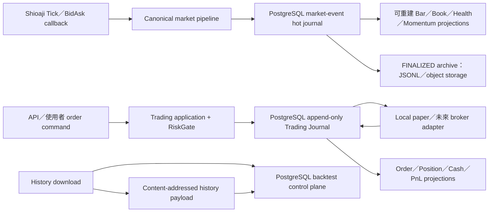

# PostgreSQL 資料持久化盤整報告與實作計畫

- 日期：2026-08-21
- 狀態：**Database/schema rebuilt / Trading 與 Backtest schema 已重建；container 刪除前的業務資料尚未恢復**
- 範圍：歷史資料、盤中行情、下單／成交／委託、資產投影、盤前與法人研究資料
- 安全邊界：維持 `subscribe_trade=false` 與無真實券商下單路徑；本文件不授權 CA、帳務查詢、order API 或 trade callback

## 1. 結論

不建議把目前所有資料一股腦搬進 PostgreSQL。建議採用「**PostgreSQL 保存可交易、可稽核、需重啟恢復與需查詢的事實；檔案／物件儲存保存大型不可變 payload；記憶體只保存可重建的即時狀態**」的混合式架構。

優先順序如下：

1. **P0 — 交易 Journal 與委託生命週期**：目前本機模擬 orders、fills、positions、cash/PnL 與 active Journal 仍在記憶體，process restart 後無法完整恢復。這是最需要先切到 PostgreSQL 的資料。
2. **P1 — 回測控制面與結果**：jobs、dataset catalog、strategy definitions、runs、decisions、trades、equity、comparisons 應由 PostgreSQL 管理。現有 SQLite 的 678 個可續傳 history partitions 可先原樣遷移，之後再外部化大型 payload。
3. **P1 — 盤中 canonical market-event hot store**：Tick、BidAsk、lifecycle、ingress/disposition 與 session 完整性應有 PostgreSQL adapter；但必須保留現有 record-before-ingest、exact replay 與 fail-closed 契約。
4. **P2 — 正規化法人／參考資料與 artifact catalog**：可查詢的 normalized facts、Candidate Prior、manifest、lineage、digest、狀態進 PostgreSQL；官方原始 response bytes 與大型研究檔仍留在 content-addressed 檔案／物件儲存。

三個不可妥協的原則：

- **不能有兩個寫入權威**：Journal 是事實，orders／positions／PnL table 是可重建 projection；sealed file 是 archive，不可再和 PostgreSQL 各自接受修改。
- **資料庫故障時交易 mutation 必須 fail closed**：不得臨時退回 memory 接單。
- **Persistence 不等於券商授權**：現在沒有真實 broker order/deal/account ingestion；先把 schema、Journal 與 recovery 做好，不代表可以開啟真實下單。

## 2. 目前資料快照

以下為本次盤整時的實際狀態：

| 資料家族 | 現在存放位置 | 目前內容 | 目前風險 |
|---|---|---:|---|
| 歷史 K 線／回測控制資料 | `data/backtest/backtest.sqlite3` | 約 208 MB；6 jobs、678 partitions、18,187,718 bars；日期 2023-08-21～2026-08-18；compressed payload 約 190.74 MiB | 單機 SQLite；0 sealed datasets、0 runs/results；一個 paused job，另有一個疑似 stale `RUNNING` job |
| 盤中 canonical market events | `records/market_events/<date>/<session>/records.jsonl` + `manifest.json` | 約 5.3 MB；6 sessions，其中 3 `FINALIZED`、3 `INCOMPLETE` | 已可落盤與 replay，但跨 process 查詢、索引、hot retention 與集中營運不足 |
| Dashboard scan／candidate／history cache | process memory | 執行中狀態 | restart 即消失；可以重建，不應直接當權威 |
| Momentum Tick／BidAsk／minute bars／signals／alerts | process memory，另有少量 research captures | 即時計算狀態 | 可由 canonical event replay 重建；不應逐個 projection 都變成寫入權威 |
| 本機模擬 orders／fills／positions／quotes／cash／PnL | process memory | 執行中狀態 | restart 後無完整交易恢復，是最高優先風險 |
| Trading Journal／checkpoints | runtime 預設 `InMemoryJournalRepository`；另有 PostgreSQL schema/adapter | 已設定的 PostgreSQL journal tables 本次驗證為 0 rows | 有 code 不等於已啟用；現行 runtime 尚未走 PostgreSQL durability path |
| Premarket artifacts | `data/premarket` | 約 5.4 MB／129 files | digest-validated、content-addressed；查詢與 active/latest resolution 不方便 |
| Institutional evaluation | `research/institutional_evaluation` | 約 5.4 MB／126 files | 原始與正規化資料混合在 artifact workflow；共享查詢與 lineage 可再強化 |
| Freshness captures | `research/captures/freshness_quote` | 約 4.3 MB／7 files | calibration evidence，非線上交易 authority |

目前沒有可遷移的真實 broker order、deal、position、cash 或 buying-power 歷史，因為所有已檢查的 Shioaji 路徑均保持 `subscribe_trade=False`。

## 3. 資料放置判斷

### 3.1 應由 PostgreSQL 保存的權威資料

| 資料 | PostgreSQL 角色 | 寫入／一致性要求 | 優先級 |
|---|---|---|---|
| Trading sessions、command、risk decision、outcome、handler failure | append-only canonical Journal | command/risk evidence 必須先 commit，才可進入 side effect；具 idempotency key | P0 |
| Order lifecycle：intent、ack、reject、partial fill、fill、cancel、expire、submit unknown | immutable execution facts | 同一 client/order/deal identity 去重；不可盲目 retry broker side effect | P0 |
| Cash ledger、cash/position reservations、fee/tax、realized PnL facts | accounting facts | account-level transaction；金額用 exact decimal；歷史 replay 不重算政策 | P0 |
| Journal projection checkpoints | recovery integrity | 保存 sequence、schema version、digest；restart 必須驗證 | P0 |
| Portfolio/account revision、status、reconciliation runs | concurrency/recovery facts | `SELECT ... FOR UPDATE` 或等價 account lock；狀態轉換不可跨 transaction 漂移 | P0 |
| Backtest jobs、datasets catalog、strategy definitions、runs/results | control-plane authority | claim/idempotency、狀態轉換、lineage 與錯誤必須可追蹤 | P1 |
| Backtest decisions、trades、daily equity、comparisons | queryable results | 對 run/dataset/strategy 有 immutable lineage | P1 |
| Market-event sessions 與 canonical records | hot operational authority | session-local record index 連續；保存完整 ingress/disposition/incident；record-before-ingest | P1 |
| Institutional normalized facts、validated partition manifests | point-in-time query facts | 依 session/date/symbol/source/as-of 索引；不可混用不同資料版本 | P2 |
| Candidate Prior artifacts／entries | deterministic derived facts | identity、rank、input digests 與 execution-disabled contract 保持不變 | P2 |
| Artifact catalog | metadata/index authority | URI、SHA-256、size、schema version、parent lineage、status、created/finalized time | P2 |

### 3.2 PostgreSQL 放 metadata，payload 留檔案／物件儲存

| 資料 | Payload authority | PostgreSQL 保存內容 | 理由 |
|---|---|---|---|
| Sealed 歷史 K 線 dataset | immutable `bars.jsonl`／未來 object storage | dataset、partition、URI、digest、bar count、date range、source、seal status | 大型、不可變、適合 streaming verify；避免 OLTP backup 重複保存所有 bytes |
| 已封存 market-event session | content-addressed JSONL／未來 object storage | archive manifest、digest、record count、projection digests、archive/restore status | PostgreSQL 適合作 hot store；長期 archive 應可獨立驗證與還原 |
| Premarket raw/context/reconciliation | 現有 content-addressed artifacts | artifact identity、session、kind、lineage、active/latest pointer、validation status | 原始證據不可變；不需要拆成大量 OLTP columns |
| Institutional raw response bytes | 現有 files／未來 object storage | source、request identity、as-of、URI、digest、normalization status | 保留原貌供稽核，normalized rows 另進 PostgreSQL |
| Freshness／qualification／parity captures | research artifacts | evidence catalog、capture window、policy version、result、URI、digest | 是校準證據，不是交易 runtime state |

`backtest_history_partitions.bars_payload BYTEA` 可作為第一階段的可續傳 checkpoint，因為現有 adapter 已支援；但不建議長期同時保存 BYTEA 和 sealed dataset。完成 seal、digest verification、restore test 後，PostgreSQL 只保留 URI/digest/count/lineage，再依明確 retention policy 清理 checkpoint payload。

### 3.3 應維持記憶體／可重建的資料

- WebSocket 訂閱、browser tab、response cache、queue depth、thread/task 狀態。
- Dashboard 畫面模型、latest quote cache、rolling bar builder、scanner intermediate state。
- 由 canonical market events 重建的 Book／Bar／Health／Momentum projection。
- 由 Trading Journal 重建的 order/position/cash/PnL view；可以 materialize 到 PostgreSQL 加速查詢，但不能成為第二套 command authority。
- 暫時性的 provider SDK object、callback object 與 connection handle。

### 3.4 不應寫進 PostgreSQL 的資料

- API key、secret key、CA password、private key、完整 DSN 或其他 secrets。
- application logs、metrics、traces；應交給 observability stack，Journal 只留業務稽核事件。
- Git 版控中的靜態 schema、strategy code、migration source、設定模板；資料庫只保存其 version/digest/provenance。
- 未經定義的任意 pickled Python object 或 SDK object。

## 4. 建議的權威與資料流

權威規則：

- `LOCAL_PAPER`：PostgreSQL Trading Journal 是 execution/accounting 的完整權威。
- 未來 `SHIOAJI_SIMULATION`／`BROKER_REAL`：broker 是 order/deal/account 最終權威；PostgreSQL 保存 command、callback、dedupe、recovery、reconciliation 與 local read model，不可反向覆寫 broker truth。
- Market events：切換完成後 PostgreSQL 是 hot operational authority；只有 `FINALIZED` 且 digest/restore 驗證過的 archive 才可進入冷儲存生命週期。
- Backtest/history：PostgreSQL 管理 workflow 與 lineage，sealed content-addressed payload 管理 bulk bytes。

## 5. PostgreSQL bounded contexts

建議使用同一 PostgreSQL cluster、不同 logical schema 與 migration owner；不要建立一個跨全系統的巨大 transaction model。

### `trading`

沿用並演進現有：

- `journal_sessions`
- `journal_records`
- `projection_checkpoints`

新增或明確化：

- `portfolio_accounts`
- `cash_ledger_entries`
- `cash_reservations`
- `position_reservations`
- `order_projection`
- `position_projection`
- `account_projection`
- `reconciliation_runs`
- `maintenance_leases`

Journal／ledger facts 是權威；`*_projection` 可 truncate/rebuild。所有同 account mutation 必須在 account lock、revision check、RiskGate、Journal append 與 reservation update的一致 transaction contract 中完成；broker call 本身不能假裝是資料庫 transaction，必須用明確的 pending/unknown/reconciliation state 處理 crash window。

### `market_data`

建議最小模型：

- `market_event_sessions`
  - `session_id`、session date/timezone、producer/source mode、status、started/finalized time、record counts、error counters、queue-drained evidence、record/projection digests、archive state。
- `market_event_records`
  - `session_date`、`session_id`、`record_index`、`record_type`、`ingress_record_index`、event identity、stream、symbol、event/received time、disposition/reason、完整 canonical `payload_jsonb`、schema version。

約束至少包含：

- unique `(session_date, session_id, record_index)`。
- `record_index` session-local contiguous verification。
- disposition 對 ingress 的可驗證 reference。
- session 建立時先為 `INCOMPLETE`；只有 queue drained、count/digest/projection parity 全部通過才轉 `FINALIZED`。
- 先以月為 RANGE partition 候選；最終粒度與 hot retention 需用完整交易日 volume、commit latency、backup window 實測後凍結，不在本報告猜固定天數。

### `backtest`

沿用現有 migrations 與 repository contract：

- datasets、jobs、history partitions
- strategy definitions
- runs、results、decisions、trades、daily equity、comparisons

第一階段可原樣支援 `bars_payload`; 第二階段加入 external payload URI/lifecycle 並在 seal 後回收重複 BYTEA。

### `research`／`reference_data`

- `artifacts`、`artifact_lineage`
- `institutional_partitions`、`institutional_flows`
- 既有 Candidate Prior artifacts／entries
- 未來若 production runtime 需要，再加入 date-effective instrument/universe reference；靜態 Git fixture 不需為了技術一致而強制搬入 DB。

## 6. Implementation plan

### Phase 0 — Freeze authority、schema 與 operation contract

目標：在寫 migration 前先消除「誰是權威」與「故障時怎麼辦」的歧義。

工作項目：

1. 建立 data authority matrix/ADR，凍結每個 bounded context 的 writer、reader、archive、retention owner。
2. 統一 typed DB configuration。現在 backtest 使用 `BACKTEST_DATABASE_URL`，trading 使用另一套 PostgreSQL DSN 命名；需決定同 cluster 不同 schema或不同 database，且 secrets 只由環境／secret manager 注入。
3. 為每個 schema 建 migration ownership、advisory lock、minimum supported version、rollback policy。
4. 定義資料分級、PII/secret redaction、backup/PITR、restore drill、partition maintenance 與 archive lifecycle。
5. 以完整交易日 capture 實測 market-event rows/sec、bytes/day、batch commit p95/p99、index growth、backup window，再凍結 partition/retention。

Exit gate：authority matrix、failure policy、schema ownership、capacity evidence與 cutover/rollback runbook 經 review；仍不得啟用 broker trade path。

### Phase 1 — Trading Journal PostgreSQL cutover（P0）

主要位置：`trading/`、`runtime/composition.py`、`dashboard/`、`simulation/`、`tests/`。

工作項目：

1. 演進 `trading/migrations/001_journal.sql`；保留 append-only、record identity、scoped idempotency 與 checkpoint digest。
2. 強化 `PostgresJournalRepository`：connection pool、typed transient/permanent errors、transaction/unit-of-work、health/readiness、無 side-effect blind retry。
3. 讓 durable runtime 明確注入 PostgreSQL repository；`InMemoryJournalRepository` 僅限 unit tests 或顯式 local ephemeral mode。
4. 將本機模擬 command、risk decision、orders、fills、cash/position reservation、fee/tax、PnL facts 全部接入同一 Journal/application path。
5. 建 reducer-backed query projections、checkpoint writer、startup replay/digest validation。
6. PostgreSQL 無法確認 command append 時關閉新 mutation；不得 fallback 到舊 `SimulationService` memory mutation。

資料遷移：目前 PostgreSQL journal tables 為空，而舊本機模擬狀態只在記憶體，沒有可信的歷史 backfill。以「新 session 起點」切換；舊 runtime 啟動前的狀態不虛構、不補造。

Acceptance gate：

- restart 前後 cash/orders/positions/realized PnL 與 checkpoint digest 完全一致。
- duplicate idempotency key 不新增 reservation、fill 或 side effect。
- 在 command append、handler call、outcome append 各 crash window 都能恢復成明確狀態。
- PostgreSQL outage 時 GET 只回 last verified projection 並標 stale/degraded；POST mutation fail closed。
- 全部測試仍保持無 CA、無 broker order API、`subscribe_trade=false`。

### Phase 2 — Backtest SQLite → PostgreSQL（P1）

主要位置：`backtest/`、`config/backtest.py`、migration/backfill CLI、tests。

工作項目：

1. 先修正／reconcile stale `RUNNING` job；保留現在 paused job 的 678/2738 resume checkpoint。
2. 對 SQLite 建 consistent read-only snapshot，透過 repository contract 分批匯入 PostgreSQL。
3. 保留 job IDs、request JSON、status、progress、partition digest/count、date span 與 timestamps。
4. 第一階段可把現有 678 個 compressed payload 搬入 `BYTEA`，先確保 resume parity；不可在遷移中把 incomplete download 宣稱成 sealed dataset。
5. 以 row counts、bar counts、每 partition digest 與「下一個待下載 symbol」驗證。
6. 切換 `BACKTEST_DATABASE_URL` 後，舊 SQLite 改為 read-only archive，不刪除。
7. 完成 dataset seal/restore 流程後，再加入 external URI 並回收重複 payload。

Acceptance gate：678 partitions、18,187,718 bars、190.74 MiB payload digest 集合一致；paused job 可從相同 checkpoint 繼續；0 datasets/runs 不可被錯誤補值。

### Phase 3 — PostgreSQL MarketEventRecorder（P1）

主要位置：`market_data/recording.py`、`market_data/journal.py`、`market_data/pipeline.py`、runtime composition、migrations、replay tests。

工作項目：

1. 在既有 `MarketEventRecorder` port 後新增 PostgreSQL adapter，不讓 psycopg/SQL 進 domain/application layer。
2. 保留單一 callback owner；先由同一 canonical queue 建 PostgreSQL shadow，不建立第二組 Shioaji subscription。
3. 以 bounded group commit 寫入 ingress batch；commit 成功後才可 ingest/project。disposition/incident 保持相同 total order；任何 durability failure 使 session `INCOMPLETE` 並 fail closed。
4. 以 JSONL authority 對 PostgreSQL shadow 比對 record count、index、canonical payload digest、disposition sequence、session summary 與 projection digest。
5. 只在完整交易日 parity 與 latency gate 通過後明確切換 authority。切換後 JSONL 改為由 finalized PostgreSQL session 產生的 verified archive，而非第二個可變寫入權威。
6. Backfill：3 個 `FINALIZED` sessions 可作 replay-authoritative import；3 個 `INCOMPLETE` sessions 僅能保留原 status 作 forensic evidence，不得升級為 complete。

Acceptance gate：record-before-ingest、continuous index、duplicate/out-of-order/gap、crash tail、queue drain、FINALIZED/INCOMPLETE、exact replay projection parity 全部通過；ingest latency不得突破 Phase 0 凍結的 SLA。

### Phase 4 — Institutional facts 與 Artifact Catalog（P2）

主要位置：`premarket/`、`institutional_data/`、`institutional_prior/`、research workflows、migrations。

工作項目：

1. 建通用 artifact catalog：kind、URI、digest、size、schema/source version、session/as-of、parent lineage、validation/finalization status。
2. 匯入現有 premarket、institutional、freshness metadata；payload 不複製進 JSONB。
3. 將 validated normalized institutional rows 和 partition manifests 寫入 PostgreSQL。
4. 將 Candidate Prior 切到既有 PostgreSQL repository，保留 deterministic identity、rank、input digests、EXPLORATORY/execution-disabled guard。
5. 所有 point-in-time query 必須帶 source partition/as-of，不可用 latest 資料回填歷史決策。

Acceptance gate：同一 artifact digest 不重複；normalized row count/digest 與原 manifest 一致；歷史 Candidate Prior replay identity/rank 相同。

### Phase 5 — Production hardening

1. Real PostgreSQL integration tests，不以 SQLite/mock 代替 JSONB、conflict、locking、transaction、partition semantics。
2. Connection pool sizing、statement/lock timeout、deadlock/retry classification、slow-query與 pool saturation metrics。
3. Migration deploy ordering與 backward-compatible rollout；多 worker migration 用 advisory lock。
4. Backup/PITR、encrypted storage、least-privilege roles、restore drill。
5. Partition creation/retention/archive jobs；任何 deletion 前先驗證 archive digest 與 restore。
6. Dashboard 顯示 storage/recovery state：initializing、degraded、read-only、reconciliation required、last verified sequence/as-of。

Exit gate：完成故障演練、restore drill、migration rollback drill、容量與 latency evidence；operator runbook 可在不猜測狀態下判斷是否能開放 mutation。

## 7. Cutover 與 rollback 原則

| Context | Cutover | Rollback |
|---|---|---|
| Trading | 新 session 起由 PostgreSQL 先記 command，再允許 side effect | cutover 後不可回 memory 接單；故障只能 read-only/recovery，修復 PostgreSQL 後 replay |
| Backtest | snapshot → import → digest/count/resume parity → config switch | PostgreSQL cutover失敗則切回未修改的 read-only-safe SQLite snapshot；不得兩邊同時 claim jobs |
| Market events | JSONL authority + PG shadow → full-session parity → explicit PG authority | cutover 前可關 shadow；cutover 後故障 session 標 `INCOMPLETE`，不得偷偷改回第二 callback/雙 authority |
| Research/artifacts | catalog backfill → lineage parity → readers switch | payload 始終留存；catalog 可重建，rollback 不刪原始 artifacts |

不建議一般性的 application-level dual-write。只有 market-event shadow verification 可在同一 callback/queue 後短期並行，且必須清楚標示哪一邊是 authority。

## 8. 驗證矩陣

| 類型 | 必驗項目 |
|---|---|
| Migration | fresh DB、upgrade、repeat migration、partial failure、advisory lock、多 worker |
| Trading idempotency | duplicate command/callback、out-of-order callback、partial fill、cancel/fill race、reservation 不 double-release |
| Trading recovery | 每個 crash window、checkpoint corruption、projection rebuild、DB outage fail closed |
| Concurrency | 同 account 多 request、revision mismatch、row lock、deadlock retry 不重送 side effect |
| Market event | ingress/disposition total order、record index、digest、incomplete session、exact replay parity |
| Backtest | row/bar counts、partition digest、job state、resume boundary、sealed lifecycle |
| Artifact/lineage | URI/digest 可讀、parent chain、normalized manifest parity、point-in-time query |
| Security/safety | payload secret scan、least privilege、backup encryption、`subscribe_trade=false`、order path not wired |

## 9. 已確認的實作決策

| 決策 | 結果 |
|---|---|
| PostgreSQL topology | 單一 database、logical schemas；已啟用 `trading` 與 `backtest` schema |
| Market-event retention | 以完整交易日 volume/latency/backup evidence 決定，不猜固定 30/90 天 |
| History payload | 維持本機 content-addressed directory；PostgreSQL 管 metadata/lineage |
| Portfolio scope | 僅 `LOCAL_PAPER`；Shioaji simulation/account read/real broker 另案授權 |
| Legacy tables | 以 forward-only migration 從 public 移入 logical schemas |

## 10. 本階段仍不實作事項

- 不搬移或刪除 JSONL／research artifacts；Backtest SQLite 在最終 digest parity 與 PostgreSQL runtime smoke 後，依使用者指示移除。
- 不啟用 Shioaji trade subscription、CA、broker account/order/deal API。
- 不替 retention、freshness 或 broker accounting SLA 猜數字。
- 在新增 pending-order lifecycle records 與 simulator hydration contract 前，不宣稱舊 LOCAL_PAPER session 已完整恢復。

## 11. Implementation status（2026-08-21）

- 已新增 typed、secret-safe Trading persistence config；PostgreSQL mode 為顯式選擇，無 DSN 或 optional dependency 時 fail closed。
- 已新增 connection-pool infrastructure factory、migration-before-open、health check 與 composition shutdown。
- 已套用 `002_trading_schema.sql` 至本機 PostgreSQL：既有空的 public Journal tables 已移至 `trading`，migration ledger 保留 `001`／`002`。
- 已將 `PostgresJournalRepository` 改為 schema-qualified、pool-backed、transaction-cleanup adapter。
- 已在新 session 與完整 LOCAL_PAPER mutation 後寫入 replay-verified projection checkpoint。
- 已完成 pooled synthetic append、idempotency、checkpoint readback smoke 並清除 synthetic rows。
- 目前 restart policy 是建立新的 LOCAL_PAPER session；舊 session Journal 事實可保存與 replay，但 pending order/reservation/quote/UI hydration 尚未完成。
- 已新增 `004_backtest_schema.sql`，將 Backtest migration ledger 與十張資料表收斂到 `backtest` logical schema；PostgreSQL runtime 綁定 `search_path=backtest,public`，避免重新產生 public 雙重權威。
- 已新增唯讀、可重跑的 SQLite → PostgreSQL 搬遷 CLI；批次 insert 後逐表比對 row count 與 normalized content digest，並以 SQLite main/WAL fingerprint 阻擋搬遷期間的來源變動。
- container／volume 重建前曾完成本機 Backtest cutover：22 strategy definitions、6 jobs、678 history partitions 全數通過十表 digest parity；共 18,187,718 bars、200,010,553 compressed bytes、涵蓋 2023-08-21～2026-08-18。這是事故前的歷史驗證紀錄，不代表目前資料筆數。
- 一筆 stale `RUNNING` job 已只在 PostgreSQL 轉成 `PAUSED`（保留 407/2738 checkpoint）；原本的 `PAUSED` job 保留 678/2738 checkpoint。最終搬遷核對時 SQLite SHA-256 為 `cff72389331fe0b56fe828ef87d02cf157d17bdf08703f12e7caccf9874871fc`；完成再次十表 digest parity 後，主檔、WAL、SHM 已依使用者指示刪除。
- 本機 `.env` 已用 `BACKTEST_DATABASE_BACKEND=postgresql` 啟用共用 DSN；正式 composition smoke 讀回 6 jobs 與 678 partitions。
- Post-cutover focused suite 為 39 passed、1 skipped；完整 regression 為 1,038 passed、4 skipped。破壞性 PostgreSQL integration test 仍只在顯式 `TEST_POSTGRES_DSN` 執行。
- 正式 Backtest backend 預設改為 PostgreSQL 並在缺少 DSN 時 fail closed；SQLite 僅能顯式選擇作為 dev/test adapter，避免刪檔後被 runtime 靜默重建。
- 已停止仍持有 SQLite file descriptor 的舊 Dashboard；現行 Dashboard API 回報 `database=PostgreSQL`，process 未開啟 SQLite，且 `data/` 下已無 `.sqlite`／`.sqlite3`／`.db` 資料檔。
- 移除後 persistence-focused regression 為 37 passed；完整 suite 為 1,040 passed、4 failed、4 skipped，4 個 failure 均落在另一組尚未完成的 Dashboard Shioaji usage UI/API contract，未改動該工作範圍。
- 使用者誤刪 PostgreSQL container／volume 後，已重新建立 `tw_intraday_trader` database，並重跑 Trading `001`／`002`、Backtest `001`～`004` migrations。Dashboard dead connection 已透過 process restart 清除，實際策略 endpoint 可正常查詢 PostgreSQL。
- 重建後現況：22 strategy definitions；Backtest jobs、history partitions、bars、runs/results 全為 0；Trading journal sessions、records、projection checkpoints 全為 0。舊歷史資料仍需由外部 dump／備份或重新下載流程恢復。

## 12. Repository evidence

- `runtime/composition.py`
- `trading/journal.py`
- `trading/postgres_journal.py`
- `trading/migrations/001_journal.sql`
- `trading/application.py`
- `trading/local_paper.py`
- `market_data/recording.py`
- `market_data/journal.py`
- `market_data/pipeline.py`
- `backtest/repository.py`
- `backtest/postgres_repository.py`
- `backtest/sqlite_postgres_migration.py`
- `backtest/migrations/001_backtest_core.sql`
- `backtest/migrations/002_strategy_catalog.sql`
- `backtest/migrations/003_resumable_history_download.sql`
- `backtest/migrations/004_backtest_schema.sql`
- `scripts/migrate_backtest_sqlite_to_postgres.py`
- `premarket/artifacts.py`
- `institutional_data/artifacts.py`
- `institutional_prior/migrations/001_candidate_prior.sql`
- `architecture/p1_canonical_market_event_pipeline_implementation_plan.md`
- `architecture/asset_portfolio_dual_mode_implementation_report.md`
