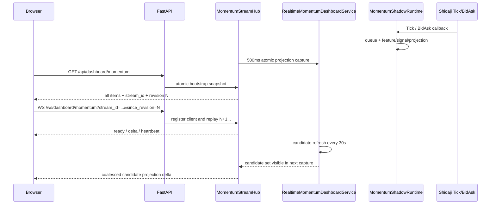

# 盤中觀察指標 WebSocket 即時推送實作計畫

## 1. 結論

建議採用「HTTP bootstrap snapshot + WebSocket projection delta」：

1. 瀏覽器第一次載入，以 `GET /api/dashboard/momentum` 取得所有目前觀察股的完整後端指標。
2. HTTP response 同時帶回 `stream_id` 與單調遞增的 `revision`。
3. 瀏覽器再連線 `/ws/dashboard/momentum`，以 `stream_id + since_revision` 接續 HTTP snapshot 之後的更新。
4. 後端只推已完成計算的 candidate projection，不把 Shioaji raw Tick／BidAsk、SDK 型別或策略公式送到瀏覽器。
5. 多筆行情在後端短時間合併，每個 symbol 只推最新狀態，避免每個 Tick 都觸發網路傳送與整張表格重畫。

這個方向能把目前 2 秒一次的完整 HTTP polling 降為第一次完整載入，後續正常情況只傳有變化的 symbol。建議第一版採 500ms coalescing，端到端目標為 projection 更新後 1 秒內顯示；實測負載安全後再評估縮短到 250ms。

### 1.1 已實作版本（2026-08-19）

- `dashboard/momentum_stream.py` 已提供 process-local cached snapshot、monotonic revision、bounded shared replay、heartbeat、client cap 與 gap resync。
- `runtime/momentum_shadow.py` 已提供同一把 process lock 內的 atomic dashboard read view。
- `RealtimeMomentumDashboardService` 已擁有獨立的 30 秒 candidate refresh worker；Provider scan 不會阻塞 500ms projection fan-out。
- v1 由 hub 每 500ms 讀取一次已完成 projection，只有 digest 變更才產生 delta；Shioaji callback 仍只 enqueue，不做 serialization 或 socket I/O。
- shared replay ring 取代 per-client queue；慢 client 超出 ring 時收到 `REVISION_TOO_OLD`，不會無限累積記憶體。
- 功能預設啟用，設定 `MOMENTUM_DASHBOARD_WS_ENABLED=false` 可立即回退到既有 HTTP polling。

## 2. 現況與主要差距

目前行為：

- `/api/dashboard/momentum` 已回傳所有目前候選的完整 Tick／BidAsk Momentum projection。
- 瀏覽器每 2 秒 GET 一次完整 payload，並用 `projection_digest` 判斷是否需要重畫。
- Shioaji callback 已先進 bounded queue，再由單一 Momentum worker 計算 feature、signal、stage 與 alert。
- 候選 membership 每 30 秒重新掃描一次，但目前是讀取 `snapshot()` 時順便觸發。
- runtime、projection、Shioaji session 都是單一 Web process 內的記憶體狀態。
- repository 尚無 WebSocket hub、replay buffer 或 broadcast abstraction。

直接把 polling 換成 WebSocket 會有五個 correctness 問題：

| 問題 | 風險 | 第一版處理 |
|---|---|---|
| HTTP 後、WebSocket 前的空窗 | 遺失更新 | snapshot 回傳 cursor，WebSocket 從該 revision replay |
| 每個 Tick 直接推送 | CPU、頻寬與 DOM 更新失控 | 500ms coalescing，每 symbol latest-wins |
| 慢速／背景分頁 | client 落後 replay 範圍 | bounded shared replay；超限要求 resync |
| backend restart | 舊 revision 無法接續 | `stream_id` 改變，瀏覽器重新 GET |
| 移除 polling 後候選不再 refresh | candidate membership 停在第一次 | 30 秒 refresh 改為 service-owned background lifecycle |

## 3. 範圍

### 3.1 第一版包含

- 所有目前 Momentum 觀察股的首次完整 HTTP snapshot。
- WebSocket 推送候選 projection、資料狀態、source health、summary、排序與 alerts。
- revision replay、gap detection、resync、heartbeat、reconnect 與 HTTP fallback。
- 30 秒 candidate refresh 從讀取路徑移到後端 background lifecycle。
- 多分頁共用同一個後端 Shioaji runtime；不因 WebSocket client 數量增加行情訂閱。
- feature flag、metrics、負載測試、漸進式 rollout 與一鍵回退到既有 polling。

### 3.2 第一版不包含

- 不推 raw Tick／BidAsk 到瀏覽器。
- 不在 JavaScript 重算 VWAP、成交量加速、score、stage 或 alert。
- 不改歷史 Kbar、回測 job、本機紙上模擬 projection 的既有 transport。
- 不新增 CA、order callback、broker order 或 real-money 路徑。
- 不宣稱支援 Uvicorn multi-worker／多 replica；第一版維持目前單 process runtime。
- 不加入 Redis、Kafka 或外部 message broker。未來要水平擴充時另開 phase。

## 4. 目標資料流



重要順序是先取得帶 cursor 的 HTTP snapshot，再用 cursor 接 WebSocket。只有「先 GET、再開 WS」但沒有 replay cursor，仍然會漏掉兩者之間的更新。

## 5. API 與訊息契約

### 5.1 HTTP bootstrap

保留現有 endpoint：

```http
GET /api/dashboard/momentum
Cache-Control: no-store
```

現有 payload 保持相容，新增：

```json
{
  "stream": {
    "schema_version": "momentum_dashboard_stream_v1",
    "stream_id": "opaque-process-stream-id",
    "revision": 1042,
    "generated_at": "2026-08-19T10:00:00.250+08:00",
    "resume_path": "/ws/dashboard/momentum"
  },
  "status": "live",
  "source": {},
  "summary": {},
  "items": [],
  "alerts": []
}
```

約束：

- `items` 是該 revision 下所有觀察股的完整 read model。
- `stream_id + revision + payload` 必須由同一個 atomic capture 產生。
- `revision` 只在可見 read model 有變化時遞增；heartbeat 不遞增。
- 現有 `projection_digest` 保留做 equality／render suppression，不拿它取代順序 cursor。

### 5.2 WebSocket 連線

```text
/ws/dashboard/momentum?stream_id=<id>&since_revision=<n>
```

- URL 只放 opaque cursor，不放憑證、券商資訊或策略敏感參數。
- 使用與頁面相同 host；HTTPS 時自動改用 `wss:`。
- 驗證 `Origin` 與 host。若未來 Dashboard 加入 authentication，WebSocket 必須沿用相同 session/cookie policy。

### 5.3 Server message

`ready`：

```json
{
  "schema_version": "momentum_dashboard_stream_v1",
  "type": "ready",
  "stream_id": "...",
  "current_revision": 1045,
  "heartbeat_seconds": 10
}
```

`delta`：

```json
{
  "schema_version": "momentum_dashboard_stream_v1",
  "type": "delta",
  "stream_id": "...",
  "base_revision": 1042,
  "revision": 1043,
  "emitted_at": "2026-08-19T10:00:00.750+08:00",
  "source": {},
  "summary": {},
  "item_upserts": [],
  "removed_symbols": [],
  "ordered_symbols": ["2330", "2454"],
  "alerts": [],
  "projection_digest": "..."
}
```

設計原則：

- `item_upserts` 傳完整 candidate row，不使用 JSON Patch。
- 每個 item 新增 `item_digest`，涵蓋 metadata、availability、intraday 與 signal。
- `ordered_symbols` 由 server 決定，瀏覽器不自行重算策略排序。
- `source`、`summary` 與 `alerts` 第一版可完整 replacement；資料量小且能降低 merge bug。
- 同一 batch 中同 symbol 多次更新只保留最後一筆。

`heartbeat`：

```json
{
  "schema_version": "momentum_dashboard_stream_v1",
  "type": "heartbeat",
  "stream_id": "...",
  "revision": 1043,
  "sent_at": "2026-08-19T10:00:10+08:00"
}
```

`resync_required`：

```json
{
  "schema_version": "momentum_dashboard_stream_v1",
  "type": "resync_required",
  "reason": "REVISION_TOO_OLD",
  "stream_id": "...",
  "current_revision": 1600
}
```

reason 至少包含：

- `STREAM_CHANGED`
- `REVISION_TOO_OLD`
- `INVALID_CURSOR`
- `CLIENT_TOO_SLOW`
- `SERVER_SHUTDOWN`

收到 `resync_required` 後，不猜測缺少的 state；關閉 socket、重新 GET 完整 snapshot，再從新 cursor 接續。

## 6. Backend 設計

### 6.1 Atomic runtime read view

在 `MomentumShadowRuntime` 新增一次性 read view，於同一個 `_process_lock` 內取得：

- runtime/source/health snapshot
- current candidate/subscription state
- 所有 symbol projections
- miss reasons
- pending alerts

`RealtimeMomentumDashboardService` 用這個 read view 一次序列化完整 Dashboard snapshot，取代目前對每個 symbol 分別呼叫 `projection()` 的多次 lock acquisition。

已實作版本不在 Runtime 註冊 change callback；hub 以固定上限頻率讀取 atomic read view，因此 Shioaji callback 不會做 JSON serialization、socket I/O 或 Provider I/O。

### 6.2 Candidate refresh lifecycle

已實作版本由 `RealtimeMomentumDashboardService` 自己管理 candidate refresh worker。Provider 全市場掃描在 projection watcher 之外執行；掃描期間 hub 繼續推送上一份候選集合，完成後再切換 metadata／subscription 並產生新 revision。

- Momentum service 第一次 `start()` 時 force refresh，之後由 worker 每 30 秒檢查到期狀態。
- hub watcher 每 500ms 只讀 atomic projection，不執行 Provider candidate scan。
- FastAPI 關站時先停止 hub watcher，再關 Momentum service/runtime。
- Provider scan 失敗時保留上一份 metadata，更新 `candidate_refresh_error`，不得把候選清空。
- candidate added／removed／metadata changed 都會改變 snapshot digest 並產生 revision delta。

### 6.3 `MomentumStreamHub`

新增 `dashboard/momentum_stream.py`，責任限於 browser read-model transport：

- 擁有 `stream_id` 與 monotonic revision。
- 保存最新完整 serialized snapshot。
- 比對 item/source/summary/alert digest，產生 delta。
- 預設每 500ms 合併 dirty changes；無變化不發 delta。
- 保存 bounded shared replay ring，預設 256 個 delta。
- 每個 client 以 revision 讀同一個 replay ring，不配置獨立 outbound queue。
- slow client 落後超過 ring 時不 silent drop；送 `resync_required` 或以 1013 關閉。
- 每 10 秒送 application heartbeat，與是否有成交事件無關。
- 關站時先停止接收 client、送 shutdown reason、取消 sender tasks，再關 Momentum runtime。

建議 config：

```text
MOMENTUM_DASHBOARD_WS_ENABLED=true
MOMENTUM_DASHBOARD_WS_COALESCE_SECONDS=0.5
MOMENTUM_DASHBOARD_WS_HEARTBEAT_SECONDS=10
MOMENTUM_DASHBOARD_WS_REPLAY_CAPACITY=256
MOMENTUM_DASHBOARD_WS_SEND_TIMEOUT_SECONDS=2
MOMENTUM_DASHBOARD_WS_MAX_CLIENTS=32
```

專案已明確宣告 `websockets>=13,<17` runtime dependency 與 `httpx2>=2,<3` dev transport client，並以 ASGI WebSocket upgrade/replay test 驗證 route，不只驗證 FastAPI function。

### 6.4 單 process 約束

第一版 `stream_id`、revision、replay ring 與 projection 都在 process memory：

- `python3 -m dashboard` 的單 worker 啟動方式可直接支援。
- 若用 `--workers > 1`，HTTP snapshot 與 WebSocket 可能落到不同 process，必須 fail fast 或在文件明確禁止。
- 未來若要多 worker／多 replica，將 hub port 抽換成 Redis Streams／PubSub 類外部 broker；不納入本次實作。

## 7. Browser 設計

在既有 `state` 增加：

```text
momentumStreamId
momentumRevision
momentumSocket
momentumSocketState
momentumReconnectAttempt
momentumReconnectTimer
momentumLastHeartbeatAt
momentumFallbackPolling
momentumDeferredRender
momentumTransportGeneration
```

啟動流程：

1. `bootstrapMomentumProjection()` GET 完整 snapshot。
2. 驗證 schema，render，保存 `stream_id/revision`。
3. `connectMomentumSocket()` 以 cursor 連線。
4. 依序 replay delta；只有 `base_revision === state.momentumRevision` 才套用。
5. `revision <= current` 視為重複並忽略。
6. `base_revision > current` 視為 gap，立即 resync。
7. WS 穩定開啟後停止 2 秒 Momentum polling。

delta merge：

- 先把現有 `items` 轉成 symbol map。
- 套用 `removed_symbols` 與 `item_upserts`。
- 依 server 的 `ordered_symbols` 重建 array。
- replacement `source/summary/alerts`。
- 更新 revision 後才 render，避免 UI 顯示 state 與 cursor 不一致。
- 若 detail dialog 開啟，沿用 `syncMomentumDialog()` 更新同一份 state。

Reconnect／fallback：

- reconnect delay：1s、2s、5s、10s、30s，加少量 jitter。
- socket close/error 後立即把 UI 標示為「即時推送中斷／重新連線」。
- reconnect 期間啟用既有 2 秒 HTTP polling fallback；每次 fallback snapshot 都更新 cursor。
- WS 恢復並通過 cursor 檢查後停止 fallback polling。
- 每次 bootstrap／reconnect 遞增 `momentumTransportGeneration`；晚到的舊 HTTP response 或舊 socket message 不得覆蓋較新的 revision。
- 分頁回到 visible 時檢查 heartbeat age；超過 2 個 heartbeat interval 就重新 bootstrap。
- hidden tab 可暫停 DOM render，但仍保留最後收到的 state；回到 visible 時只畫最新 revision。

UI 資料來源狀態至少區分：

- `即時推送`
- `重新連線中`
- `HTTP 輪詢備援`
- `資料同步中`
- `即時資料不可用`

## 8. Implementation phases

### Phase 0 — Contract、baseline 與 feature flag

工作：

1. 凍結 `momentum_dashboard_stream_v1`、message type、reason code 與 cursor semantics。
2. 量測目前 71 檔完整 HTTP payload bytes、2 秒 polling request rate、projection update rate 與 render time。
3. 新增 realtime Dashboard config 與 `MOMENTUM_DASHBOARD_WS_ENABLED=true`；可切為 `false` 回退。
4. 在 runtime dependencies 明確加入 WebSocket protocol backend；在 dev dependencies 補齊 HTTP／WebSocket transport test client。
5. 為既有 `/api/dashboard/momentum` payload 建 backward-compatibility fixture。

Gate G0：真實 Uvicorn WebSocket upgrade smoke、schema fixture、config validation 與 baseline report 完成；功能關閉時現況完全不變。

### Phase 1 — Atomic read model 與 change notification

工作：

1. 在 `runtime/momentum_shadow.py` 加入 atomic read view。
2. 由固定頻率 atomic read watcher 涵蓋 projection、health、subscription、reconnect 與 alert 狀態。
3. 在 `dashboard/momentum.py` 改用 atomic view 產生完整 snapshot。
4. 將 30 秒 candidate refresh 改成 service-owned worker，加入乾淨 shutdown。
5. 新增 stable `item_digest` 與 candidate-set digest。

Gate G1：同一 snapshot 內 source/summary/items/alerts 一致；沒有 listener 時 runtime 行為與測試完全相容；候選在零 HTTP polling 下仍每 30 秒更新。

### Phase 2 — Stream hub、revision replay 與 WebSocket route

工作：

1. 新增 `MomentumStreamHub`、coalescing、revision、shared replay ring 與 client cap。
2. 讓 HTTP bootstrap 從 hub 的 atomic cached snapshot 取得 cursor。
3. 新增 `/ws/dashboard/momentum`，完成 ready/replay/delta/heartbeat/resync。
4. 驗證 Origin、invalid cursor、slow client、send timeout 與 disconnect cleanup。
5. FastAPI lifespan 先關 hub，再關 Momentum service/runtime/provider。

Gate G2：HTTP revision N 後發生的所有更新，client 不是收到 N+1...，就是收到明確 `resync_required`；不得 silent gap。

### Phase 3 — Browser bootstrap、delta merge 與 fallback

工作：

1. 拆分目前 `loadMomentumProjection()` 為 bootstrap、apply snapshot、connect socket、apply delta。
2. 加入 cursor validation、ordered merge、dialog sync 與 deferred render。
3. 加入 reconnect backoff、heartbeat watchdog、visibility recovery 與 2 秒 HTTP fallback。
4. WebSocket healthy 時移除正常路徑的 `setInterval(pollMomentumProjection, 2000)`。
5. 顯示目前 transport 與最近成功更新時間。

Gate G3：正常 WS 連線持續 10 分鐘時，Network panel 只有一次 bootstrap GET，沒有週期性 Momentum GET；斷線後自動 fallback，恢復後回到 WS。

### Phase 4 — Observability、負載與 failure tests

工作：

1. 加入 active clients、delta batches、coalesced changes、bytes、replay hit/miss、resync、slow-client disconnect、queue high watermark metrics。
2. 量測 projection commit 到 WebSocket send 的 p50/p95/p99 latency。
3. 用至少 100 symbols、synthetic burst、10 browser clients 驗證 bounded memory 與 CPU。
4. 覆蓋 restart、candidate add/remove、illiquid/no-tick、stale BidAsk、alert ack、hidden tab 與 malformed message。
5. 跑完整 Python、Dashboard JavaScript、API/UI 與 whitespace checks。

Gate G4：預設 500ms coalescing 下，正常負載 p95 projection-to-send 小於 750ms、沒有 unbounded queue、沒有 Shioaji callback thread blockage；完整 regression 通過。

### Phase 5 — 漸進 rollout 與 rollback

工作：

1. 本機／MockProvider 啟用 WS，HTTP polling 保留做可觀察 fallback。
2. 真實 Shioaji market-data-only session 以 WS primary + HTTP parity monitor 跑一個盤中觀察窗口，比對 digest／revision／as_of。
3. parity 通過後關閉正常 polling，只在 disconnect 時 fallback。
4. 監控一個完整交易時段後，再評估將 coalescing 從 500ms 調到 250ms。

Rollback：設定 `MOMENTUM_DASHBOARD_WS_ENABLED=false`，瀏覽器回到既有 2 秒 polling；不需要資料 migration，也不影響 Shioaji subscription、strategy projection 或本機紙上模擬。

Gate G5：回退不需要重啟資料模型或修復狀態；關閉 flag 後現有 HTTP contract 與功能持續可用。

## 9. 預計檔案變更

```text
config/
  dashboard_realtime.py                 # WS/coalescing/replay/fallback config

dashboard/
  realtime.py                           # hub, cursor, replay, client lifecycle
  momentum.py                           # atomic snapshot, candidate scheduler, notices
  server.py                             # bootstrap cursor, WebSocket route, lifespan
  static/index.html                     # bootstrap, socket, delta merge, fallback UI

runtime/
  momentum_shadow.py                    # atomic dashboard read view

tests/
  test_momentum_websocket_hub.py        # revision, replay, coalescing, slow client
  test_momentum_websocket_api.py        # route, cursor, reconnect/resync lifecycle
  test_realtime_momentum_dashboard_service.py
  test_momentum_shadow_runtime.py
  test_momentum_dashboard_api.py
  test_momentum_dashboard_ui.py

README.md                               # startup mode, transport, config, fallback
pyproject.toml                          # runtime WS backend and dev transport clients
```

## 10. Test matrix

| 類別 | 必測案例 |
|---|---|
| Snapshot/cursor | payload 與 revision atomic；digest 不變不增 revision |
| Bootstrap race | GET 後、WS 前的 update 可 replay |
| Ordering | duplicate ignored；gap resync；out-of-order 不套用 |
| Candidate | add/remove/reorder；refresh error 保留上一份 |
| Coalescing | 同 symbol burst 只送最後狀態；不同 symbol 同 batch |
| Health | Tick/BidAsk stale、disconnect、reconnect、warm-up 狀態可推送 |
| Alert | new、acknowledged、dedup 後 client state 一致 |
| Slow client | queue bounded；明確 resync／close；其他 client 不受阻 |
| Restart | stream_id 改變；舊 cursor 不被誤用 |
| Browser | 初次 GET 一次；WS delta 更新 table/dialog；fallback/recovery |
| Transport | 真實 Uvicorn upgrade；缺 backend 時 startup/preflight 明確失敗 |
| Safety | 不推 raw callback；不新增 order／CA／trade subscription |
| Shutdown | sender/client/candidate worker/runtime/provider 依序乾淨停止 |

## 11. Definition of Done

1. 第一次載入取得所有觀察股完整指標與 `stream_id/revision`。
2. WS healthy 時不再每 2 秒 GET 完整 Momentum payload。
3. HTTP／WS 交界沒有 silent lost update；任何無法 replay 的情況都 fail closed 到完整 resync。
4. 推送內容只含 server-owned projection；瀏覽器沒有策略公式。
5. 候選清單在沒有 browser polling 時仍每 30 秒更新。
6. 每 symbol update latest-wins、active clients 與 replay history 都有明確上限。
7. reconnect、restart、slow client、hidden tab 與 fallback 都有自動化測試。
8. 100 symbols／10 clients 的 synthetic burst 下沒有 unbounded memory，p95 send latency 達標。
9. feature flag 可立即回到既有 HTTP polling，無資料 migration。
10. 全程維持 `subscribe_trade=False`、無 CA、無 broker order、無 real-money side effect。
