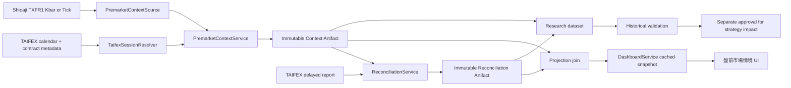

# 台指期夜盤盤前偵測 Implementation Plan

日期：2026-08-19
狀態：Phase 1～3 observation-only runtime、durable artifact store、source qualification capture 與 TAIFEX reconciliation acquisition 已實作；Shioaji completeness promotion 仍待證據 review

## 1. 結論

可以加入，而且建議做成「市場層級的盤前情境」，不要直接塞進個股 `StockData`，也不要立刻改寫現有 `GapUpRule`、Candidate 排名或 Buy Score。

建議分成兩段：

1. **05:00 後夜盤候選摘要**：整理歸屬今日交易日的臺股期貨（TX）盤後交易資料；只有通過版本化 completeness predicate 才能標記為 `READY`。
2. **08:45～08:50 日盤確認**：比較日盤開盤後的 raw signed metrics 與夜盤數值；任何延續／反轉分類都留待後續研究與另行核准。

第一版採 **observation-only**：只在盤前儀表板顯示、保存資料品質與來源證據，不影響候選、評分、RiskGate、本機紙上模擬或任何委託。完成歷史／樣本外驗證後，才另開 review 決定是否升級為策略輸入。

## 2. 現況與已確認缺口

目前 repository 有：

- `app.run_scan()`：一次性的股票市場快照掃描。
- `GapUpRule`／`GapScoreRule`：計算個股當日開盤價相對前一日收盤價的跳空。
- `DashboardService`：快取最近一次掃描，只有明確 refresh 才重新查 Provider。
- `premarket_gap_watchlist_v1`：策略目錄中的盤前草案，狀態仍是 `DRAFT`。
- Shioaji 股票 Snapshot、Kbar、Tick／BidAsk 與明確 logout lifecycle。
- DataHealth、Replay、timezone-aware event 與 future-data guard 等可沿用基礎。

目前沒有：

- 臺股期貨（TAIFEX TX）資料模型與 contract resolver。
- 盤後交易歸屬日／週末／休市日 resolver。
- 夜盤 provider reference、OHLCV、夜收、原始漲跌幅與資料品質投影。
- 儀表板的盤前市場情境區塊。
- 能證明台指期夜盤對現貨開盤或目前策略有增益的歷史驗證。

重要邊界：加入台指期資料後，`premarket_gap_watchlist_v1` 仍不能直接從 `DRAFT` 升級，因為它另外宣告需要個股盤前試撮資料 `PREOPEN_INDICATIVE`；台指期只能補上大盤情境。

## 3. 交易所與資料來源規則

### 3.1 商品與代碼

- 交易所商品：臺股期貨，TAIFEX 英文代碼 `TX`。
- Shioaji product root：`TXF`。
- 建議即時／當日 lookup 使用近月 alias `TXFR1`。
- 即時／當日 context 必須保存 `TXFR1` 在 query time 解析到的 `target_code`、交割月份、最後交易日與查詢時間。
- Historical backfill 禁止把「現在的」`TXFR1.target_code` 寫入過去資料。歷史 contract identity 必須由該交易日的 dated-contract／roll mapping 解出；若證據不足就標記 `UNRESOLVED`，不能猜測。

### 3.2 時段與交易日歸屬

- 一般交易時段：08:45～13:45；到期月份最後交易日到 13:30。
- 盤後交易時段：15:00～次日 05:00。
- 盤後交易屬於「次一一般交易時段」的交易日。

因此不可用 `event_time.date()` 或 `trading_date - 1 day` 直接判斷夜盤。星期一的夜盤來源通常是前一個星期五 15:00～星期六 05:00，不是星期日晚上。連假、封關、颱風休市與到期換月都必須透過 TAIFEX 行事曆與 contract metadata 解決。

### 3.3 Provider reference 與 TAIFEX settlement

TAIFEX 說明其盤後交易開盤參考價原則上來自當日一般交易時段的每日結算價，並延續至次一一般交易時段；但本計畫尚未證明 Shioaji `FuturesInfo.reference` 一定等於該 TAIFEX settlement／opening reference。

因此兩者必須分開：

- Context Artifact 只保存 Shioaji 原始欄位，命名為 `provider_reference_price`、`provider_reference_updated_at` 與 `provider_reference_source=SHIOAJI_CONTRACT_INFO`。
- TAIFEX settlement／opening reference 只能由獨立 Reconciliation Artifact 提供。
- 在 reconciliation 證明相等以前，API、UI、研究資料與文件都不得把 Shioaji reference 標成「TAIFEX settlement」或「期交所結算價」。
- `provider_reference_change_pct` 可作為來源明確的描述性數值；正式 `settlement_change_pct` 只在 Reconciliation Artifact 有合格 TAIFEX 值時產生。

### 3.4 Shioaji acquisition

Shioaji 支援：

- `TXFR1` contract lookup，並回傳 `target_code`、`reference`、交割日、最後交易日與更新日期。
- 期貨歷史 Tick、Kbar。
- `TickFOPv1`、`BidAskFOPv1` 即時訂閱。

Phase 0 必須用一個真實夜盤 fixture 比較 historical Kbar 與 Tick 的 trading-date／跨午夜行為，再決定 MVP 的正式查詢。預設偏好「一分鐘 Kbar 聚合＋最後 Tick 交叉檢查」；若實測證明 Kbar session 邊界不可靠，改由 trading-date Tick 聚合。不得只依文件推測。

## 4. Scope 與非目標

### In scope

- TX 近月夜盤摘要與資料品質。
- TAIFEX trading-date／session-window resolver。
- 盤前市場情境 API 與繁體中文 UI。
- 每交易日不可變的 Context Artifact，以及與它分離的 Reconciliation Artifact。
- Live/as-of 與 historical backfill 各自可稽核的 contract identity resolution。
- Mock／Replay／真實 Shioaji qualification。
- 歷史事件研究，驗證夜盤資訊是否真的改善現貨開盤與現有策略判斷。
- 可選的 08:45～08:50 日盤確認訊號。

### Out of scope

- 台指期、選擇權或任何商品的委託／部位／下單。
- 自動調整 Candidate、Buy Score、RiskGate 或本機模擬成交。
- 用夜盤漲跌直接宣稱今日台股必漲／必跌。
- 同時導入 MTX、TMF、TXO、Put/Call ratio、未平倉量或三大法人期貨部位。
- 把期貨欄位加入 `StockData`。

## 5. 目標架構



### Boundary decision

新增獨立的 `PremarketContextSource` Protocol，讓 domain/service 不依賴 Shioaji SDK；但 MVP 可由現有 `ShioajiProvider` 實作這個 capability，以共用同一個 login／logout session。這同時避免：

- domain 直接讀 `_api` 私有欄位；
- 為了單一 TX context 建立第二次 Shioaji login；
- 把期貨資料塞進股票 `StockData`；
- 擾動既有股票 Tick／BidAsk subscription set。

若未來擴大到多個期貨商品、整夜串流或期貨策略，再將 concrete adapter 抽成獨立 `ShioajiFuturesProvider`，並由共享 session gateway 注入。

## 6. 核心資料與 artifact 契約

### 6.1 Context Artifact

建議新增不可變的 `TaifexNightContextArtifact`。它只回答「Shioaji 在指定 trading date／session window 提供了什麼」，不承擔 TAIFEX 對帳結論：

| 欄位 | 說明 |
|---|---|
| `schema_version` | 例如 `taifex_night_context_v0` |
| `trading_date` | 此夜盤歸屬的下一個一般交易日 |
| `timezone` | 固定 `Asia/Taipei` |
| `product_root` | `TXF` |
| `contract_alias` | `TXFR1` |
| `contract_identity_status` | `RESOLVED_AS_OF_QUERY`、`RESOLVED_HISTORICALLY`、`UNRESOLVED` |
| `contract_resolution_method` | query-time alias、historical dated-contract mapping 或未解析原因 |
| `resolved_contract_code` | 可為 `null`；不得拿現在的 `TXFR1.target_code` 補歷史空值 |
| `delivery_month`／`last_trading_date` | 換月與到期證據 |
| `session_start`／`session_end` | calendar resolver 產生的實際窗口 |
| `query_not_before`／`queried_at` | 查詢資格時間與實際查詢時間；不代表 READY |
| `provider_reference_price`／`provider_reference_updated_at` | Shioaji provider reference 與新鮮度，不宣稱為 TAIFEX settlement |
| `open`／`high`／`low`／`close`／`volume` | 完整夜盤摘要 |
| `first_event_at`／`last_event_at`／`received_at` | 來源窗口與接收時間 |
| `session_move_pct` | 夜收相對夜盤開盤的變化 |
| `session_range_pct` | 夜盤高低區間相對夜盤開盤價 |
| `provider_reference_change_pct` | 可選；夜收相對 Shioaji provider reference 的變化 |
| `close_location` | 夜收位於夜盤高低區間的位置 |
| `late_return_pct` | 可選，04:00 至夜收的最後一小時變化 |
| `completeness_status`／`completeness_evidence` | `COMPLETE`、`PARTIAL`、`UNKNOWN` 與 Phase 0 凍結的證據 |
| `health`／`reasons` | `READY`、`PENDING`、`NOT_APPLICABLE`、`DEGRADED`、`UNAVAILABLE` 與原因碼 |
| `artifact_id`／`context_digest` | Context Artifact identity 與 canonical SHA256 |
| `source`／`raw_source_digest` | Provider、SDK version、query parameters 與原始 source checksum |

V0 不包含 `direction`、`FLAT`、neutral band 或 `regime`。正負漲跌直接由 signed numeric metrics 表達，不另行分類。

### 6.2 Reconciliation Artifact

`TaifexNightReconciliationArtifact` 是另一份不可變 artifact：

| 欄位 | 說明 |
|---|---|
| `schema_version`／`reconciliation_id` | Reconciliation 版本與 identity |
| `context_artifact_id`／`context_digest` | 明確指向被對帳的 Context Artifact |
| `source`／`raw_source_digest` | TAIFEX report/API 名稱、查詢參數與原始 checksum |
| `taifex_trading_date`／`contract_code` | TAIFEX 對帳 key |
| `taifex_settlement_price` | 可選；只有來源真的提供 settlement 才填入 |
| `taifex_open`／`high`／`low`／`close`／`volume` | 可取得的 TAIFEX 欄位 |
| `field_deltas` | 逐欄差異，不把不同語意欄位強行比較 |
| `status`／`reasons` | `MATCHED`、`MISMATCHED`、`PARTIAL`、`UNAVAILABLE` |
| `reconciled_at` | 對帳執行時間 |

Reconciliation 不得更新、補寫或覆蓋 Context Artifact。Dashboard projection 可以在讀取時以 `context_digest` join 兩者，但必須分別顯示 context health 與 reconciliation status。

### 6.3 公式

在已確認輸入為正值且 Context Artifact 完整時：

```text
session_move_pct             = (close / open - 1) * 100
session_range_pct            = (high - low) / open * 100
provider_reference_change_pct = (close / provider_reference_price - 1) * 100
close_location               = (close - low) / (high - low)
```

`provider_reference_change_pct` 必須保留 provider 語意；它不是 settlement return。若 Reconciliation Artifact 提供已驗證的 `taifex_settlement_price`，才可在 reconciliation／projection 層另算：

```text
settlement_change_pct = (context.close / reconciliation.taifex_settlement_price - 1) * 100
```

若 `high == low`，`close_location` 回傳 `null`，不可捏造 0.5。任何公式缺少必要輸入都回傳 `null`，不可 fallback 到另一種價格語意。

### 6.4 Query eligibility 與 READY

- `05:05` 只定義 `query_not_before`：到達後允許查詢，但不代表資料已完整，也不直接轉成 `READY`。
- `PENDING`：尚未到 query cutoff，或已查詢但 source completeness 仍是 `UNKNOWN/PARTIAL` 且可重試。
- `NOT_APPLICABLE`：今天不是 TAIFEX 一般交易日，或該 contract 無適用 session。
- `READY`：query 成功，且 session window、contract identity、required OHLCV、first/last event time、資料順序與 Phase 0 定義的 source-completion evidence 全部通過。
- `DEGRADED`：core session 已可顯示，但 provider reference 過期／缺失或其他非核心欄位不完整。Reconciliation mismatch 不改寫 context health，而是留在 reconciliation status。
- `UNAVAILABLE`：Provider 不支援、無資料、查詢錯誤或 calendar 不完整。

READY predicate 必須在 Phase 0 由真實 fixture 凍結並版本化；不得只寫成 `now >= 05:05`、`last_event_at <= 05:00` 或「query 有回資料」。若 Shioaji 沒有可證明 finalization 的欄位，Context 保持 `PENDING`／`DEGRADED`，直到取得計畫中核准的 completeness evidence。

Fail-degraded 規則：台指期 context 失敗時，股票掃描與 dashboard 仍可使用，但 UI 必須明確顯示「台指期夜盤資料不可用」，不得沿用昨天資料冒充今日結果，也不得因此改動候選或交易決策。

### 6.5 Historical backfill contract identity

Live/as-of context 與 historical backfill 使用不同的 identity contract：

- Live/as-of：可以記錄 query time 的 `TXFR1.target_code`，狀態為 `RESOLVED_AS_OF_QUERY`。
- Historical backfill：先以目標 trading date 查 dated contract／roll calendar，再讀該 contract 的歷史資料，狀態為 `RESOLVED_HISTORICALLY`。
- 若 continuous series 能提供價格但沒有逐日 actual contract identity，仍可保存 series observation，但 `resolved_contract_code=null`、狀態 `UNRESOLVED`；不得拿 current alias target 補值。
- Roll calendar 本身要版本化，保存來源、as-of time、規則與 SHA256；更正 mapping 時建立新版本，不改舊 artifact。
- Historical fixture 至少覆蓋 expiry 前一夜、expiry trading date、roll 後首個 trading date、星期一與連假後交易日。

## 7. 盤前判讀方式

### Phase A：原始市場情境

第一版只顯示：

- `session_move_pct`、`session_range_pct` 等 signed numeric metrics；
- 可取得時顯示 `provider_reference_change_pct`，標籤固定為「相對 Shioaji 參考價」；
- 夜開、夜收、夜盤高低與第一／最後資料時間；
- contract identity status、completeness、context health 與 reconciliation status；
- 提示文字：「市場情境，不等於個股開盤預測」。

V0 不顯示「上漲／持平／下跌」、「偏多／中性／偏空」或 `FLAT`。顏色若用於 signed value 只是數值格式，不代表已驗證分類。

### Phase B：08:45～08:50 確認（可選）

TX 日盤比現貨早 15 分鐘開盤。若開啟此階段，新增：

- `day_open_return_pct`：08:45 起至 cutoff 的變化；
- `night_to_preopen_pct`：08:50 附近相對夜收的變化；

此階段需要獨立的 futures callback／subscription lifecycle，不可共用或覆蓋股票 callback handler。V0 仍只顯示兩個 signed metrics；`CONTINUED`／`REVERSED` 等分類完全延後到研究核准後。

### 不立即加入 Buy Score 的理由

台指期是市場層級資料，個股可能受產業、ADR、個別消息與盤前試撮影響而背離。未驗證前若直接加減分，會同時改變候選數量、排序、回測樣本與風險暴露，無法判斷增益來自資料還是門檻重寫。

## 8. Dashboard／API

沿用既有：

- `GET /api/dashboard/snapshot`
- `POST /api/dashboard/refresh`

在 payload 增加：

```json
{
  "premarket_context": {
    "status": "READY",
    "artifact_id": "...",
    "context_digest": "...",
    "trading_date": "2026-08-19",
    "product": "臺股期貨近月",
    "contract_alias": "TXFR1",
    "contract_identity": {
      "status": "RESOLVED_AS_OF_QUERY",
      "resolved_contract_code": "...",
      "resolution_method": "QUERY_TIME_ALIAS"
    },
    "provider_reference": {
      "source": "SHIOAJI_CONTRACT_INFO",
      "price": 24000,
      "updated_at": "..."
    },
    "metrics": {
      "close": 24180,
      "session_move_pct": 0.75,
      "provider_reference_change_pct": 0.75
    },
    "session_start": "...+08:00",
    "session_end": "...+08:00",
    "last_event_at": "...+08:00",
    "completeness": {"status": "COMPLETE", "evidence": ["..."]},
    "health": {"state": "READY", "reasons": []},
    "reconciliation": {
      "status": "PENDING",
      "artifact_id": null,
      "context_digest": "..."
    }
  }
}
```

`reconciliation` 是 projection join 的摘要，不代表它被寫進 Context Artifact。數值只由 backend 計算；Browser 只做 format／render，不能自行重算漲跌幅、交易日、完整性或任何分類。

UI 建議在「市場總覽」摘要與候選清單之間加入一個 `盤前市場情境` panel：

```text
台指期夜盤｜夜開至夜收 +0.75%
夜收 24,180｜Shioaji 參考價 24,000｜高低 24,220 / 23,910
05:07 查詢｜完整性已驗證｜TXFR1 → 實際月份
TAIFEX 對帳：等待中
市場情境，不等於個股開盤預測
```

狀態顏色必須同時有文字，不可只靠紅綠色；`PENDING`、`NOT_APPLICABLE`、`DEGRADED`、`UNAVAILABLE` 都要有可辨識文案。

## 9. Cache、排程與流量

- Context cache／artifact key：`trading_date + contract_identity_key + schema_version + source_request_digest`。Historical identity 若是 `UNRESOLVED`，必須把該狀態納入 key，不能帶入 current target code。
- 只有達到版本化 READY predicate 的 Context Artifact 才視為 immutable completed context；05:00 或 05:05 本身都不具備此效果。
- `05:05` 是建議的 `query_not_before`，保留來源落盤延遲；到時只允許開始 query。回傳資料仍須走 completeness checks，未通過就有限 backoff 並維持 `PENDING`／`DEGRADED`。
- Dashboard 在 query cutoff 前或資料未完成時回傳 `PENDING`，不可阻塞股票快照。
- MVP 採 lazy load：第一次 snapshot／refresh 才建立 context，符合現有 dashboard 的明確 refresh 模式。
- 若之後要求每天自動產出，才新增 05:05 scheduler；不要在本次同時擴張背景工作。
- 07:00 左右可建立獨立 TAIFEX Reconciliation Artifact；對帳失敗只改變 reconciliation status，不覆蓋 Context Artifact，也不把 context health 偷換成 TAIFEX health。
- Context／Reconciliation 各自的 raw 與 normalized artifact 都必須帶 SHA256，保留 provider、SDK version、查詢參數與 contract identity／resolution method。

## 10. Implementation phases

### Phase 0 — Contract freeze 與真實資料 qualification

工作：

- 使用一個一般交易日、一個星期一／連假後交易日、一個到期／換月附近交易日擷取 `TXFR1`。
- 比較 historical Kbar、historical Tick 與 futures stream 的時間、交易日、OHLCV、Shioaji provider reference、`target_code`。
- 以 TAIFEX daily report 建立獨立 Reconciliation Artifact，對帳夜收、高低、量，並單獨驗證 provider reference 是否等於 TAIFEX settlement／opening reference。
- 凍結 READY completeness predicate、normalized fixture、schema、calendar source、query 選擇與 SDK 支援版本。
- 建立至少涵蓋換月前後的 historical contract roll fixture；確認 backfill 不讀 current `TXFR1.target_code`。

驗收：

- 夜盤窗口與交易日歸屬零歧義。
- fixture 能重播並得到同一 digest。
- 05:05 query 成功但資料不完整的 fixture 不得成為 READY。
- Context Artifact 與 Reconciliation Artifact 有不同 identity／digest，且前者不被後者更新。
- 沒有任何 order callback、CA activation 或 order API 呼叫。

### Phase 1 — Domain、calendar 與 Provider capability

工作：

- 新增 `TaifexSessionResolver`、`TaifexNightContextArtifact`、`TaifexNightReconciliationArtifact`、health／reason enums。
- 新增 `PremarketContextSource` Protocol。
- `MockProvider` 提供固定 fixture；`ShioajiProvider` 以既有 login 實作 narrow capability。
- 加入 live query-time identity、historical dated-contract mapping、provider reference freshness 與 per-day cache。

驗收：

- 星期一、連假、非交易日、跨午夜、到期與 rollover 測試通過。
- Historical backfill 無法解析 identity 時明確 `UNRESOLVED`，且不出現 current target code。
- 來源資料缺失時 fail-degraded，不影響股票掃描。
- 現有股票 Tick／BidAsk 訂閱與 shutdown regression 全數通過。

### Phase 2 — PremarketContextService 與 Dashboard projection

工作：

- Server-side 聚合與公式計算。
- 注入 `RuntimeComposition`／`DashboardService`。
- 在既有 snapshot／refresh payload 加入 `premarket_context`。
- Context cache 與有限重試；分別保存 immutable Context／Reconciliation raw 與 normalized artifacts。
- Projection 只以 `context_digest` join reconciliation 摘要，不回寫 Context Artifact。

驗收：

- 同一交易日重複 refresh 不重查 provider。
- API 各 health 狀態 contract 測試通過。
- Browser 端不存在交易日、報酬、completeness 或分類計算。

### Phase 3 — 繁體中文 UI observation rollout

工作：

- 新增盤前市場情境 panel、status 文案、來源時間與 disclaimer。
- 新增桌面／窄螢幕 layout 與 keyboard／screen-reader 狀態。
- 更新 README 與策略目錄，另增 `taifex_overnight_context_v0`，狀態 `EXPERIMENTAL`。

驗收：

- `READY`、`PENDING`、`NOT_APPLICABLE`、`DEGRADED`、`UNAVAILABLE` 可目視辨識。
- Context health 與 reconciliation status 分開顯示。
- UI 沒有 `FLAT`／中性 band 或其他方向分類。
- UI 不因 context 缺失而隱藏候選或顯示舊資料。
- `premarket_gap_watchlist_v1` 仍維持 `DRAFT`。

### Phase 4 — 歷史驗證與參數校準

研究資料至少包含：

- 夜盤 context：return、range、close location、late return、volume、contract identity。
- 現貨 outcome：TAIEX 09:00 gap、09:00～09:05／09:30／10:00 報酬。
- 策略 outcome：原 Candidate／Buy Score 的樣本數、命中率、損益、最大回撤與產業分布。

方法：

- 僅使用 cutoff 前可取得資料，禁止 future leakage。
- 依時間做 train／validation／out-of-sample，並用 walk-forward 檢查穩定性。
- 先比較 raw correlation、研究用價格正負號命中率、MAE、分位數差異，再比較 baseline 與 challenger 策略；此分析不產生 production `FLAT` band 或方向分類。
- 若未來研究分類門檻，只能從 train 產生、凍結新版本後在 out-of-sample 評估；本計畫不預設 `FLAT` 或 neutral threshold。

驗收：

- 原始 signed metrics、樣本期間、缺失率與 confidence interval 可重現。
- 若未顯著優於 baseline，維持 observation-only，不硬推進策略。

### Phase 5 — 08:45～08:50 confirmation（另行核准）

工作：

- 新增一個 TX futures stream lifecycle 與 day-open confirmation projection。
- 比較夜盤與日盤 raw signed metrics 的條件關係是否比夜盤單獨使用更有預測力；本階段不產生延續／反轉分類。
- 保持與股票 subscription allocator 分離，shutdown 必須取消期貨訂閱並排空 callback。

驗收：

- 重連、out-of-order、stale、05:00／08:45 session transition 與 shutdown 測試通過。
- 未通過 Phase 4 前仍不可改 Candidate／Score／Order。

### Phase 6 — 策略影響（需要第二次明確 approval）

候選方案只可擇一做 baseline/challenger：

1. 僅 UI annotation；
2. Candidate 排名的 market-context tie-breaker；
3. Long-only entry guardrail；
4. Buy Score 的版本化小權重項。

不建議一開始同時做 2～4，否則無法歸因。任何 promotion 都要新增 strategy version，保留舊版 baseline，並維持 real-money disabled。

## 11. 預計檔案地圖

### 新增

- `config/premarket.py`：typed、versioned、fail-closed 設定。
- `premarket/__init__.py`
- `premarket/models.py`：Context／Reconciliation／health contracts。
- `premarket/artifacts.py`：canonical serialization、digest 與 projection join。
- `premarket/calendar.py`：TAIFEX trading-date 與 session resolver。
- `premarket/service.py`：聚合、completeness、cache 與 context projection。
- `premarket/reconciliation.py`：TAIFEX 對帳與獨立 reconciliation artifact。
- `tests/fixtures/taifex_txfr1_night_session.json`
- `tests/fixtures/taifex_contract_roll_history.json`
- `tests/test_premarket_calendar.py`
- `tests/test_premarket_context.py`
- `tests/test_premarket_artifacts.py`
- `tests/test_premarket_historical_identity.py`
- `tests/test_premarket_dashboard_ui.py`

### 修改

- `market_data/provider.py`：optional capability、Mock 與 Shioaji mapping。
- `runtime/composition.py`：注入 context service，維持單一 provider lifecycle。
- `dashboard/service.py`：snapshot 增加 `premarket_context`。
- `dashboard/static/index.html`：繁體中文盤前市場情境 panel。
- `strategy_catalog/service.py`：新增 observation-only experimental 定義。
- `tests/test_shioaji_provider.py`
- `tests/test_dashboard_service.py`
- `tests/test_runtime_composition.py`
- `README.md`

Phase 0 若確認需要獨立 artifact/calendar 目錄，再新增 `research/captures/taifex/` 與 versioned calendar JSON；不要先把不確定的資料格式寫死進 production code。

## 12. Observability

每交易日至少記錄：

- context build 成功／失敗與 latency；
- trading date、session window、alias、identity status／method、resolved code、provider reference update date；
- query eligibility、query time、bar/tick count、first/last event time、completeness evidence、缺口與重複資料數；
- cache hit/miss、provider query count、retry count；
- context health state/reasons；
- Context Artifact ID／digest；
- Reconciliation Artifact ID／referenced context digest／status／field deltas；
- Shioaji provider reference 與 TAIFEX settlement parity 結果，禁止只記一個模糊的 `reference`。

禁止 log API key、secret、帳號或原始 credential。

## 13. Rollout 與 rollback

Feature flags：

- `taifex_premarket_capture_enabled`
- `taifex_premarket_dashboard_enabled`
- `taifex_day_open_confirmation_enabled`
- `taifex_context_affects_decisions`（本計畫各階段固定 `false`）

Rollout：Mock/Replay → 真實資料 capture → Shadow dashboard → 歷史驗證 → 另行 review。

Rollback 只需關閉 dashboard/capture flag；既有股票掃描 payload 其餘欄位、Candidate、Score、simulation 與 backtest contract 不變。已寫入的 raw／normalized artifact 保留供稽核，不做破壞性刪除。

## 14. 主要風險

| 風險 | 控制方式 |
|---|---|
| 夜盤歸錯交易日 | TAIFEX calendar resolver；星期一／連假 fixture |
| `TXFR1` 換月後歷史不可重現 | Backfill 使用 historical dated-contract／roll mapping；不使用 current target；無證據則 `UNRESOLVED` |
| Shioaji reference 被誤標為 TAIFEX settlement | 欄位與 artifact 分離；只有 reconciliation 可以提供／驗證 TAIFEX settlement |
| Context 被 reconciliation 改寫 | 兩份 immutable artifact，以 context digest join；任何更正建立新 artifact |
| Kbar 跨午夜語意不同 | Phase 0 與 Tick／TAIFEX 日報三方對帳 |
| 05:05 query 回傳部分資料卻誤判 READY | query cutoff 與 READY predicate 分離；completeness evidence 未通過就維持 PENDING／DEGRADED |
| 未驗證的 FLAT／方向門檻污染 UI 或研究 | V0 只提供 signed metrics；分類需另開版本與樣本外核准 |
| 台指期與個股背離 | observation-only；先做樣本外驗證 |
| context 失敗拖垮 dashboard | fail-degraded、per-day cache、與股票掃描隔離 |
| 第二次 Shioaji login／callback 衝突 | 同一 provider session、獨立 port；日盤 stream 另設 lifecycle |
| 使用昨天 context 冒充今天 | cache key 含 trading date、contract identity method/key、schema version 與 source request digest；任一不合立即拒絕 |

## 15. Review 建議

建議先核准 Phase 0～3，範圍是：

- `TXFR1` 夜盤資料 qualification；
- 正確交易日、historical contract identity 與 provider reference 語意；
- Context／Reconciliation artifacts 分離與版本化 READY predicate；
- observation-only dashboard；
- 不改現有候選、分數與交易。

Phase 4 完成後再決定：

- 是否要加入 08:45～08:50 confirmation；
- 是否有足夠證據把 context 升級為策略輸入；
- 若升級，只挑一個 baseline/challenger 方案。

## 16. Implementation result（2026-08-19）

已完成：

- `premarket` domain/application package、2026 TAIFEX versioned calendar、session resolver 與 historical contract identity resolver；
- immutable Context／Reconciliation contracts、canonical SHA256 digest 與分離的 projection join；
- Mock／Shioaji narrow provider capability、RuntimeComposition／DashboardService wiring；
- 繁體中文 observation-only panel、signed metrics、獨立 TAIFEX 對帳狀態；
- `taifex_overnight_context_v0` EXPERIMENTAL strategy catalog metadata；
- calendar、READY、historical identity、artifact separation、provider、API、UI 與 regression tests；
- raw source、Context、Reconciliation 的 content-addressed durable repository，含重啟 rehydrate 與 tamper rejection；
- Shioaji completed-session Kbar／Tick 單次 qualification CLI，以及 TAIFEX 官方盤後日報的固定 URL／POST adapter；
- TAIFEX trading date、TX product 與 dated delivery month 的 strict join；官方 settlement 缺值、volume basis 與 comparable fields 分別保存；
- current/as-of Context、qualification、official reconciliation 三個可重跑 CLI。

驗證結果：初版完整 pytest suite 為 `357 passed, 1 skipped`；durable evidence、qualification 與官方 reconciliation 完成後的完整 suite 為 `385 passed, 1 skipped`。Mock dashboard browser smoke、重新掃描及 390 px responsive layout 均通過；Python compile、Dashboard JavaScript syntax 與 whitespace checks 也通過。

2026-08-19 的 live current/as-of Context 把 `TXFR1` 解析為 `TXFH6`／delivery month `202608`，取得夜盤 OHLC 45,137／45,208／44,424／44,527；輸出依契約維持 `PENDING`、`completeness=UNKNOWN`、`SOURCE_COMPLETENESS_UNQUALIFIED`。另一個 Kbar／Tick qualification capture 取得 832 根 Kbar、20,946 筆 Tick，OHLCV 差異為零，但狀態仍是 `CAPTURED_UNQUALIFIED`，因為這些資料沒有官方 finalization marker。

同一 Context 的 TAIFEX 官方盤後日報回傳相同 OHLC、settlement `null` 與 volume 28,126；Shioaji Context volume 為 27,692。官方說明 volume 包含價差及鉅額交易契約，兩者口徑尚未證明相同，所以 Reconciliation Artifact 只對比 OHLC，四欄 delta 均為零，狀態為 `PARTIAL / TAIFEX_VOLUME_BASIS_UNQUALIFIED`。這不會改寫 Context health，也沒有把 Shioaji reference 標成 TAIFEX settlement。

目前限制：Shioaji source completion evidence 尚未通過 review，所以 production Shioaji Context 不能升為 READY；TAIFEX volume parity 與 provider reference／TAIFEX settlement parity 也尚未證明。Phase 4～6、08:45 日盤確認、Candidate／Score／RiskGate／simulation／broker-order 影響均未實作。

## 17. 參考資料

- [TAIFEX 盤後交易介紹](https://www.taifex.com.tw/cht/4/aHIntroduction)
- [TAIFEX 臺股期貨契約規格](https://www.taifex.com.tw/cht/2/tX?menuid1=12)
- [TAIFEX 2026 期貨市場行事曆](https://www.taifex.com.tw/file/taifex/CHINESE/4/2026Calendar.pdf)
- [TAIFEX 期貨商買賣日報表](https://www.taifex.com.tw/cht/3/dailyFutures)
- [TAIFEX 期貨每日交易行情查詢](https://www.taifex.com.tw/cht/3/futDailyMarketReport)
- [TAIFEX 期貨每日交易行情下載](https://www.taifex.com.tw/cht/3/dlFutDailyMarketView)
- [Shioaji Contract](https://sinotrade.github.io/tutor/contract/)
- [Shioaji Futures streaming](https://sinotrade.github.io/tutor/market_data/streaming/futures/)
- [Shioaji Historical market data](https://sinotrade.github.io/tutor/market_data/historical/)
